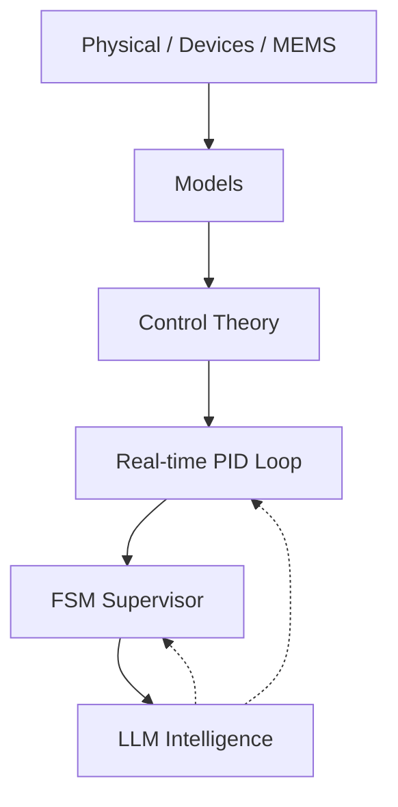

# 🎓 Samizo-AITL Portal  
> **物理 → デバイス → 制御 → 知能化を  
> 一つの因果構造で統合する技術アーカイブ**  
> *A unified framework connecting physics, devices, systems, and intelligent control.*

[](https://github.com/Samizo-AITL)
[](https://zenn.dev/samizo_aitl)


## 🌐 Language / 言語
[](https://samizo-aitl.github.io/en/)
[](https://samizo-aitl.github.io/)

---

## ▶ はじめての方へ（Overview）

Samizo-AITL の設計思想と全体像を、  
短いスライドにまとめています。  
**まずはこちらをご覧ください。**

▶ [はじめての方はこちら（Overview スライド）](https://samizo-aitl.github.io/about/marp/samizo-aitl-presentation.html)

---

## 🚀 What You Can Gain from This Portal

**Samizo-AITL** は、半導体・MEMS・制御・AI を  
**「物理基盤から一気通貫で理解・設計できる構造」**として  
再構築した技術ポータルです。

このポータルで得られるもの：

- 分野横断の技術を **因果構造として理解** できる  
- 物理モデルを起点に **制御・知能化まで接続** できる  
- 教材・PoC・実装を **再利用可能な設計構造** として扱える  

単なる教材集ではなく、  
**技術体系そのものを「設計可能な形」で提示すること**を目的としています。

---

## 🎯 Who Is This Portal For?

Samizo-AITL は、以下の技術者・研究者を対象としています。

- 物理モデル起点で設計を行いたい **半導体・MEMS・制御系エンジニア**  
- AI / LLM を **制御の代替ではなく、監督・再設計層として使いたい人**  
- 分野横断で **技術体系を再構築したい研究者・設計者**

※ 初学者向け入門サイトではありません。  
本ポータルは **設計のための構造アーカイブ** です。

---

## 🧩 AITL Structure Map（全体構造）


> Samizo-AITL における技術アーキテクチャ全体図。  
> 物理 → 制御 → 知能化を中核とし、  
> DevEnv・CodeGen・Docs・Archives の各レイヤを横断して  
> 因果構造として統合している。



AITL（Adaptive Intelligent Technology Loop）では、

- **内側**：物理・デバイス・MEMS（制約を生む層）  
- **中間**：モデル・制御理論（挙動を決める層）  
- **外側**：FSM / LLM（判断・再設計・適応）

という三層構造で、  
**物理モデルを正しく「使い切る」ための知能化**を行います。

---

## 🗂 Samizo-AITL Directory Overview（全体像）

> **本ポータルは「ディレクトリ構成＝設計思想」です。**

```text
Samizo-AITL/
├─ 01_DevEnv/        環境・再現性（VSCode / Python / Toolchain）
│
├─ 02_CodeGen/       実装・制御・生成
│   ├─ PID           実時間制御（安定化・V–I 制御）
│   ├─ FSM           状態遷移・モード管理
│   └─ LLM           監督・再設計（非実時間）
│
├─ 03_Docs/          理解・教育・設計思想
│   ├─ Edusemi-v4x
│   ├─ EduController
│   └─ Edusemi-Plus
│
└─ 04_Archives/      PoC・履歴・技術資産
```

**推奨順**：  
**思想 → 物理 → 制御 → 知能**

---

## 📝 Essays / Design Philosophy (Zenn)

**設計思想・物理起点工学・AITL構造に関する考察記事は Zenn に集約しています。**

[](https://zenn.dev/samizo_aitl)

---

# 💠 Main Core（中核教材）

---

## 1️⃣ Edusemi-v4x
半導体プロセス・デバイス・回路設計を**物理起点で体系化する基幹教材**。

[](https://samizo-aitl.github.io/Edusemi-v4x/)
[](https://github.com/Samizo-AITL/Edusemi-v4x)

---

## 2️⃣ SemiDevKit
物理モデルから **SPICE・信頼性・レイアウト**までを接続する実装キット。

[](https://samizo-aitl.github.io/SemiDevKit/)
[](https://github.com/Samizo-AITL/SemiDevKit)

---

## 3️⃣ Edusemi-Plus
材料・装置・産業構造を、**物理視点で拡張する補助教材**。

[](https://samizo-aitl.github.io/Edusemi-Plus/)
[](https://github.com/Samizo-AITL/Edusemi-Plus)

---

## 4️⃣ openlane2-sram｜SRAMマクロ統合・物理設計実証
OpenLane2（v2）を用いて **SRAM hard macro を統合し、RTL → GDS まで完走する**  
**マクロ対応・物理設計の実践教材**。

- SRAM を **external hard macro（blackbox / LEF / GDS）** として扱う
- FIXED 配置・halo / keepout を含む **macro-aware floorplanning**
- OpenLane2 Classic flow による **最終 GDS 生成**
- SoC 物理設計で一般的な **「SRAM 中身は見ない」設計作法**を明示

[](https://samizo-aitl.github.io/openlane2-sram/)
[](https://github.com/Samizo-AITL/openlane2-sram)

### 🔎 Layout Evidence（GDS）

**Figure 1: SRAM Macro Block-Level View**


**Figure 2: Standard-Cell-Level View Around SRAM Macro**


> Note: The SRAM is integrated as a fixed hard macro using abstract views (LEF/GDS).  
> Its internal transistor-level layout is intentionally not visible, which is consistent with standard SoC physical design practice.

---

# 🎛 Applied Layer（制御・知能化）

---

## 🧭 Control Architecture Concepts（制御アーキテクチャ概念）

> Runtime（運用）と Design-time（設計）を分離して扱うための  
> **中核となる制御アーキテクチャ概念**です。  
> いずれも「AIが制御を置き換えない」ことを前提にしています。

| Concept | Role | Links |
|---|---|---|
| **Envelope Control** | Runtime enforcement of safe operating envelopes under uncertainty | 🔗 [Open](https://samizo-aitl.github.io/envelope-control/) ｜ 🔧 [Repo](https://github.com/Samizo-AITL/envelope-control) |
| **Design Recovery Control** | Offline recovery of violated control design assumptions | 🔗 [Open](https://samizo-aitl.github.io/design-recovery-control/) ｜ 🔧 [Repo](https://github.com/Samizo-AITL/design-recovery-control) |

**Relationship (non-overlapping):**
- **Envelope Control** constrains *how the system operates now*.
- **Design Recovery Control** repairs *why the original design no longer works*.

These concepts are **complementary**, not alternative.

---

## ▶ Control Playground（Time Response Demo）

**固定 PID 制御器が、  
色付きかつ状態依存の外乱にさらされたときの時間応答を可視化したデモ**です。

- スライダーなし
- チューニング不可
- 見えるのは **y(t), setpoint(t), disturbance(t)** のみ

<iframe
  src="https://samizo-aitl.github.io/control-playground/"
  style="width:100%; height:420px; border:none;">
</iframe>

> 制御の成否は、説明ではなく **波形そのもの**が語ります。

---

## 5️⃣ EduController
PID・FSM を中心に**制御構造を理解するための教材**。

[](https://samizo-aitl.github.io/EduController/)
[](https://github.com/Samizo-AITL/EduController)

---

## 6️⃣ AITL-Controller-A-Type
PID × FSM × LLM **三層構造の最小 PoC**。

[](https://samizo-aitl.github.io/aitl-controller-a-type/)
[](https://github.com/Samizo-AITL/aitl-controller-a-type)

---

## 7️⃣ V–I Control ASIC on SKY130
V–I 制御（PID + FSM）を **RTL → GDS まで実装する ASIC 教材**。

[](https://samizo-aitl.github.io/vi-control-asic-sky130/)
[](https://github.com/Samizo-AITL/vi-control-asic-sky130)

---

# ⚙️ MEMS / Physical Boundary

---

## 8️⃣ mems-ana
抽象モデルの限界を確認する **pre-FEM MEMS 解析ツール**。

[](https://samizo-aitl.github.io/mems-ana/)
[](https://github.com/Samizo-AITL/mems-ana)

---

## 9️⃣ Inkjet Printing — Design Trade-off Models
画質・速度・ドット挙動の因果関係を**最小モデルで可視化する教材**。

[](https://samizo-aitl.github.io/inkjet-dts/)
[](https://github.com/Samizo-AITL/inkjet-dts)

---

## 🔟 inkjet-timing  
ピエゾインクジェットにおける **電気・機械・流体の時間因果関係**を、単一時間軸上で可視化する設計・教育用デモ。

[](https://samizo-aitl.github.io/inkjet-timing/)
[](https://github.com/Samizo-AITL/inkjet-timing)

---

# 🎞 AITL Animation Demos
AITL 概念を可視化するための**試験的アニメーションデモ集**。

[](https://samizo-aitl.github.io/aitl-animation-demos/)

---

## 🎞 AITL Control Flow Demo

AITL（Adaptive Intelligence–in–the–Loop）制御の**中核**である  
**PID × FSM × LLM の三層構造**が、時間軸上でどのように連携するかを示すデモです。

---

### 🔁 三層の役割（要点）

- **PID（最内層）**  
  実時間制御を担当。通常はPIDのみで安定追従する。

- **FSM（中間層）**  
  状態監督を担当。誤差や劣化を検出し、  
  *monitoring → disturbance → recovery → stable* を切り替える。

- **LLM（最外層）**  
  再設計を担当。  
  FSMに呼ばれた場合のみ介入し、PIDゲイン（例：Kp）を再同定する。

---

### 📉 デモの流れ

1. **通常**：PID追従／FSM監視／LLM待機  
2. **外乱**：誤差増大 → FSMが劣化検出  
3. **介入**：LLMがゲイン再調整  
4. **回復**：PID再追従 → FSM stable → LLM idle

---

### 🎯 AITL制御の本質

- LLMは**常時制御しない**
- PIDを**置き換えない**
- FSMが**判断の主導権**を持つ
- LLMは**設計を更新する存在**

👉 **これが AITL 制御の根幹思想**

---

<section class="aitl-demo" style="margin:0;padding:0;">
  <iframe
    src="https://samizo-aitl.github.io/aitl-animation-demos/demo/js-svg/aitl-control-flow.html"
    style="display:block;width:100%;height:520px;border:none;border-radius:12px;background:#000;margin:0;"
    loading="lazy"
    referrerpolicy="no-referrer">
  </iframe>
</section>

---

# 🕘 Update Log

**サイトおよび教材の更新履歴はこちらに集約しています。**  
設計思想・教材構成・PoC の更新は、必ずログとして残します。

- [📄 更新履歴を見る](https://samizo-aitl.github.io/about/update/)

---

# 👤 Author

**三溝 真一（Shinichi Samizo）**  
独立系半導体研究者  

- GitHub: [https://github.com/Samizo-AITL](https://github.com/Samizo-AITL)
- Zenn: [https://zenn.dev/samizo_aitl](https://zenn.dev/samizo_aitl)  
- Career Summary: [https://samizo-aitl.github.io/about/career-summary/](https://samizo-aitl.github.io/about/career-summary/)

---

# 💬 技術ディスカッション / Technical Consultation

[](https://github.com/Samizo-AITL/Samizo-AITL.github.io/discussions)

> 本ポータルでは、メールや SNS 等の私的な連絡手段は設けていません。  
> 技術的な議論・相談・協業に関する問い合わせは、  
> **GitHub Discussions 上での公開議論**として受け付けています。  
>  
> 設計思想の共有、因果構造の整理、PoC 検討など、  
> **再現性と技術的文脈を重視した対話**を目的としています。


