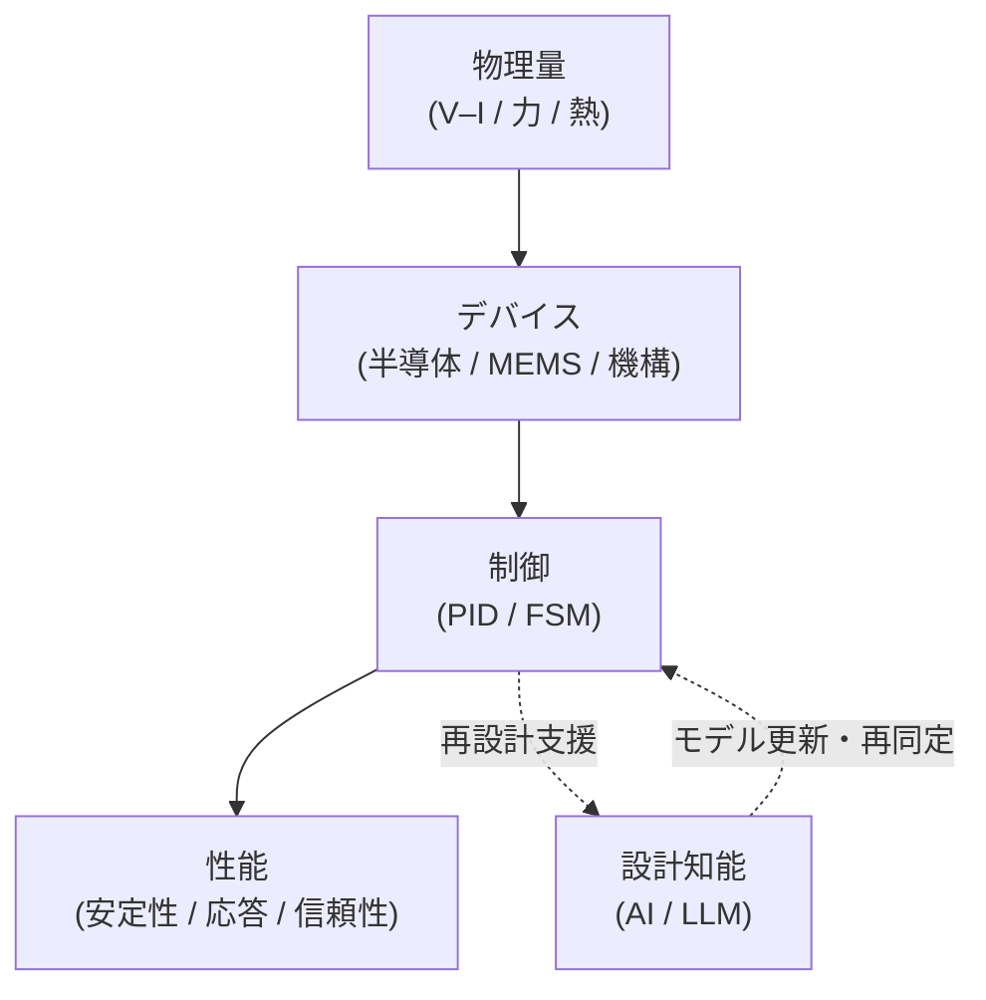

# 🎓 Samizo-AITL Portal
> 半導体・制御・AIを「同じ構造図」で整理した個人技術アーカイブ

  ▶ <a href="/portal/">統合構造 Portal</a>　
  ▶ <a href="/zenn-articles/">Zenn 記事一覧</a>　
  ▶ <a href="https://github.com/Samizo-AITL">GitHub</a>

Architecture for Integrated Technology Logic

物理量（V–I など）から、デバイス・制御・AIまでを 
<strong>同じ構造図で一貫して理解するための設計構造アーカイブ</strong>

  
  

---

## 🧭 統合構造図（AITL）

本サイトのすべての記事・デモ・Portal は、この構造図の
<strong>「箱」または「矢印」</strong>のどれかに対応しています。

---

## 📚 Articles（Zenn 記事）

<a href="/zenn-articles/"
   style="
     display: inline-block;
     padding: 22px 56px;
     font-size: 1.45em;
     font-weight: 900;
     letter-spacing: 0.12em;
     color: #ffffff;
     background: linear-gradient(135deg, #2563eb, #1e40af);
     border-radius: 16px;
     text-decoration: none;
     box-shadow: 0 18px 38px rgba(30,64,175,0.45);
   ">
  ▶ Zenn 記事一覧
</a>

各記事は、上の統合構造図の中から 
<strong>特定の構成要素（箱）または関係（矢印）</strong>を切り出して解説しています。

---

## 🧩 Portal（構造ナビゲーション）

Portal は <strong>Samizo-AITL の中核ナビゲーション</strong> です。 
構造図を起点に、記事・デモ・設計視点を横断的に辿れます。

<a href="/portal/"
   style="
     display: inline-block;
     padding: 20px 48px;
     font-size: 1.3em;
     font-weight: 900;
     letter-spacing: 0.10em;
     color: #ffffff;
     background: linear-gradient(135deg, #1e40af, #1e3a8a);
     border-radius: 16px;
     text-decoration: none;
     box-shadow: 0 16px 32px rgba(30,64,175,0.40);
   ">
  ▶ 統合構造 Portal を開く
</a>

  

    <strong>全体構造マップ</strong> 
    
      物理量（V–I）から AI までの全体関係を俯瞰します
    
  

  

    <strong>制御階層（PID / FSM）</strong> 
    
      モデル化・制御構造の整理と位置づけ
    
  

  

    <strong>AI連携・構造デモ</strong> 
    
      再設計・知能化が構造のどこに入るかを示します
    
  

---

## 🧩 初学者向けの補足記事（qiita-articles）

<a href="https://samizo-aitl.github.io/qiita-articles/"
   style="
     display:inline-block;
     padding:14px 30px;
     border-radius:14px;
     background:#2563eb;
     color:#ffffff;
     font-weight:900;
     text-decoration:none;
     box-shadow:0 10px 22px rgba(37,99,235,0.45);
   ">
  ▶ 記事一覧を開く
</a>

