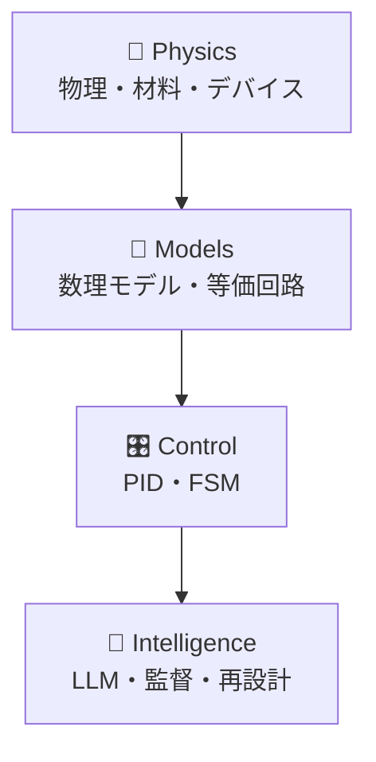
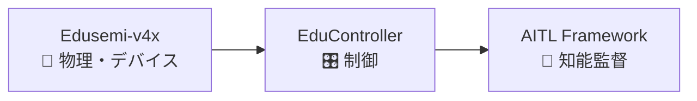
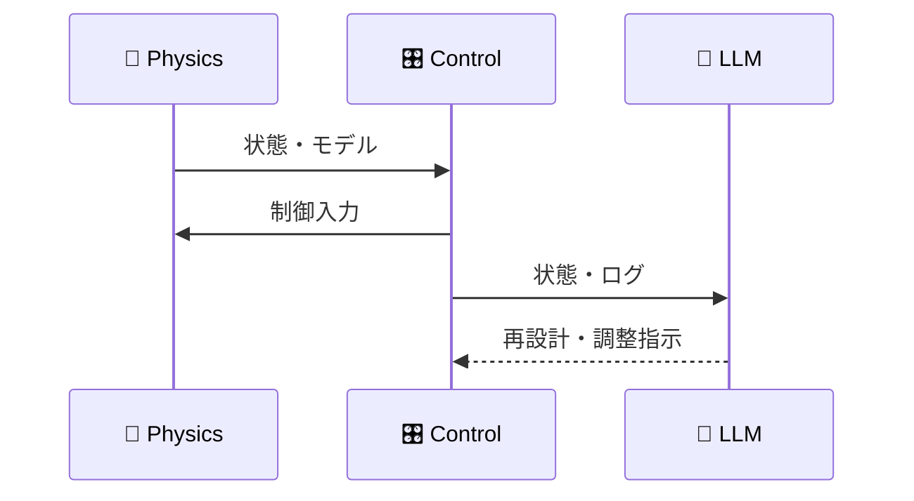

# 🧱 Physical-First 工学と  
# 🧠 知能制御アーキテクチャ

### 半導体／制御／AI の統合設計思想  

🔗 https://samizo-aitl.github.io/

---

## ❓ なぜ Physical-First 工学が必要なのか

- 🤖 AI や制御がブラックボックス化している  　
- 📐 数式・モデル・実装が分断されている  
- 🧩 半導体・制御・AI が別々に語られている  

👉 工学システムには  
**因果的・階層的な構造** が不可欠

---

## 🏗 工学システムの階層構造

👉 各層は  
**責務・時間スケール・役割が明確に分離**

---

## 🧭 各レイヤの役割分担

- **🧱 物理（Physics）**  
  材料特性・デバイス挙動・構造制約  
- **📐 モデル（Models）**  
  数理モデル・等価回路・パラメータ化  
- **🎛 制御（Control）**  
  PID・FSM による実時間安定性  
- **🧠 知能（Intelligence）**  
  LLM による診断・判断・再設計  

👉 「賢さ」は **最外層にだけ置く**

---

## 🧪 Samizo-AITL における実装対応

- **Edusemi-v4x**  
  物理・デバイスモデル／半導体プロセス  
- **EduController**  
  PID・FSM による制御設計  
- **AITL Framework**  
  LLM による監督・再設計レイヤ  

👉 各教材は  
**同一構造の異なるレイヤ切り出し**

---

## 🧱 物理・モデル層  
##（Physics & Models）

- 材料特性・デバイス物理  
- コンパクトモデル／等価回路  
- **物理的意味を持つパラメータ**

❌ ブラックボックス近似  
❌ AI による直接フィッティング

👉 **意味を失ったモデルは使わない**

---

## 🎛 制御層  
##（PID & FSM）

- PID による実時間フィードバック制御  
- FSM による状態・モード管理  
- **決定論的・説明可能な振る舞い**

❌ 実時間制御への確率的判断導入

👉 安定性は **数学と構造で保証**

---

## 🧠 知能層  
##（LLM）

- 上位監督としての意思決定  
- 故障解析・性能診断  
- 制御器の再設計・パラメータ調整  

👉 **実時間制御ループの外側**で動作  
👉 人間の思考を拡張する位置づけ

---

## 🔁 AITL  
## 閉ループ知能制御アーキテクチャ

👉 **人の思考力 × 機械の信頼性**

---

## 🧪 実装・Proof of Concept

- 🧩 V–I 制御 ASIC（SKY130）  
- 🔢 固定小数点 PID／FSM 実装  
- 🧮 SystemDK × FEM による設計検証  

👉 物理モデルから  
👉 **シリコン実装まで一貫**

---

## 🎓 Samizo-AITL が提供する価値

- 🧱 物理起点で説明可能な工学設計  
- 🎛 知能監督付きの決定論的制御  
- 📘 モデルから実装まで再現可能な技術教育  

🔗 https://samizo-aitl.github.io/
