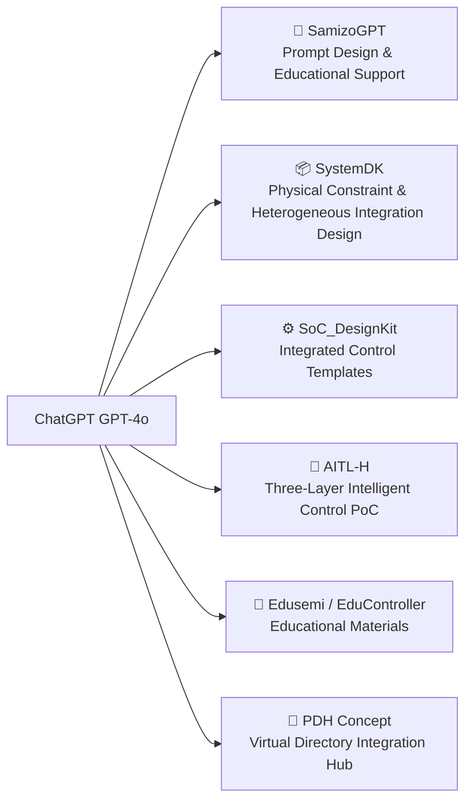

---

# 🤝 Message to OpenAI and Technical Collaboration Partners
 

---

## 📝 Executive Summary

This initiative positions **ChatGPT (GPT-4o) as the core foundation for education, design, and control**,  
supporting end-to-end workflows spanning curriculum generation, physical-constraint-aware design, PoC construction, and intelligent control architectures.  

**Key value for OpenAI** can be summarized in three points:  
- 🎓 **Educational impact**: A unique use case combining semiconductor/control engineering and AI education  
- ⚙️ **Industrial differentiation**: Novel applications directly tied to physical design and PoC implementation  
- 🌍 **Global collaboration model**: Open, bilingual (EN/JP), MIT-licensed materials enabling international partnerships  

---

## 🔧 Structure of ChatGPT-Integrated Projects

The following illustrates the key projects built around ChatGPT:

### 🧠 SamizoGPT — Prompt Design & Generation Engine  
A framework for **educational, design, and conceptual template generation** using ChatGPT.  
Supports curriculum creation, design assistance, and structured dialogue design.  

### 📦 SystemDK — Physical-Constraint-Aware Design with ChatGPT  
Special module within Edusemi-v4x. Educational reproduction of physical implementation design including:  
- **SI/PI, thermal, stress, EMI/EMC** multiphysics integration  
- **GAA / AMS / MRAM** heterogeneous node integration PoC  
- Hierarchical progression **PDK → IPDK → PKGDK → SystemDK**  
- Integration of **FEM analysis and S-parameter evaluation** with ChatGPT for design understanding  

### ⚙️ SoC_DesignKit_by_ChatGPT — Integrated Control Templates  
A collection of templates for FSM, PID, and LLM-integrated control PoCs.  
HDL (Verilog/C) generation can be automated via the ChatGPT API.  

### 🤖 AITL-H — Three-Layer Intelligent Control Architecture (PoC)  
- FSM (instinct) + PID (logic) + LLM (intelligence) layered structure  
- Practical integrated design examples combining control algorithms and AI  

### 📘 Edusemi / EduController — Educational & PoC-Embedded Materials with ChatGPT  
- Structured learning resources covering **semiconductors and control engineering**  
- ChatGPT-powered **hierarchical knowledge assistance and curriculum reconstruction**  

### 🧩 PDH (Project Design Hub) Concept  
- Unified management of educational materials, design outputs, and PoC setups via a **virtual directory structure**  
- ChatGPT assists in **project navigation, design documentation, and structural guidance**  

---

## 💡 Potential Collaboration with OpenAI

| **Domain** | **Proposal** |
|------------|--------------|
| 🎓 Education | Co-creation of **educational templates and curriculum generation** with ChatGPT |
| 🤖 Control Engineering | Joint research on **next-generation intelligent control architectures (FSM+PID+LLM)** |
| 📘 Implementation Design | Collaboration on **constraint-driven design templates** under the **SystemDK concept** |
| 📦 Heterogeneous Integration PoC | Educational deployment of chiplet integration examples combining **GAA / AMS / MRAM** |
| 🔬 SI-PI / EMI-EMC Analysis | Development of **design interpretation support models** using FEM / S-parameter / EMI evaluation via ChatGPT |
| 🌍 International Collaboration | Promotion of **open, bilingual (EN/JP), MIT-licensed educational templates** as a global standard |

---

## ✉️ To Engineers, Educators, and Researchers

If you are interested in these initiatives, please feel free to get in touch:  
- **Joint research**  
- **Educational co-creation**  
- **International standardization activities**  

Available in both English and Japanese.  

📬 Contact: [shin3t72@gmail.com](mailto:shin3t72@gmail.com)

---

## 🛡️ License

© 2025 Shinichi Samizo — MIT License  
All **materials, templates, and design concepts** on this page are released under the MIT License,  
and can be **freely reused, modified, and redistributed**.  

---

## 📎 Related Links

- **Edusemi-v4x**: <https://samizo-aitl.github.io/Edusemi-v4x/>  
- **SystemDK (Special Chapter 2a)**: <https://github.com/Samizo-AITL/Edusemi-v4x/tree/main/f_chapter2a_systemdk>  
- **SamizoGPT**: <https://samizo-aitl.github.io/SamizoGPT/>  
- **AITL-H**: <https://samizo-aitl.github.io/AITL-H/>
