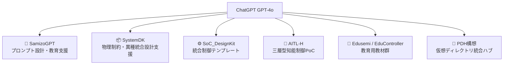

---

# 🤝 OpenAI・技術連携パートナーへのメッセージ
 

---

## 📝 Executive Summary

本構想は、**ChatGPT（GPT-4o）を教育・設計・制御の統合基盤に位置づけ**、  
教材生成、物理制約設計、PoC構築、知能制御アーキテクチャまでを一気通貫で支援する枠組みです。  

**OpenAIにとっての価値**は以下の3点に集約されます：  
- 🎓 **教育応用の拡張**：半導体・制御工学とAI教育の融合事例  
- ⚙️ **産業応用の差別化**：物理設計・PoC実装に直結する新ユースケース  
- 🌍 **国際展開のモデル**：英日対応・MITライセンス教材によるオープン連携  

---

## 🔧 ChatGPT連携プロジェクトの構成

以下は、ChatGPTを核とした主要プロジェクトの体系です：

### 🧠 SamizoGPT — プロンプト設計・生成支援エンジン 
ChatGPTを活用した**教育・設計・構想テンプレートの生成支援フレームワーク**。  
教材生成・設計支援・対話設計を統合的に支援します。

### 📦 SystemDK — ChatGPTによる物理制約設計と異種統合支援  
Edusemi-v4x内の特別編として構成。以下を中心とした物理実装設計を教育的に再現：  
- **SI/PI・熱・応力・EMI/EMC** の多物理連成設計  
- **GAA / AMS / MRAM** を活用した異種ノード統合PoC  
- **PDK → IPDK → PKGDK → SystemDK** への階層連携構造  
- **FEM解析やSパラ評価**をChatGPT連携で支援

### ⚙️ SoC_DesignKit_by_ChatGPT — 統合制御設計テンプレート集 
FSM・PID・LLM制御の統合PoCを実現する**知能制御テンプレート**。  
HDL（Verilog/C）記述はChatGPT APIと連携し、自動生成にも対応可能。

### 🤖 AITL-H — 三層型知能制御アーキテクチャ（PoC実装）
- FSM（本能）＋PID（論理）＋LLM（知性）の三層構造  
- 制御アルゴリズムとAI応用の実践的な統合設計事例

### 📘 Edusemi / EduController — 教育・PoC向けChatGPT組込み教材  
- 半導体・制御分野における**構造教材 × 実装テンプレート × 検証支援**  
- ChatGPT活用による階層的な知識補助・構成補助・教材再構築を実装

### 🧩 PDH（Project Design Hub）構想  
- 教材・設計成果・PoC構成を**仮想ディレクトリ構造**で一元管理  
- ChatGPTが**プロジェクト進行・設計記録・構成ナビゲーション**を支援

---

## 💡 OpenAIとの協働・応用の可能性

| **分野** | **提案内容** |
|----------|--------------|
| 🎓 教育 | ChatGPTを用いた**教育テンプレート・教材生成支援**の共創 |
| 🤖 制御工学 | FSM＋PID＋LLM による**次世代知能制御アーキテクチャ**の共同研究 |
| 📘 実装設計 | **SystemDK構想**に基づく**制約駆動型設計テンプレート**の構築連携 |
| 📦 異種統合PoC | **GAA / AMS / MRAM** を組み合わせた**チップレット統合事例**の教材化と展開 |
| 🔬 SI-PI / EMI-EMC解析 | **FEM / Sパラ / EMI評価** をChatGPTで支援する**設計理解支援モデル**の検討 |
| 🌍 国際連携 | **英日対応 × MITライセンス × 教材テンプレート** による**国際オープン教材連携**の推進 |

---

## ✉️ 技術者・教育者・研究者の皆様へ

本構成にご関心をお持ちの方は、ぜひお気軽にご連絡ください。  
- **共同研究**  
- **教材共創**  
- **国際標準化活動**  

日本語・英語の両方に対応可能です。  

📬 Contact: [shin3t72@gmail.com](mailto:shin3t72@gmail.com)

---

## 🛡️ ライセンスについて

© 2025 Shinichi Samizo — MIT License  
本ページに掲載されている**教材・構成・テンプレート・設計構想**は、  
MITライセンスのもとで**自由に再利用・改変・再配布**いただけます。

---

## 📎 関連リンク

- **Edusemi-v4x**：<https://samizo-aitl.github.io/Edusemi-v4x/>  
- **SystemDK章（特別編 第2a章）**：<https://github.com/Samizo-AITL/Edusemi-v4x/tree/main/f_chapter2a_systemdk>  
- **SamizoGPT**：<https://samizo-aitl.github.io/SamizoGPT/>  
- **AITL-H**：<https://samizo-aitl.github.io/AITL-H/>
