---

# 🎓 Samizo-AITL Portal 

> "Read the structure, create the motion, accelerate with AI" – A portal for learning the fusion of physics and intelligence

**Samizo-AITL Portal** is a personal project by **Shinichi Samizo**,  
aimed at **systematically organizing and connecting fragmented knowledge, technologies, and physical phenomena**  
across the fields of **Semiconductors × Control × AI**.

While today’s AI trend is dominated by tools like **ChatGPT** (conversational AI),  
I believe the next wave will be driven by **“Physical AI”**—AI that is tightly integrated with physical structures and phenomena.

Samizo-AITL is built on both real-world manufacturing experience and structural analysis,  
focusing on **education, PoC (Proof of Concept), and strategy proposals**  
to develop AI that is not just linguistic—but functional, observable, and controllable in physical systems.

---

## 🔗 Official Links

| Language | GitHub Pages 🌐 | GitHub 💻　|
|--------------------|--------------|--------|
| 🇺🇸 English |  |  |
| 🇯🇵 Japanese |  |  |

---

## 🔍 **Projects Overview**

Below is a list of core projects featured in this portal, spanning areas such as education, PoC, AI utilization, and policy strategy.

| Icon | **Project Name** | Domain | Description |
|------|------------------|--------|-------------|
| 🧠 | **[SamizoGPT](https://samizo-aitl.github.io/SamizoGPT/)** 🔗 [GitHub](https://github.com/Samizo-AITL/SamizoGPT) | [🧠 AI] | A curated collection of **prompt engineering templates** and strategies for ChatGPT. (*AI assistance is used in part, but all content structure and responsibility lies with the author.*) |
| 📡 | **[SemiTechBot](https://samizo-aitl.github.io/SamizoGPT_SemiTechBot/)** 🔗 [GitHub](https://github.com/Samizo-AITL/SamizoGPT_SemiTechBot) | [💠 Semiconductor] [🧠 AI] | A **chatbot specialized in semiconductor technical support** based on SamizoGPT. ⚠️ Flask-based bot app is **under development** (UI and integration in progress). |
| 📠| **[Edusemi-v4x](https://samizo-aitl.github.io/Edusemi-v4x/en/)** 🔗 [GitHub](https://github.com/Samizo-AITL/Edusemi-v4x) | [💠 Semiconductor] [📠Education] | A **structured educational material** covering **process, design, and PDK exercises**. |
| ╠| **[Edusemi-Plus](https://samizo-aitl.github.io/Edusemi-Plus/en/)** 🔗 [GitHub](https://github.com/Samizo-AITL/Edusemi-Plus) | [💠 Semiconductor] [🧪 Materials] [🧠 AI] [💰 Investment] [🌠Geopolitics] [🭠Industry] | An **extended educational series** linking **semiconductors to social structure**, covering materials, AI, industry, geopolitics, and investment. |
| ğŸ›ï¸ | **[EduController](https://samizo-aitl.github.io/EduController/en/)** 🔗 [GitHub](https://github.com/Samizo-AITL/EduController) | [ğŸ›ï¸ Control] [🧠 AI] | From **PID control to LLM integration**—an educational resource for **Control × AI**. |
| ⚙️ | **[EduMecha](https://samizo-aitl.github.io/EduMecha/)** 🔗 [GitHub](https://github.com/Samizo-AITL/EduMecha) | [⚙️ Mechanical] | CAD exercises using **Creo**, focusing on **mechanical enclosure design**. ⚠️ CAD files (.prt / .asm) not included due to IP and compatibility reasons. |
| 📠| **[EduLms](https://samizo-aitl.github.io/EduLms/)** 🔗 [GitHub](https://github.com/Samizo-AITL/EduLms) | [📠Education] | LMS-compatible material for **quality, environment, and skills training**. |
| 🤖 | **[AITL-H](https://samizo-aitl.github.io/AITL-H/en/)** 🔗 [GitHub](https://github.com/Samizo-AITL/AITL-H) | [🧠 AI] [ğŸ›ï¸ Control] | A **three-layer intelligent control architecture** based on **FSM × PID × LLM**.  ⚠️ *Under Development* |
| 🖨️ | **[Inkjet](https://samizo-aitl.github.io/Inkjet/)** 🔗 [GitHub](https://github.com/Samizo-AITL/Inkjet) | [🛠 Product Tech] | Archive of **inkjet architecture, drive waveforms, and evaluation data**. |
| 💰 | **[AssetPortfolio](https://samizo-aitl.github.io/AssetPortfolio-StartGuide/)** 🔗 [GitHub](https://github.com/Samizo-AITL/AssetPortfolio-StartGuide) | [💰 Investment] | **Asset management guide for engineers**, using ETFs and NISA. |
| 🮠| **[Rekiden](https://samizo-aitl.github.io/Rekiden/en/)** 🔗 [GitHub](https://github.com/Samizo-AITL/Rekiden) | [🯠History] [🧠 AI] | A **historical simulation platform** using ChatGPT. |
| ğŸ›ï¸ | **[AITL-Strategy-Proposal](https://samizo-aitl.github.io/AITL-Strategy-Proposal/)** 🔗 [GitHub](https://github.com/Samizo-AITL/AITL-Strategy-Proposal) | [📑 Policy Proposal] | A **national strategy proposal** based on **Education × AI × Control**. ⚠️ *This proposal is in Draft v4.0 stage and is under review.* |

---

## 🧠 Background of the AITL Integrated Concept

**Samizo-AITL** organically integrates **Semiconductors × Control × AI**,  
providing a unified framework for **Education, Conception, and Design**  
through the process of **analyzing physical phenomena, validating via PoC, and supporting design with AI**.

> 📘 All educational materials and PoC projects in this repository are released under a **Hybrid License scheme**:  
> - **Code** : [MIT License](https://opensource.org/licenses/MIT)  
>   (Free to use, modify, and redistribute)  
> - **Text materials** : [CC BY 4.0](https://creativecommons.org/licenses/by/4.0/)  
>   (Attribution required)  
> - **Figures & diagrams** : [CC BY-NC 4.0](https://creativecommons.org/licenses/by-nc/4.0/)  
>   (Non-commercial use only)  
> - **External references** : Follow the original license of the source (with proper citation)  
{: .annotation-narrow}

> 💡 The core curriculum, [**Edusemi-v4x**](https://samizo-aitl.github.io/Edusemi-v4x/),  
> is an **educational program reconstructed from the author’s professional experience and research results**.  
> It is not related to any specific products or corporate activities.  
{: .annotation-narrow}

---

## 📘 **Core Educational Resources and PoC Structure**

| Core Material | Description |
|---------------|-------------|
| **[🎓 Edusemi-v4x](https://samizo-aitl.github.io/Edusemi-v4x/en/)** | Comprehensive foundation for learning **semiconductor processes, devices, design, testing, and reliability**. |
| ┗ 📦 **[SystemDK Special Chapter (2a)](https://samizo-aitl.github.io/Edusemi-v4x/f_chapter2a_systemdk/)** | Covers **physical constraints** (SI/PI, thermal, stress, EMI/EMC), and PoC for **GAA / AMS / MRAM** heterogeneous integration. |
| **[ğŸ›ï¸ EduController](https://samizo-aitl.github.io/EduController/en/)** +  **[SoC DesignKit](https://samizo-aitl.github.io/EduController/SoC_DesignKit_by_ChatGPT/)** | Training material for **FSM, PID, and LLM-based control**, along with **HDL templates** (Verilog/C code assisted by AI). |
| **[🤖 AITL-H](https://samizo-aitl.github.io/AITL-H/)** +  **[PoC Manual](https://samizo-aitl.github.io/AITL-H/docs/)** | Full teaching suite for **three-layer intelligent control architecture (FSM × PID × LLM)** as a reproducible PoC. ⚠️ *Under Development* |

---

## 🧩 Integrated Framework of Semiconductors × Control × AI × Educational Materials

```mermaid
flowchart TD
    A[🎓 Edusemi-v4x<br/>Foundational Materials for Semiconductor SoC Design]
        --> B[🎛️ EduController<br/>Control Theory × AI × SoC Design]
        --> C[🤖 AITL-H<br/>Intelligent Control Architecture & PoC]
        --> D[🏛️ AITL-Strategy-Proposal<br/>Integrated Framework of Semiconductors × Control × AI × Educational Materials]

    style A fill:#e6f0ff,stroke:#3366cc,stroke-width:2.5px
    style B fill:#fff7e6,stroke:#ff9900,stroke-width:2.5px
    style C fill:#f0e6ff,stroke:#6633cc,stroke-width:2.5px
    style D fill:#e8fff0,stroke:#2a8f6a,stroke-width:2.5px
```

---

## 🏛️ **Policy, Collaboration, and Global Outreach**

| Item | Description |
|------|-------------|
| ğŸ›ï¸ **[AITL Strategy Proposal](https://samizo-aitl.github.io/AITL-Strategy-Proposal/)** | Mid-to-long term **policy vision** connecting **Education × AI × Control**, including PoC-based curriculum design proposals.  ⚠️ *This proposal is in Draft v4.0 stage and is under review.*|
| 🤝 **[Message to OpenAI](../about/openai-message-en.md)** | Case studies of ChatGPT usage and proposals for international educational integration. |

---

## 📚 **Supplemental Materials and Updates**

| Item | Description |
|------|-------------|
| 🕘 **[Update Log](../about/update-en.md)** | History of updates and structural changes. |
| 🧠 **[ChatGPT Skill Evaluation](../about/chatgpt-skill-eval-en.md)** | LLM skill assessment (Level 5) focused on structural design, memory use, and generation strategies. |
| 📋 **[Gemini Review](../about/gemini-review-en.md)** | Evaluation of this portal by **Google Gemini**. |
| 🌐 **[日本語版（Japanese Version）](../index.md)** | Link to the Japanese version. |

---

## 👤 **Author**

| **Item** | **Details** |
|----------|-------------|
| **Name** | **Shinichi Samizo**  |
| **Education** | **M.S. in Electrical and Electronic Engineering, Shinshu University** |
| **Career** | Former **Engineer at Seiko Epson Corporation** (since 1997)|
| **✉️ Email** |  |
| **🦠X** |  |
| **💻 GitHub** |  |

---

## 📌 **Career Summary**

  
Detailed report of **Shinichi Samizo**'s technical background and expertise:

- **Semiconductor devices** (Logic, Memory, High-voltage mixed-signal)  
- **Thin-film piezo** actuators for inkjet  
- **PrecisionCore printhead** productization, BOM management, ISO education  
- Curriculum design, PoC construction, and AI-assisted design support

---

## 🖼️ **Technology Integration Architecture (Realistic Illustration)**

  

*Illustration: A symbolic vision of “Samizo-AITL” integrating Semiconductors, AI, Control, and Robotics.  
It depicts a future where physical movement, intelligent control (PID), and AI learning converge under human guidance.*

