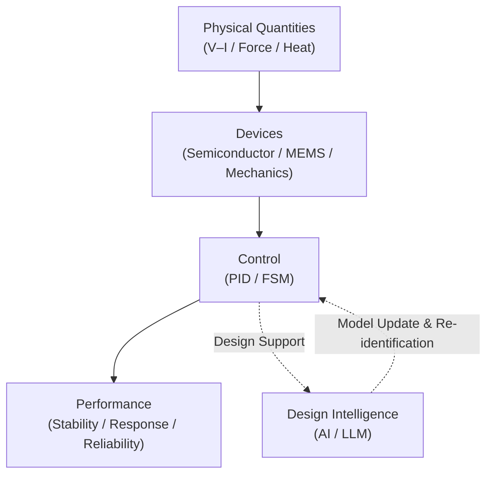

# 🎓 Samizo-AITL Portal
> A personal technical archive that organizes semiconductors, control, and AI through a single unified architecture diagram

  ▶ <a href="/portal/en/">Integrated Architecture Portal</a>　
  ▶ <a href="/zenn-articles/en/">Zenn Articles</a>　
  ▶ <a href="https://github.com/Samizo-AITL">GitHub</a>

Architecture for Integrated Technology Logic

From physical quantities (such as V–I), through devices and control, to AI, 
<strong>this is a technical architecture archive designed to be understood through a single, consistent structural diagram</strong>

  
  

---

## 🧭 Integrated Architecture Diagram (AITL)

All articles, demos, and the Portal on this site correspond to
<strong>either a box or an arrow</strong> in this architecture diagram.

---

## 📚 Articles (Zenn)

<a href="/zenn-articles/en/"
   style="
     display: inline-block;
     padding: 22px 56px;
     font-size: 1.45em;
     font-weight: 900;
     letter-spacing: 0.12em;
     color: #ffffff;
     background: linear-gradient(135deg, #2563eb, #1e40af);
     border-radius: 16px;
     text-decoration: none;
     box-shadow: 0 18px 38px rgba(30,64,175,0.45);
   ">
  ▶ Zenn Article Index
</a>

Each article focuses on 
<strong>a specific component (box) or relationship (arrow)</strong> 
within the integrated architecture diagram above.

---

## 🧩 Portal (Structural Navigation)

The Portal is the <strong>core navigation of Samizo-AITL</strong>. 
Starting from the architecture diagram, it allows you to traverse articles, demos, and design perspectives horizontally.

<a href="/portal/en/"
   style="
     display: inline-block;
     padding: 20px 48px;
     font-size: 1.3em;
     font-weight: 900;
     letter-spacing: 0.10em;
     color: #ffffff;
     background: linear-gradient(135deg, #1e40af, #1e3a8a);
     border-radius: 16px;
     text-decoration: none;
     box-shadow: 0 16px 32px rgba(30,64,175,0.40);
   ">
  ▶ Open Integrated Architecture Portal
</a>

  

    <strong>Global Architecture Map</strong> 
    
      A bird’s-eye view of the entire structure from physical quantities (V–I) to AI
    
  

  

    <strong>Control Hierarchy (PID / FSM)</strong> 
    
      Organization and positioning of models and control structures
    
  

  

    <strong>AI Integration & Structural Demos</strong> 
    
      How redesign and intelligence are embedded within the architecture
    
  

---

## 🔍 Search Queries (Observed in Google Search Console)

This section records <strong>actual search queries</strong> 
that generated impressions in Google Search Console.

<!--
Operation rules:
- Copy directly from Search Console → Performance → Queries
- Update once per month
- Do not include queries with zero impressions
- No curation, no rewriting
-->

| Query | Impressions | Clicks | Avg. Position |
|-------|-------------|--------|---------------|
| (example) control system architecture diagram | 12 | 1 | 18.4 |
| (example) PID FSM AI structure | 7 | 0 | 22.1 |
| (example) V-I based control design | 5 | 1 | 15.9 |

Note: This is not a curated keyword list, 
but raw search queries observed by Google.

