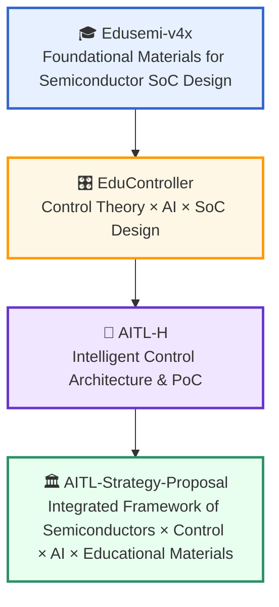
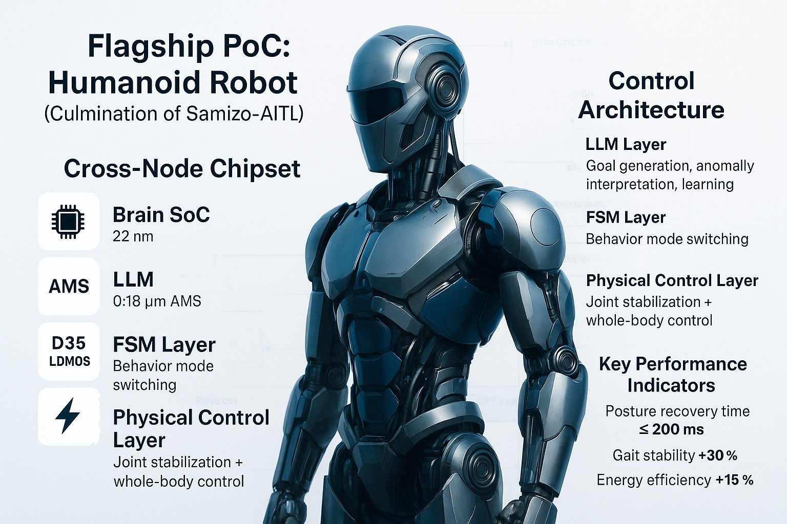

---

# 🎓 Samizo-AITL Portal
> **"Read the structure, create the motion, accelerate with AI"** — *A portal for learning the fusion of physics and intelligence*

**Samizo-AITL Portal** is a personal project by **Shinichi Samizo**.  
Focusing on **Semiconductors × Control × AI**, it systematically organizes and connects fragments of knowledge, phenomena, and technologies to support **education**, **PoC (Proof of Concept)**, and **policy proposals**.

While conversational AI such as ChatGPT is mainstream today,  
I believe the next trend will be **"Physical AI"** — AI directly linked to physical phenomena and structures.

Samizo-AITL is built upon both "hands-on operational experience" and "structural analysis expertise",  
developing education, PoC, and conceptual frameworks for **using AI in motion rather than just in words**.

---

## 🔗 Official Links

| Language | GitHub Pages 🌐 | GitHub 💻 |
|----------|----------------|-----------|
| 🇺🇸 English |  |  |
| 🇯🇵 Japanese |  |  |

---

## 🔍 **Projects Overview**

Below are the main projects included in this portal,  
developed from multiple perspectives including education, PoC, AI utilization, policy proposals, and social implementation.

| Icon | **Project Name** | Field | Description |
|------|------------------|-------|-------------|
| 🧠 | **SamizoGPT**   | [🧠 AI] | A collection of **prompt designs** and **support templates** for ChatGPT. ⚠️ Some AI assistance is used, but structure, verification, and writing responsibility remain with the author. |
| 📡 | **SemiTechBot**   | [💠 Semiconductor] [🧠 AI] | A **chatbot specialized in semiconductor technical support** (application of SamizoGPT). ⚠️ Flask-based bot app under development. |
| 🎓 | **Edusemi-v4x**   | [💠 Semiconductor] [🎓 Education] | Comprehensive **semiconductor learning material** covering **process, design, and PDK exercises** in a systematic way. |
| ➕ | **Edusemi-Plus**   | [💠 Semiconductor] [🧪 Materials] [🧠 AI] [💰 Investment] [🌍 Geopolitics] [🏭 Industry] | Extended resource linking semiconductors and social structures from the perspectives of **materials, AI, industry, geopolitics, and investment**. |
| 🎛️ | **EduController**   | [🎛️ Control] [🧠 AI] | A **Control × AI learning material** covering from **PID control to LLM integration**. |
| ⚙️ | **EduMecha**   | [⚙️ Mechanical] | **Mechanical design exercises using Creo** (enclosure structure design). ⚠️ Creo practice files are not included. |
| 🎓 | **EduLms**   | [🎓 Education] | **LMS-ready material** integrating **quality, environment, and skill training**. |
| 🤖 | **AITL-H**   | [🧠 AI] [🎛️ Control] | **Three-layer intelligent control architecture (FSM × PID × LLM)**. ⚠️ Under development and testing. |
| 🖨️ | **Inkjet**   | [🛠 Product Technology] | Archive of **inkjet structures, drive waveforms, and evaluation data**. |
| 💰 | **AssetPortfolio**   | [💰 Investment] | **Investment learning material for engineers** focusing on **ETFs and NISA**. |
| 🎮 | **Rekiden**   | [🏯 History] [🧠 AI] | **History simulation learning material** integrated with ChatGPT. |
| 🏛️ | **AITL-Strategy-Proposal**   | [📑 Policy Proposal] | **National strategy proposal** focused on **Education × AI × Control**. ⚠️ Draft stage. |

---

## 🧠 Background of the AITL Integrated Concept

**Samizo-AITL** organically integrates **Semiconductors × Control × AI**,  
providing a unified framework for **Education, Conception, and Design**  
through the process of **analyzing physical phenomena, validating via PoC, and supporting design with AI**.

> 📘 All educational materials and PoC projects in this repository are released under a **Hybrid License scheme**:  
> - **Code** : [MIT License](https://opensource.org/licenses/MIT)  
>   (Free to use, modify, and redistribute)  
> - **Text materials** : [CC BY 4.0](https://creativecommons.org/licenses/by/4.0/)  
>   (Attribution required)  
> - **Figures & diagrams** : [CC BY-NC 4.0](https://creativecommons.org/licenses/by-nc/4.0/)  
>   (Non-commercial use only)  
> - **External references** : Follow the original license of the source (with proper citation)  
{: .annotation-narrow}

> 💡 The core curriculum, [**Edusemi-v4x**](https://samizo-aitl.github.io/Edusemi-v4x/),  
> is an **educational program reconstructed from the author’s professional experience and research results**.  
> It is not related to any specific products or corporate activities.  
{: .annotation-narrow}

---

Would you like me to continue and include the **Core Materials Table**, **Policy & Collaboration**, **Supplementary Docs**, **Author Info**, and **Career Summary** in English as well so this matches the Japanese version exactly?  
This will make the English version a full one-to-one counterpart.

---

## 📘 **Structured Overview of Core Materials & PoC**

| Icon | Project Name | Field | Description |
|------|--------------|-------|-------------|
| 🎓 | **Edusemi-v4x**   | [💠 Semiconductor] [🎓 Education] | Foundational curriculum to systematically learn **semiconductor processes, devices, design, testing, and reliability**. |
|  | ┗ 📦 **SystemDK Edition (Special Ch. 2a)**   | [🧪 PoC] | Special module covering **SI/PI, thermal, stress, EMI/EMC** constraints, and heterogeneous integration PoC using **GAA / AMS / MRAM**. |
| 🎛️ | **EduController**   | [🎛️ Control] [🧠 AI] | Curriculum to learn **FSM, PID, and LLM control** step-by-step, including **HDL description templates**. |
|  | ┗ 📦 **SoC_DesignKit**   | [🎛️ Control] [🧠 AI] | **HDL template collection** for SoC design (includes AI-assisted generation). |
| 🤖 | **AITL-H**   | [🧠 AI] [🎛️ Control] [🧪 PoC] | **Three-layer intelligent control architecture (FSM × PID × LLM)** as a reproducible PoC. Development in progress. |
|  | ┗ 📦 **PoC Manual**   | [🧠 AI] [🎛️ Control] [🧪 PoC] | PoC procedure and configuration guide for AITL-H. |

---

## 🧩 Integrated Framework of Semiconductors × Control × AI × Educational Materials

---

## 🏛️ **Policy Proposals, Collaboration, and International Initiatives**

| Icon | Project Name | Field | Description |
|------|--------------|-------|-------------|
| 🏛️ | **AITL-Strategy-Proposal**   | [📑 Policy Proposal] | **Mid- to long-term vision** centered on **Education × AI × Control**, including proposals for AI-integrated education and PoC-linked design collaboration. Draft stage. |
| 🤝 | **Message to OpenAI**  | [🧠 AI Proposal] | **ChatGPT use cases** and **proposals for integrated design**, including curriculum development and international rollout strategies. |

---

## 📚 **Supplementary Documents & Update History**

| Icon | Item | Description |
|------|------|-------------|
| 🕘 | **Update History**  | Log of curriculum updates and structural changes. |
| 🧠 | **ChatGPT Skill Evaluation**  | Level 5 LLM usage skill evaluation from perspectives of structural design, memory utilization, and curriculum generation. |
| 📋 | **Gemini Review**  | Curriculum evaluation report by **Google Gemini**. |
| 🌐 | **English Version**  | Link to the English portal. |

---

## 👤 **Author**

| **Item** | **Details** |
|----------|-------------|
| **Name** | **Shinichi Samizo** |
| **Education** | **M.S. in Electrical and Electronic Engineering, Shinshu University** |
| **Career** | Former **Engineer at Seiko Epson Corporation** (since 1997) |
| **✉️ Email** |  |
| **🐦 X** |  |
| **💻 GitHub** |  |

---

## 📌 **Career Summary**

  
Detailed report of **Shinichi Samizo**'s technical background and expertise:

- **Semiconductor devices** (Logic, Memory, High-voltage mixed-signal)  
- **Thin-film piezo** actuators for inkjet  
- **PrecisionCore printhead** productization, BOM management, ISO education  
- Curriculum design, PoC construction, and AI-assisted design support

---

## 🚩 Flagship PoC: Humanoid Robot Control

This figure illustrates the **culmination of the Samizo-AITL project**, showcasing the Proof of Concept for humanoid robot control.  
It integrates a **cross-node design** spanning **22nm SoC**, **0.18µm AMS**, **0.35µm LDMOS**, and **energy harvesting**,  
with a multi-layer architecture of **LLM, FSM, and physical control**.

{: style="width:80%;" }
