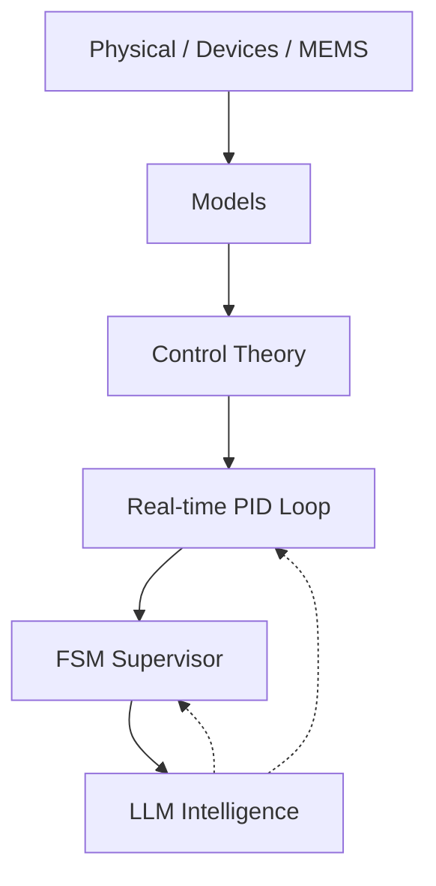

# 🎓 Samizo-AITL Portal  
> **A physical-first framework that connects devices, control, and intelligence  
> through a single coherent causal structure**  
> *A design-oriented technical archive for engineers and researchers.*

[](https://github.com/Samizo-AITL)
[](https://zenn.dev/samizo_aitl)


## 🌐 Language
[](https://samizo-aitl.github.io/)
[](https://samizo-aitl.github.io/en/)

---

## ▶ For First-Time Visitors (Overview)

A short slide deck summarizing  
the **design philosophy and overall concept of Samizo-AITL**.

**We recommend starting here.**

▶ [Start here (Overview slides)](https://samizo-aitl.github.io/about/marp/en/samizo-aitl-presentation.html)

---

## 🚀 What This Portal Provides

**Samizo-AITL** is not a collection of isolated tutorials.  
It is a **structural archive** that enables you to:

- Understand engineering systems **from physical constraints upward**
- Connect **devices → models → control → intelligence** without breaking causality
- Reconstruct **design decisions**, not just implementations
- Reuse architectural thinking across **education, PoC, and real design work**

This portal is built for engineers who need  
**structure, not abstraction shortcuts**.

---

## 🎯 Intended Audience

This portal is designed for engineers and researchers who:

- Start system design **from physical models and constraints**
- Treat control theory as a **first-class design element**
- Use AI / LLMs as **supervisory and analytical layers**, not black-box controllers
- Need **cross-domain understanding without collapsing physical meaning**

⚠️ This is **not an introductory tutorial site**.  
It is a **reference archive for design-oriented engineering work**.

---

## 🧭 What Is Samizo-AITL?

The **Samizo-AITL Portal**, created by **Shinichi Samizo**, reorganizes  
semiconductor devices, MEMS, and control engineering around a  
**shared physical-first design philosophy**.

Instead of explaining technologies in isolation,  
systems are presented through a **single causal chain**:

**Physics → Structure → Devices → Process → Models → Systems → Control → Intelligence**

This approach allows readers to follow *why* design decisions exist,  
not just *how* to implement them.

---

## 🧩 AITL Structure Map


> **Figure:**  
> Samizo-AITL technical architecture integrating  
> *physics → control → intelligence*  
> across DevEnv, CodeGen, Docs, and Archives layers.



### Architectural Positioning

- **Inner layers**: Physics, devices, MEMS (constraint-defining layers)  
- **Middle layers**: Modeling and classical control theory  
- **Outer layers**: Intelligence, supervision, and redesign  

This layered concept is referred to as  
**AITL — Adaptive Intelligent Technology Loop**.

LLMs are explicitly placed **outside the real-time control loop**,  
supporting diagnosis, analysis, and redesign.

---

## 🗂 Directory Overview (Structural Map)

> **The directory structure itself represents the design philosophy.**

```text
Samizo-AITL/
├─ 01_DevEnv/        Environment & reproducibility
│   └─ VSCode / Python / Toolchain
│
├─ 02_CodeGen/       Implementation, control, and generation
│   ├─ PID           Real-time control (stability, V–I control)
│   ├─ FSM           State transitions and supervisory logic
│   └─ LLM           Supervision and redesign (non–real-time)
│
├─ 03_Docs/          Documentation, education, design philosophy
│   ├─ Edusemi-v4x
│   ├─ EduController
│   └─ Edusemi-Plus
│
└─ 04_Archives/      PoCs, history, and technical assets
```

**Recommended entry order**:  
**Architecture → Physics → Control → Intelligence**

---

## 🗺 How to Navigate This Portal

1. **Architecture & philosophy**  
   → Physical-first engineering and AITL concepts  
2. **Main Core (physical foundations)**  
   → Semiconductor devices, MEMS, physical constraints  
3. **Applied Layer (control & intelligence)**  
   → PID, FSM, and LLM roles  
4. **Proof-of-concept implementations**  
   → Verification through working systems  

This order avoids tool-driven or fragmented understanding.

---

## 📝 Essays / Design Philosophy (Zenn)

**Essays on design philosophy, physical-first engineering, and the AITL architecture are published on Zenn.**

[](https://zenn.dev/samizo_aitl)

---

# 💠 Main Core — Foundational Repositories
The Main Core forms a **coherent technical backbone**  
covering semiconductor technology from physics to system-level constraints.

---

## 1️⃣ Edusemi-v4x
A **systematic curriculum** covering semiconductor devices and processes:

- Device structures and operating physics  
- Process integration flows  
- Compact models and PDK concepts  
- Circuit-level fundamentals  
- SystemDK-based physical constraints  
  (thermal, stress, SI/PI, EMI)

[](https://samizo-aitl.github.io/Edusemi-v4x/)
[](https://github.com/Samizo-AITL/Edusemi-v4x)

---

## 2️⃣ SemiDevKit
An **implementation-oriented development kit** bridging theory and practice:

- Poisson / Drift–Diffusion solvers  
- BSIM4 compact modeling  
- SPICE simulation  
- NBTI / HCI reliability analysis  
- Physical layout using OpenLane-Lite  

[](https://samizo-aitl.github.io/SemiDevKit/)
[](https://github.com/Samizo-AITL/SemiDevKit)

---

## 3️⃣ Edusemi-Plus
Extended materials connecting semiconductor fundamentals with surrounding domains:

- Advanced materials (SiC, GaN)  
- Manufacturing equipment and fabs  
- Packaging and system integration  
- Supply chains and industrial structures  

[](https://samizo-aitl.github.io/Edusemi-Plus/)
[](https://github.com/Samizo-AITL/Edusemi-Plus)

---

# 🎛 Applied Layer — Control & Intelligence

This layer explores how physical foundations are applied to  
**dynamic systems and control problems**.

Classical control (PID, FSM) remains the **primary control mechanism**,  
while AI/LLMs are treated as **architectural support tools**, not replacements.

---

## ▶ Control Playground (Time Response Demo)

This demo visualizes the **time response of a fixed-gain PID controller**
under **colored, adversarial disturbances**.

- No sliders  
- No tuning  
- Only **y(t), setpoint(t), and disturbance(t)** are shown  

<iframe
  src="https://samizo-aitl.github.io/control-playground/"
  style="width:100%; height:420px; border:none;">
</iframe>

> Control performance is not explained by words.  
> **The waveform tells the whole story.**

---

## 4️⃣ EduController
An educational resource focused on **control fundamentals**:

- PID control principles  
- FSM-based supervisory logic  
- Control-oriented design thinking  
- Optional HDL template generation  

[](https://samizo-aitl.github.io/EduController/)
[](https://github.com/Samizo-AITL/EduController)

---

## 5️⃣ AITL-Controller-A-Type
A **minimal experimental controller** implemented in Python to explore:

- Separation of control (PID)  
- Supervision and decision logic (FSM)  
- Redesign and analysis support (LLM)

This project is a **thinking framework**,  
not a proposal for a new control algorithm.

[](https://samizo-aitl.github.io/aitl-controller-a-type/)
[](https://github.com/Samizo-AITL/aitl-controller-a-type)

---

## 6️⃣ V–I Control ASIC on SKY130
A **hands-on educational control ASIC** demonstrating a complete flow from  
**control theory to silicon** using **PID + FSM**.

- Deterministic digital V–I control  
- Fixed-point PID with explicit saturation  
- FSM-based safety supervision  
- Full RTL → GDS flow on OpenLane + SKY130  

[](https://samizo-aitl.github.io/vi-control-asic-sky130/)
[](https://github.com/Samizo-AITL/vi-control-asic-sky130)

---

# ⚙️ MEMS — Where Abstraction Meets Reality

A boundary domain where  
**abstract models are tested against real physical structures**,  
revealing the limits of simplification.

---

## 7️⃣ mems-ana
**Pre-FEM MEMS structural exploration tool**

[](https://samizo-aitl.github.io/mems-ana/)
[](https://github.com/Samizo-AITL/mems-ana)

---

## 8️⃣ Inkjet Printing — Design Trade-off Models
Minimal models visualizing trade-offs between:

- Print quality  
- Throughput  
- Dot behavior  

through **simple Python simulations**,  
serving as a domain-specific example of physical trade-offs.

[](https://samizo-aitl.github.io/inkjet-dts/)
[](https://github.com/Samizo-AITL/inkjet-dts)

---

# 🎞 AITL Animation Demos
Experimental animation demos visualizing  
**AITL concepts and layered control structures**.

[](https://samizo-aitl.github.io/aitl-animation-demos/)

---

# 🕘 Update Log
Chronological record of site and repository updates.

[📄 View update history](https://samizo-aitl.github.io/about/update/en/)

---

# 👤 Author

**Shinichi Samizo**  
Independent Semiconductor Researcher  

- GitHub: [https://github.com/Samizo-AITL](https://github.com/Samizo-AITL)
- Zenn: [https://zenn.dev/samizo_aitl](https://zenn.dev/samizo_aitl)
- Career Summary: [https://samizo-aitl.github.io/about/career-summary/en/](https://samizo-aitl.github.io/about/career-summary/en/)

---

# 💬 Technical Discussion / Consultation

[](https://github.com/Samizo-AITL/Samizo-AITL.github.io/discussions)

> This portal does not provide private contact channels  
> (e-mail, social media, or direct messages).
>
> All technical questions, discussions, and consultation inquiries  
> are handled **publicly via GitHub Discussions**,  
> with an emphasis on reproducibility and design context.
