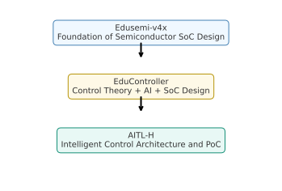
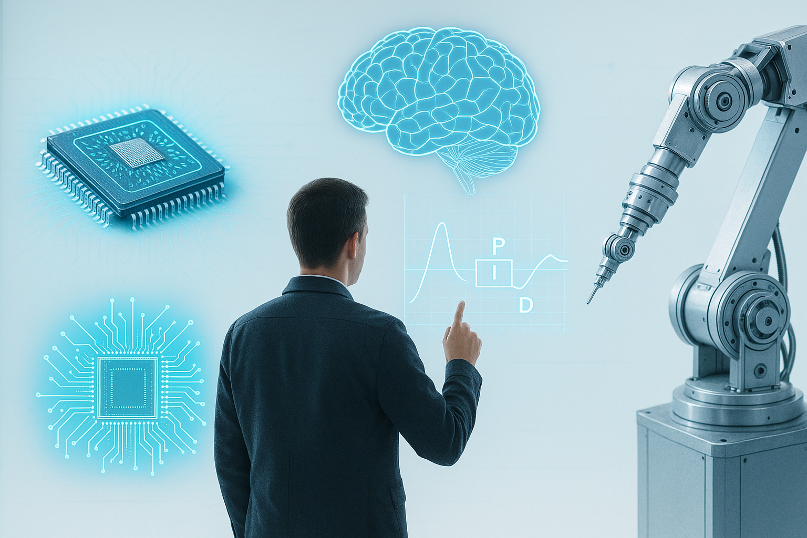

---

# 🎓 Samizo-AITL Portal
> **"Read the structure, create the motion, accelerate with AI"** — *A portal for learning the fusion of physics and intelligence*

**Samizo-AITL Portal** is a personal project by **Shinichi Samizo**.  
Focusing on **Semiconductors × Control × AI**, it systematically organizes and connects fragments of knowledge, phenomena, and technologies to support **education**, **PoC (Proof of Concept)**, and **policy proposals**.

While conversational AI such as ChatGPT is mainstream today,  
I believe the next trend will be **"Physical AI"** — AI directly linked to physical phenomena and structures.

Samizo-AITL is built upon both "hands-on operational experience" and "structural analysis expertise",  
developing education, PoC, and conceptual frameworks for **using AI in motion rather than just in words**.

---

## 🔗 Official Links

| Language | GitHub Pages 🌐 | GitHub 💻 |
|----------|----------------|-----------|
| 🇺🇸 English |  |  |
| 🇯🇵 Japanese |  |  |

---

## 🔍 **Projects Overview**

Below are the main projects included in this portal,  
developed from multiple perspectives including education, PoC, AI utilization, policy proposals, and social implementation.

| Icon | **Project Name** | Field | Description |
|------|------------------|-------|-------------|
| 🧠 | **SamizoGPT**   | [🧠 AI] | Collection of **prompt designs** and **support templates** for ChatGPT (AI assistance used in part, but all structure, verification, and writing responsibility is with the author). |
| 📡 | **SemiTechBot**   | [💠 Semiconductor] [🧠 AI] | **Chatbot specialized in semiconductor technology** (based on SamizoGPT). Flask-based bot app is under development. |
| 🎓 | **Edusemi-v4x**   | [💠 Semiconductor] [🎓 Education] | Comprehensive **semiconductor process, design, and PDK training** curriculum. |
| ➕ | **Edusemi-Plus**   | [💠 Semiconductor] [🧪 Materials] [🧠 AI] [💰 Investment] [🌍 Geopolitics] [🏭 Industry] | Extended curriculum linking semiconductors to society through perspectives of **materials, AI, industry, geopolitics, and investment**. |
| 🎛️ | **EduController**   | [🎛️ Control] [🧠 AI] | Education on **PID control to LLM integration** for control × AI applications. |
| ⚙️ | **EduMecha**   | [⚙️ Mechanical] | **Mechanical design exercises using Creo** (structural design). |
| 🎓 | **EduLms**   | [🎓 Education] | **LMS-compatible curriculum** integrating quality, environment, and skill training. |
| 🤖 | **AITL-H**   | [🧠 AI] [🎛️ Control] | **Three-layer intelligent control architecture (FSM × PID × LLM)** — PoC in development. |
| 🖨️ | **Inkjet**   | [🛠 Product Technology] | Archive of **inkjet structures, drive waveforms, and evaluation data**. |
| 💰 | **AssetPortfolio**   | [💰 Investment] | **Asset management curriculum** for engineers, covering ETFs and NISA. |
| 🎮 | **Rekiden**   | [🏯 History] [🧠 AI] | **History simulation curriculum** integrated with ChatGPT. |
| 🏛️ | **AITL-Strategy-Proposal**   | [📑 Policy Proposal] | **National strategy proposal** focusing on **Education × AI × Control** (Draft stage). |

---

## 🧠 **Background of the AITL Integrated Concept**

**Samizo-AITL** organically connects **Semiconductors × Control × AI**,  
integrating the process of **analyzing physical structures, validating through PoC, and supporting design with AI** into education, concept development, and engineering.

> 📘 All materials and PoC examples in this project group are released under the **MIT License**. While AI tools such as ChatGPT are used as assistants, the overall structure, verification, and writing responsibility lie entirely with the author.  
{: .annotation-narrow}

> 💡 The core curriculum [**Edusemi-v4x**](https://samizo-aitl.github.io/Edusemi-v4x/en/) is reconstructed from the author's professional experience and research, and is unrelated to any specific commercial product or company activity.  
{: .annotation-narrow}

---

Would you like me to continue and include the **Core Materials Table**, **Policy & Collaboration**, **Supplementary Docs**, **Author Info**, and **Career Summary** in English as well so this matches the Japanese version exactly?  
This will make the English version a full one-to-one counterpart.

---

## 📘 **Structured Overview of Core Materials & PoC**

| Icon | Project Name | Field | Description |
|------|--------------|-------|-------------|
| 🎓 | **Edusemi-v4x**   | [💠 Semiconductor] [🎓 Education] | Foundational curriculum to systematically learn **semiconductor processes, devices, design, testing, and reliability**. |
|  | ┗ 📦 **SystemDK Edition (Special Ch. 2a)**   | [🧪 PoC] | Special module covering **SI/PI, thermal, stress, EMI/EMC** constraints, and heterogeneous integration PoC using **GAA / AMS / MRAM**. |
| 🎛️ | **EduController**   | [🎛️ Control] [🧠 AI] | Curriculum to learn **FSM, PID, and LLM control** step-by-step, including **HDL description templates**. |
|  | ┗ 📦 **SoC_DesignKit**   | [🎛️ Control] [🧠 AI] | **HDL template collection** for SoC design (includes AI-assisted generation). |
| 🤖 | **AITL-H**   | [🧠 AI] [🎛️ Control] [🧪 PoC] | **Three-layer intelligent control architecture (FSM × PID × LLM)** as a reproducible PoC. Development in progress. |
|  | ┗ 📦 **PoC Manual**   | [🧠 AI] [🎛️ Control] [🧪 PoC] | PoC procedure and configuration guide for AITL-H. |

  
  
<em><strong>
    Integrating semiconductors, control, and AI into a three-layer educational system for implementation and evaluation of intelligent control applications.
  </strong></em>

---

## 🏛️ **Policy Proposals, Collaboration, and International Initiatives**

| Icon | Project Name | Field | Description |
|------|--------------|-------|-------------|
| 🏛️ | **AITL-Strategy-Proposal**   | [📑 Policy Proposal] | **Mid- to long-term vision** centered on **Education × AI × Control**, including proposals for AI-integrated education and PoC-linked design collaboration. Draft stage. |
| 🤝 | **Message to OpenAI**  | [🧠 AI Proposal] | **ChatGPT use cases** and **proposals for integrated design**, including curriculum development and international rollout strategies. |

---

## 📚 **Supplementary Documents & Update History**

| Icon | Item | Description |
|------|------|-------------|
| 🕘 | **Update History**  | Log of curriculum updates and structural changes. |
| 🧠 | **ChatGPT Skill Evaluation**  | Level 5 LLM usage skill evaluation from perspectives of structural design, memory utilization, and curriculum generation. |
| 📋 | **Gemini Review**  | Curriculum evaluation report by **Google Gemini**. |
| 🌐 | **English Version**  | Link to the English portal. |

---

## 👤 **Author**

|  |  |
|--|--|
| **Name** | Shinichi Samizo |
| **Education** | M.S. in Electrical and Electronic Engineering, Shinshu University Graduate School |
| **Career** | Former Engineer at Seiko Epson Corporation (1997–) |
| **Contact** | ✉️ [Email](mailto:shin3t72@gmail.com) / 🐦 [X](https://x.com/shin3t72) / 💻 [GitHub](https://samizo-aitl.github.io/) |

---

## 📌 **Career Summary**

  
Detailed report of **Shinichi Samizo**'s technical background and expertise:

- Semiconductor devices (Logic, Memory, High-voltage mixed-signal)  
- Thin-film piezo actuators for inkjet  
- PrecisionCore printhead productization, BOM management, ISO education  
- Curriculum design, PoC construction, and AI-assisted design support

---

## 🖼️ **Technology Integration Architecture (Realistic Version)**

  

*Figure: Conceptual realistic illustration of "Samizo-AITL" integrating semiconductors, AI, control, and robotics. It depicts a future where intelligent control (PID) directed by humans integrates with AI learning to fuse with robotic and circuit control.*
