# 🎓 Samizo-AITL Portal

Architecture for Integrated Technology Logic

From physical quantities (such as V–I), through devices and control, to AI, 
<strong>a technical archive that connects system design using a single structural diagram</strong>

  
  

---

## 🧭 Structure Diagram

```mermaid
flowchart TD
    P["Physical Quantities<br>(V–I / Force / Heat)"]
    D["Devices<br>(Semiconductors / MEMS / Mechanisms)"]
    C["Control<br>(PID / FSM)"]
    A["Design Intelligence<br>(AI / LLM)"]
    S["Performance<br>(Stability / Response / Reliability)"]

    P --> D
    D --> C
    C --> S
    C -. Redesign Support .-> A
    A -. Model Update / Re-identification .-> C
```

Articles and demos here each focus on a single element (box) or connection (arrow) in this diagram.

---

## 📚 Articles

<a href="/en/zenn-articles/"
   style="
     display: inline-block;
     padding: 22px 54px;
     font-size: 1.4em;
     font-weight: 900;
     letter-spacing: 0.10em;
     color: #ffffff;
     background: linear-gradient(135deg, #2563eb, #1e40af);
     border-radius: 16px;
     text-decoration: none;
     box-shadow: 0 18px 38px rgba(30,64,175,0.45);
   ">
  ▶ Zenn Articles
</a>

Each article describes a <strong>specific box or arrow</strong> 
from the structure diagram above.

---

## 🧩 Portal (Structural View)

<a href="/en/portal/"
   style="
     display: inline-block;
     padding: 18px 44px;
     font-size: 1.25em;
     font-weight: 800;
     letter-spacing: 0.08em;
     color: #1e40af;
     background: #ffffff;
     border: 3px solid #1e40af;
     border-radius: 14px;
     text-decoration: none;
   ">
  ▶ Open Portal
</a>

  

    Overall Structure Map
  

  

    Control Layers (PID / FSM)
  

  

    AI-Integrated Structural Demos
  

