# 🎓 Samizo-AITL Portal
**A physical-first engineering archive  
that connects physics, devices, control, and intelligence  
through explicit causal structure.**

---

## 🧭 What this is
**AITL (Architecture for Integrated Technology Logic)** is a framework for organizing  
engineering knowledge as **causal relationships** linking  
physical quantities, device behavior, control logic, and system performance.

```mermaid
flowchart TD
    P["Physical quantities<br>(V–I, force, heat, etc.)"]
    D["Devices<br>(semiconductors / MEMS / mechanisms)"]
    C["Control<br>(PID / FSM)"]
    A["Design intelligence<br>(AI / LLM)"]
    S["Performance<br>(stability / reliability)"]

    P --> D
    D --> C
    C --> S
    C -. redesign support .-> A
    A -. model update / re-identification .-> C
```

Rather than presenting isolated methods,  
this portal focuses on **how design decisions arise from physical constraints**  
and how those decisions propagate through control and system architecture.

---

## ⚡ 60-second orientation
If this is your first visit, start here.

  <a href="/portal/en/"
     style="
       display: inline-block;
       padding: 18px 36px;
       font-size: 1.2em;
       font-weight: 700;
       letter-spacing: 0.05em;
       color: #fff;
       background: linear-gradient(135deg, #2563eb, #1e40af);
       border-radius: 10px;
       text-decoration: none;
       box-shadow: 0 8px 20px rgba(30,64,175,0.35);
       transition: transform 0.15s ease, box-shadow 0.15s ease;
     "
     onmouseover="this.style.transform='translateY(-2px)';this.style.boxShadow='0 12px 28px rgba(30,64,175,0.45)';"
     onmouseout="this.style.transform='none';this.style.boxShadow='0 8px 20px rgba(30,64,175,0.35)';"
  >
    ▶ PORTAL
  </a>

| Topic | Link | Note |
|---|---|---|
| **Architecture overview (Portal)** | [/portal/en/](https://samizo-aitl.github.io/portal/en/) | AITL overview |
| **Semiconductor / device-oriented path** | [/Edusemi-v4x/en/](https://samizo-aitl.github.io/Edusemi-v4x/en/) | Physics → process → device |
| **Control / AI-oriented path** | [/EduController/en/](https://samizo-aitl.github.io/EduController/en/) | PID / FSM / AI roles |

---

## 🧠 Design structure
AITL organizes control and intelligence by role.

| Layer | Role | Responsibility |
|---|---|---|
| **PID** | Real-time control | Stability, response, disturbance rejection |
| **FSM** | Supervisory logic | Mode selection, state transitions, safety |
| **AI / LLM** | Non-real-time support | Model updates, gain re-ID, rule refinement |

AI is treated as a **design support layer**,  
not as a replacement for deterministic control loops.

---

## 👤 Intended audience
- Engineers working with physics-based systems  
  (semiconductors, MEMS, control, AI)
- Those interested in **design rationale and causal explanation**
- Readers looking to organize engineering knowledge across domains
