# 🎓 Samizo-AITL Portal

Architecture for Integrated Technology Logic

<strong>A physical-first engineering archive</strong> 
that integrates <strong>physics, devices, control, and intelligence</strong> 
as an explicit <strong>causal structure</strong>.

  
  

---

## 🧭 What is AITL?

**AITL (Architecture for Integrated Technology Logic)** is a framework for organizing  
engineering knowledge as **causal relationships**:

Physical quantities → Devices → Control → Intelligence → Performance

Rather than presenting isolated methods or tools,  
AITL focuses on **how design decisions emerge from physical constraints**  
and how those decisions propagate through control and system architecture.

```mermaid
flowchart TD
    P["Physical quantities<br>(V–I / force / heat)"]
    D["Devices<br>(semiconductors / MEMS / mechanisms)"]
    C["Control<br>(PID / FSM)"]
    A["Design intelligence<br>(AI / LLM)"]
    S["Performance<br>(stability / reliability)"]

    P --> D
    D --> C
    C --> S
    C -. redesign support .-> A
    A -. model update / re-identification .-> C
```

---

## ▶ Step 1 — Read the design philosophy

Understand the design rationale and causal thinking

<a href="/zenn-articles/en/"
   style="
     display: inline-block;
     padding: 22px 54px;
     font-size: 1.45em;
     font-weight: 900;
     letter-spacing: 0.10em;
     color: #ffffff;
     background: linear-gradient(135deg, #2563eb, #1e40af);
     border-radius: 16px;
     text-decoration: none;
     box-shadow: 0 18px 38px rgba(30,64,175,0.45);
   ">
  ▶ Zenn Articles
</a>

Design philosophy, causal structure, and decision criteria of AITL 
are documented <strong>as long-form articles on Zenn</strong>.

---

## ▶ Step 2 — Experience the structure visually

Portal — Visual Architecture Archive

Explore the overall structure, causal layers, and design boundaries of AITL 
through <strong>diagrams, animations, and interactive demos</strong>.

  <a href="/portal/en/"
     style="
       display: inline-block;
       padding: 18px 44px;
       font-size: 1.25em;
       font-weight: 800;
       letter-spacing: 0.08em;
       color: #1e40af;
       background: #ffffff;
       border: 3px solid #1e40af;
       border-radius: 14px;
       text-decoration: none;
     ">
    ▶ Open the Portal
  </a>

  

    System-level architecture diagrams
  

  

    Control hierarchy (PID × FSM × AI)
  

  

    Animations and demos
  

---

## 🔐 Positioning (SSOT)

The Samizo-AITL Portal is **not intended as a simplified tutorial site**.

It serves as my personal  
<strong>Single Source of Truth (SSOT)</strong> —  
an archive that preserves design assumptions, reasoning processes,  
and causal structures without abstraction or simplification.

Readability is secondary to **architectural transparency**.

---

## 👤 Intended audience

- Engineers working with physics-based systems  
  (semiconductors, MEMS, control, AI)
- Readers interested in **design rationale and causal explanation**
- Those organizing engineering knowledge across multiple domains

---

> **AITL is not a control method.**  
> **It is a structure for explaining and evolving design.**
