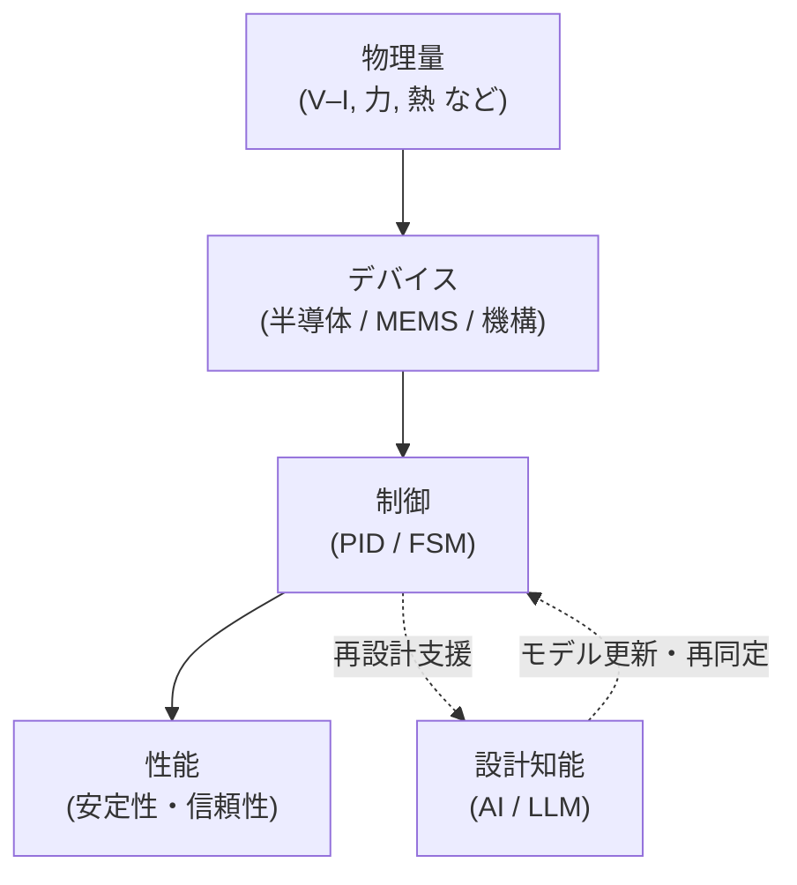

# 🎓 Samizo-AITL Portal

**物理を起点とした設計から出発し、  
デバイス・制御・AI を因果構造として整理する設計アーカイブ**

---

## 🧭 これは何か

**AITL（Architecture for Integrated Technology Logic）** は、

**物理量 → デバイス → 制御 → AI → 性能**

という関係を、  
**設計判断と説明に使える「因果構造」**として整理するための枠組みです。

個別技術の解説ではなく、

- どの要素が  
- どこに効き  
- なぜその設計が成立しているか  

を **構造として扱う** ことを目的としています。

---

## ▶ まずはこちらから

  <a href="/zenn-articles/"
     style="
       display: inline-block;
       padding: 20px 40px;
       font-size: 1.3em;
       font-weight: 800;
       letter-spacing: 0.05em;
       color: #fff;
       background: linear-gradient(135deg, #2563eb, #1e40af);
       border-radius: 12px;
       text-decoration: none;
       box-shadow: 0 10px 24px rgba(30,64,175,0.35);
       transition: transform 0.15s ease, box-shadow 0.15s ease;
     "
     onmouseover="this.style.transform='translateY(-2px)';this.style.boxShadow='0 14px 32px rgba(30,64,175,0.45)';"
     onmouseout="this.style.transform='none';this.style.boxShadow='0 10px 24px rgba(30,64,175,0.35)';"
  >
    ▶ Zenn Articles
  </a>

AITL の設計思想・因果構造・設計判断は  
**Zenn 記事としてまとめています**。

---

## 🔐 本ポータルの位置づけ

Samizo-AITL Portal は、  
不特定多数に向けた入門サイトではなく、  
**設計思想・判断基準・検討過程を記録するアーカイブ**です。

読みやすさよりも、  
**設計の前提条件と因果関係を省略せず残すこと**を優先しています。

---

## 📚 Reference / Archive

以下は、設計資料・教材・アーカイブへの入口です。

- [Portal](/portal/)
- [Edusemi – Physical / Semiconductor Design](/Edusemi-v4x/)
- [EduController – Control / AI Structure](/EduController/)

---

> **AITL は制御手法ではない。  
> 設計を説明し、更新するための構造である。**
