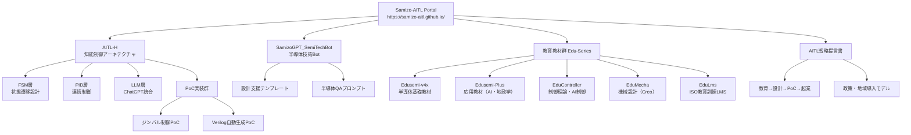

本サイトは、**三溝 真一（Shinichi Samizo）** による教育・研究開発プロジェクト群の統合ポータルです。

  

  

> 🌐 [View English Version](./en/index.md)

---

## 🔍 プロジェクト一覧 | Projects Overview

| アイコン | プロジェクト名 | 分野 | 内容 |
|---------|----------------|------|------|
| 🧠 | [SamizoGPT](https://samizo-aitl.github.io/SamizoGPT/) | [🟨 AI] | ChatGPTプロンプト設計・プロジェクト支援テンプレート集 |
| 📡 | [SemiTechBot](https://samizo-aitl.github.io/SamizoGPT_SemiTechBot/) | [🟦 半導体] [🟨 AI] | 半導体技術支援チャットボット（SamizoGPT応用） ⚠️ FlaskベースのBotアプリは現在整備中です |
| 📘 | [Edusemi-v4x](https://samizo-aitl.github.io/Edusemi-v4x/) | [🟦 半導体] | プロセス・設計・PDK演習などを体系化した半導体教材 |
| ➕ | [Edusemi-Plus](https://samizo-aitl.github.io/Edusemi-Plus/) | [🟦 半導体] [🟥 材料] [🟨 AI] [🟧 投資] [🟫 地政学] | 材料・先端技術・地政学・投資と半導体の交差点教材 |
| 🎛️ | [EduController](https://samizo-aitl.github.io/EduController/) | [🟥 制御] [🟨 AI] | 制御理論＋AI制御教材（PID〜LLM統合） |
| 🛠️ | [EduMecha](https://samizo-aitl.github.io/EduMecha/) | [🔵 機械] | Creoを用いた機械設計・筐体構造教材 ※⚠️演習用ファイル（.prt / .asm）は未収録 |
| 🧠 | [EduLms](https://samizo-aitl.github.io/EduLms/) | [🟩 教育] | ISO品質・環境・教育訓練を統合した教材（LMS対応） |
| 🤖 | [AITL-H](https://samizo-aitl.github.io/AITL-H/) | [🟨 AI] [🟥 制御] | FSM×PID×LLMによる知能制御アーキテクチャ |
| 🖨️ | [Inkjet](https://samizo-aitl.github.io/Inkjet/) | [⚙️ 製品技術] | インクジェット構造・波形・評価アーカイブ |
| 💰 | [AssetPortfolio](https://samizo-aitl.github.io/AssetPortfolio-StartGuide/) | [🟧 投資] | テクノロジー分野特化の資産運用教材（ETF・NISA） |
| 🎮 | [Rekiden](https://samizo-aitl.github.io/Rekiden/) | [🟪 歴史] [🧠 LLM] | ChatGPT連携型・歴史シミュレーション教材 |
| 🧩 | [AITL-Strategy-Proposal](https://samizo-aitl.github.io/AITL-Strategy-Proposal/) | [🏛️ 政策提言] | AITL構想に基づく国家戦略提言（教育×AI×制御） |

---

## 🧠 AITL統合思想の背景

Samizo-AITLは、以下のような**異分野統合アーキテクチャ**を目指しています：

- **半導体 × 制御理論 × 機械設計 × AI × 教育技術**
- **ChatGPT / LLMと連携した設計・学習・実装支援**
- 教材・PoC構成・テンプレート類を **MITライセンス** で公開

> 💡 特に [Edusemi-v4x](https://samizo-aitl.github.io/Edusemi-v4x/) は、実務経験に基づく中核教材です。

---

## 📘 中核教材・PoCの構造的整理

| 中核教材 | 解説 |
|----------|------|
| 📘 [Edusemi-v4x](https://samizo-aitl.github.io/Edusemi-v4x/) | プロセス・デバイス・設計・テスト・信頼性を体系的に学ぶ |
| 🎛️ [EduController](https://samizo-aitl.github.io/EduController/) ＋ [SoC_DesignKit](https://samizo-aitl.github.io/EduController/SoC_DesignKit_by_ChatGPT/) | FSM・PID・LLMによる制御教材＋HDLテンプレート一式 |
| 🤖 [AITL-H](https://samizo-aitl.github.io/AITL-H/) ＋ [PoCマニュアル](https://samizo-aitl.github.io/AITL-H/docs/) | 知能制御アーキテクチャをPoCで再現（FSM × PID × LLM） |

---

## 🏛️ 提言・連携・国際協働に向けて

以下では、**産業政策・技術連携・LLM導入事例**の提案を示しています：

- 🧩 [国家提言：AITL構想](https://samizo-aitl.github.io/AITL-Strategy-Proposal/)  
　教育×AI×制御を軸とする長期戦略的ビジョン

- 🤝 [OpenAI向けメッセージ](./about/openai-message.md)  
　SamizoGPT/AITL-Hを通じたChatGPT統合設計の実例と提案

---

## 📚 補足資料・更新履歴

| 項目 | 内容 |
|------|------|
| 🕘 [更新履歴](./about/update.md) | 教材更新・構成変更履歴 |
| 🧠 [ChatGPT活用レベル診断](./about/chatgpt-skill-eval.md) | LLMスキルレベル（Lv5.0）自己評価 |
| 📋 [Geminiレビュー](./about/gemini-review.md) | Google Geminiによるポートフォリオ評価 |
| 🌐 [English Version](./en/index.md) | 英語ポータルへのリンク |

---

## 👤 執筆者 / Author

**三溝 真一（Shinichi Samizo）**  
- 信州大学大学院 電気電子工学 修了  
- 元 セイコーエプソン株式会社 技術者（1997年〜）  

📌 **経験領域**：   📘 [キャリア要約](./about/career-summary.md)
- 半導体デバイス（ロジック／メモリ／高耐圧混載）  
- 薄膜ピエゾアクチュエータ  
- PrecisionCoreプリントヘッド製品化・構成管理・教育設計

📬 **連絡先**
- ✉️ Email: [shin3t72@gmail.com](mailto:shin3t72@gmail.com)  
- 🐦 X (Twitter): [https://x.com/shin3t72](https://x.com/shin3t72)  
- 💻 GitHub: [https://samizo-aitl.github.io/](https://samizo-aitl.github.io/)

---

© 2025 Shinichi Samizo — MIT License  
教材・コード・図面・テンプレートは、MITライセンスのもと自由にご利用いただけます。

---

### 🖼️ 技術統合アーキテクチャ図（写実版）

---
