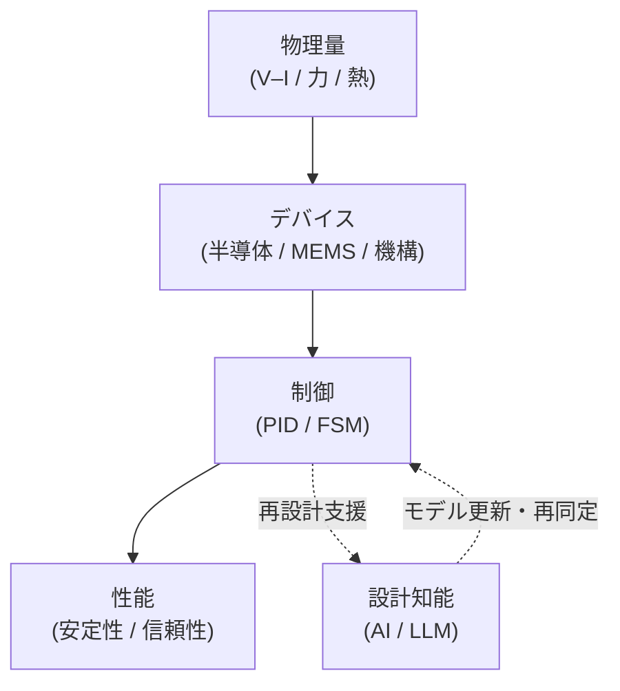

# 🎓 Samizo-AITL Portal

Architecture for Integrated Technology Logic

<strong>物理を起点とした設計</strong>から出発し、 
<strong>デバイス・制御・AI</strong> を 
<strong>因果構造として整理する</strong> 設計アーカイブ

  
  

---

## 🧭 What is AITL?

**AITL（Architecture for Integrated Technology Logic）** は、

物理量 → デバイス → 制御 → AI → 性能

という関係を、  
**設計判断と説明に使える「因果構造」**として扱うための枠組みです。

---

---

## 🎯 What this archive focuses on

- **どの物理要素が**
- **どの設計層に効き**
- **なぜその設計判断が成立しているのか**

を、  
**個別技術ではなく「構造」として残すこと**を目的としています。

---

## ▶ Start Here

  <a href="/zenn-articles/"
     style="
       display: inline-block;
       padding: 22px 48px;
       font-size: 1.35em;
       font-weight: 800;
       letter-spacing: 0.08em;
       color: #ffffff;
       background: linear-gradient(135deg, #2563eb, #1e40af);
       border-radius: 14px;
       text-decoration: none;
       box-shadow: 0 14px 32px rgba(30,64,175,0.4);
     ">
    ▶ Zenn Articles
  </a>

  

    AITL の設計思想・因果構造・判断基準は 
    <strong>Zenn 記事として集約</strong>しています
  

---

## 🔐 Positioning

Samizo-AITL Portal は、  
チュートリアルや入門解説を目的としたサイトではありません。

**設計思想・判断基準・検討過程を省略せず残す  
設計アーカイブ（SSOT）**として公開しています。

---

## 📚 Reference / Archive

  <ul style="line-height:1.8;">
    <li><a href="/portal/">Portal – 全体構造・索引</a></li>
    <li><a href="/Edusemi-v4x/">Edusemi – Physical / Semiconductor Design</a></li>
    <li><a href="/EduController/">EduController – Control / AI Structure</a></li>
  </ul>

---

<blockquote style="font-size:1.05em;">
<strong>AITL は制御手法ではない。</strong> 
<strong>設計を説明し、更新するための構造である。</strong>
</blockquote>
