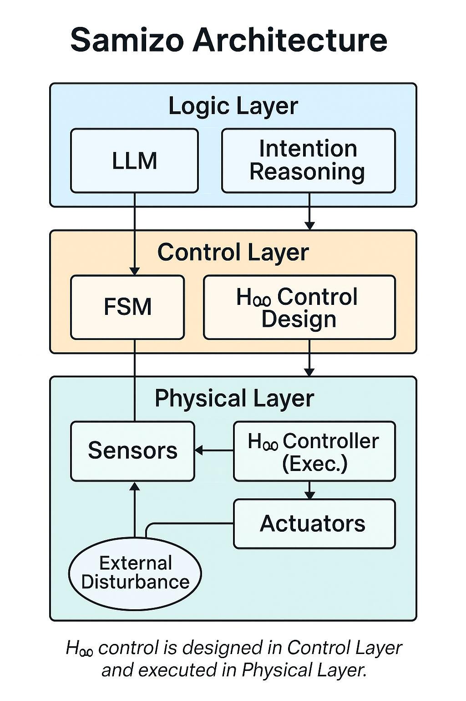

Technical Portfolio by Shinichi Samizo / 三溝真一 技術ポートフォリオ

Welcome to the official portal for AITL architecture and semiconductor education projects.
三溝真一によるAITL構想および半導体教育プロジェクトの統合ポータルサイトへようこそ。

  

---

## 🔗 教材ポータル / Educational Portal

### 📘 Edusemi v4.x（半導体教育教材）  
KOSEN・大学・企業向けの統合教材。Sky130, OpenLane, Python自動化に対応。  
▶︎ [Edusemi GitHubページ](https://github.com/Samizo-AITL/Edusemi-v4x)

| 範囲 | 内容 |
|------|------|
| 基礎編 | 半導体物性、論理回路、プロセス、MOS設計、SoC設計、テスト |
| 応用編 | 高耐圧、ESD、アナログ、レイアウト、PDK・EDA環境など |
| 実践編 | Python自動化、Sky130実験、OpenLane設計、PoC構築と評価 |
| 特別編 | FinFET・GAA構造、チップレット・先端パッケージなど |

---

### 🧠 AITL (All-in-Theory Logic)  
論理・制御・物理を統合する三層AI設計モデル  
▶︎ [AITL GitHubリポジトリ](https://github.com/Samizo-AITL/AITL)

---

### 🤖 ChatGPT-Accelerated Design  
ChatGPTを活用したPoC共創・設計支援プロンプト集  
▶︎ [Sky-HyEV Prompt Collection](https://github.com/Samizo-AITL/ChatGPT-Accelerated-Designs/blob/main/Sky-HyEV/prompts/Prompt_Collection.md)

---

## 📦 主な成果物 / Key Deliverables

- [`AITL_SoC_Design_Manual_v1.0`](https://github.com/Samizo-AITL/aitl-lab/blob/main/docs/soc-manual/AITL_SoC_Design_Manual_v1.0.md)  
  AITL三層理論に基づくSoC設計ガイド

- [`SoC_PoC_Manual_v5.0`](https://github.com/Samizo-AITL/aitl-lab/blob/main/docs/SoC_PoC_Manual_v5.0.md)  
  AI制御PoCのための設計マニュアル（PoCDK対応）

- [`Projects.md`](https://github.com/Samizo-AITL/AITL/blob/main/docs/Projects.md)  
  AITL応用プロジェクト（ドローン・センサ等）の一覧

- [`AITL_Proposal_v1.0.md`](https://github.com/Samizo-AITL/AITL/blob/main/AITL_Proposal_v1.0.md)  
  AI設計と教育融合に関する国家提案書

---

## 📫 連絡先 / Contact

技術監修・執筆：**三溝 真一（Shinichi Samizo）**  
- GitHub: [@Samizo-AITL](https://github.com/Samizo-AITL)  
- Email: shin3t72@gmail.com  

---

© 2025 Shinichi Samizo — MIT License  
教材・仕様・図版はすべてオープンソースとして再利用可能です。

---

## 🕘 更新履歴 / Update Log

- **2025-07-07**  
  Edusemi v4.xポータル版に改訂。教材構成とGitHubページを統合。

- **2025-07-01**  
  初版統合ポートフォリオ公開。各設計マニュアル・PoC文書を収録。

- **2025-06-28**  
  Sky-HyEV Prompt Collection（ChatGPT設計支援）を追加。

- **2025-06-15**  
  Edusemi教材公開版（README）を初掲載。

---

_Last updated: 2025-07-07_
