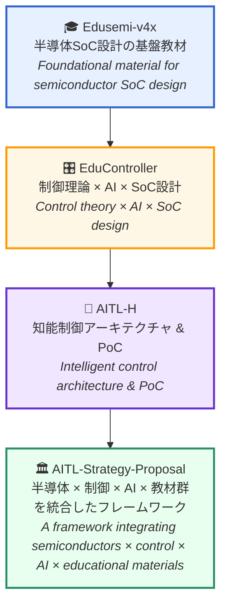

---

# 🎓 Samizo-AITL Portal
> **「構造を読む、動きを作る、AIで加速する」**  
> *"Read structures, create dynamics, accelerate with AI" — A portal for learning the fusion of physics and intelligence*

**Samizo-AITLポータル**は、三溝真一による個人プロジェクトです。  
*The Samizo-AITL Portal is a personal project by Shinichi Samizo.*  

**半導体 × 制御 × AI** を軸に、知識・現象・技術の断片を**構造的に整理・接続**し、  
教育・PoC（実現性と有効性の事前検証）・提言構築に活かすことを目的としています。  
*It focuses on **Semiconductors × Control × AI**, structurally organizing and connecting fragments of knowledge, phenomena, and technologies, to be applied to education, proof-of-concepts, and proposals.*  

現在の主流は ChatGPT に代表される**対話AI**ですが、  
今後は　**物理現象や構造と結びつく「物理AI」** こそが、次のトレンドになると考えています。  
*While conversational AI such as ChatGPT is mainstream today, the next trend will be **"Physics AI"**, closely tied to physical phenomena and structures.*  

Samizo-AITLは、「動かす現場」と「読み解く構造」その両方の経験をもとに、  
**言葉ではなく、動きの中でAIを使う**ための教育・PoC・構想を展開しています。  
*Based on experience in both **practical implementation** and **structural analysis**, Samizo-AITL develops education, PoCs, and concepts to use AI not only through words, but through actions.*  

---

## 🔗 公式リンク | Official Links

| 言語 / Language | GitHub Pages 🌐 | GitHub 💻 |
|-----------------|----------------|-----------|
| 🇯🇵 Japanese |  |  |
| 🇺🇸 English |  |  |

---

## 🔍 プロジェクト一覧 | Projects Overview

以下は、本ポータルに含まれる主要プロジェクト群です。  
*Below are the main project groups included in this portal.*  

教育・PoC・AI活用・提言・社会実装といった複数の視点から展開しています。  
*They are developed from multiple perspectives such as education, PoC, AI utilization, proposals, and social implementation.*  

| アイコン | **プロジェクト名** | 分野 | 内容 |
|---------|--------------------|------|------|
| 🧠 | **SamizoGPT**   | [🧠 AI] | ChatGPTの **プロンプト設計** と **支援テンプレート** 集（※一部AI支援を活用していますが、構成・検証・記述責任は筆者） *A collection of **prompt designs** and **support templates** for ChatGPT (some AI assistance is used, but structure, verification, and description are the author’s responsibility).* |
| 📡 | **SemiTechBot**   | [💠 半導体] [🧠 AI] | **半導体技術支援** に特化した **チャットボット**（SamizoGPT応用） ⚠️ FlaskベースのBotアプリは開発中 *A chatbot specialized in **semiconductor technical support** (application of SamizoGPT). ⚠️ Flask-based bot app under development.* |
| 🎓 | **Edusemi-v4x**   | [💠 半導体] [🎓 教育] | **プロセス・設計・PDK演習** を体系的に学べる **半導体教材** *Semiconductor learning material covering **process, design, and PDK exercises** in a systematic way.* |
| ➕ | **Edusemi-Plus**   | [💠 半導体] [🧪 材料] [🧠 AI] [💰 投資] [🌍 地政学] [🏭 産業] | **材料・AI・産業・地政学・投資**の視点で半導体と社会構造を結ぶ**拡張教材** *An extended learning resource linking semiconductors and social structures from the perspectives of **materials, AI, industry, geopolitics, and investment**.* |
| 🎛️ | **EduController**   | [🎛️ 制御] [🧠 AI] | **PID制御〜LLM統合** までを扱う **制御×AI教材** *A Control × AI learning resource covering from **PID control to LLM integration**.* |
| ⚙️ | **EduMecha**   | [⚙️ 機械] | **Creoによる機械設計演習**（筐体構造設計） *Mechanical design exercises using **Creo** (enclosure structure design).* ⚠️ Creoの演習ファイルはありません。 *⚠️ Creo practice files are not included.* |
| 🎓 | **EduLms**   | [🎓 教育] | **品質・環境・技能訓練**を統合した **LMS対応教材** *LMS-ready learning material integrating **quality, environment, and skill training**.* |
| 🤖 | **AITL-H**   | [🧠 AI] [🎛️ 制御] | **FSM × PID × LLM** による **三層型知能制御アーキテクチャ** ⚠️ 開発・検証中 *A **three-layer intelligent control architecture** combining FSM × PID × LLM. ⚠️ Under development and testing.* |
| 🖨️ | **Inkjet**   | [🛠 製品技術] | **インクジェット構造・駆動波形・評価データ** のアーカイブ *An archive of **inkjet structures, drive waveforms, and evaluation data**.* |
| 💰 | **AssetPortfolio**   | [💰 投資] | **ETF・NISA** を活用した **技術者向け資産運用教材** *Investment learning material for engineers using **ETFs and NISA**.* |
| 🎮 | **Rekiden**   | [🏯 歴史] [🧠 AI] | ChatGPT連携の **歴史シミュレーション教材** *A history simulation learning resource integrated with ChatGPT.* |
| 🏛️ | **AITL-Strategy-Proposal**   | [📑 政策提言] | **教育 × AI × 制御** を軸とした **国家戦略提言** ⚠️ Draft段階 *A **national strategy proposal** focused on Education × AI × Control. ⚠️ In draft stage.* |

---

## 🧠 AITL統合思想の背景
*🧠 Background of AITL’s Integrated Philosophy*

**Samizo-AITL** は、**半導体 × 制御 × AI** を有機的に結びつけ、  
*Samizo-AITL organically integrates **Semiconductors × Control × AI**,*  

「**物理現象の構造を読み解き、PoCで検証し、AIで設計を支援する**」という一連のプロセスを  
*to form a unified process of **analyzing the structure of physical phenomena, verifying with PoCs, and supporting design with AI**,*  

**教育・構想・設計** に統合するためのフレームワークです。  
*which serves as a framework to integrate into **education, conceptualization, and design**.*  

> 📘 本プロジェクト群で公開している教材やPoCは、**ハイブリッドライセンス方式**のもと公開しています。  
> *📘 The teaching materials and PoCs released in this project group are published under a **hybrid licensing scheme**.*  
> - **コード (Code)** : [MIT License](https://opensource.org/licenses/MIT)  
>   （自由に使用・改変・再配布可）  
>   *Free to use, modify, and redistribute*  
> - **教材テキスト (Text materials)** : [CC BY 4.0](https://creativecommons.org/licenses/by/4.0/)  
>   （著者表示必須）  
>   *Attribution required*  
> - **図表・イラスト (Figures & diagrams)** : [CC BY-NC 4.0](https://creativecommons.org/licenses/by-nc/4.0/)  
>   （非商用利用のみ可）  
>   *For non-commercial use only*  
> - **外部引用 (External references)** : 元ライセンスに従う（引用元を明記）  
>   *Follow the original license (cite the source explicitly)*  
{: .annotation-narrow}

> 💡 中核教材である [**Edusemi-v4x**](https://samizo-aitl.github.io/Edusemi-v4x/) は、筆者の**実務経験と研究成果に基づき再構成された教育用カリキュラム**であり、特定の製品や企業活動とは一切関係ありません。  
> *💡 The core material [**Edusemi-v4x**](https://samizo-aitl.github.io/Edusemi-v4x/) is an **educational curriculum reconstructed from the author’s practical experience and research results**, and is not related to any specific products or corporate activities.*  
{: .annotation-narrow}

---

## 📘 中核教材・PoCの構造的整理
*📘 Structural Organization of Core Materials & PoCs*

| アイコン | プロジェクト名 | 分野 | 内容 |
|----------|----------------|------|------|
| 🎓 | **Edusemi-v4x**   | [💠 半導体] [🎓 教育] | **半導体プロセス・デバイス・設計・テスト・信頼性** を体系的に学べる基盤教材。 *A foundational material to systematically learn **semiconductor processes, devices, design, testing, and reliability**.* |
|  |┗ 📦 **SystemDK編（特別編 第2a章）**   | [🧪 PoC] | **SI/PI・熱・応力・EMI/EMC** の物理制約を統合設計し、**GAA / AMS / MRAM** を活用した異種統合PoCを扱う特別編教材（Edusemi-v4x内包） *A special edition material (within Edusemi-v4x) that integrates physical constraints of **SI/PI, thermal, stress, and EMI/EMC**, and handles heterogeneous integration PoCs utilizing **GAA / AMS / MRAM**.* |
| 🎛️ | **EduController**   | [🎛️ 制御] [🧠 AI] | **FSM・PID・LLM制御** を段階的に学ぶ教材と、**HDL記述テンプレート** 一式。 ※Verilog/Cコード生成はAI支援、筆者は制御構成を担当 *A learning material to study **FSM, PID, and LLM control** step by step, along with a full set of **HDL description templates**. (Verilog/C code generation is AI-assisted; the control design is by the author.)* |
|  | ┗ 📦 **SoC_DesignKit**   | [🎛️ 制御] [🧠 AI] | SoC設計用の**HDLテンプレート集**（AI支援生成を含む） *A collection of **HDL templates** for SoC design (including AI-assisted generation).* |
| 🤖 | **AITL-H**   | [🧠 AI] [🎛️ 制御] [🧪 PoC] | **三層型知能制御アーキテクチャ（FSM×PID×LLM）** を概念実証（PoC）として再現可能な統合教材 ⚠️ 開発・検証中 *An integrated learning material enabling reproducible PoCs of a **three-layer intelligent control architecture (FSM × PID × LLM)**. ⚠️ Under development/testing.* |
|  | ┗ 📦 **PoCマニュアル**   | [🧠 AI] [🎛️ 制御] [🧪 PoC] | AITL-HのPoC手順書・構成解説 *A manual and structural explanation for AITL-H PoCs.* |

---

## 🧩 半導体 × 制御 × AI × 教材群を統合したフレームワーク
*🧩 An Integrated Framework of Semiconductors × Control × AI × Educational Materials*

---

## 🏛️ 提言・連携・国際協働に向けて
*🏛️ Towards Proposals, Collaboration, and International Cooperation*

| アイコン | プロジェクト名 | 分野 | 内容 |
|----------|----------------|------|------|
| 🏛️ | **AITL-Strategy-Proposal**   | [📑 政策提言] | **教育 × AI × 制御** を軸とした **中長期的ビジョン**（AI活用教育導入とPoC設計連携の提案を含む） ⚠️ Draft段階 *A **medium- to long-term vision** centered on **Education × AI × Control** (including proposals for AI-based education and PoC design collaboration). ⚠️ Draft stage.* |
| 🤝 | **OpenAI向けメッセージ**  | [🧠 AI提案] | **ChatGPT活用事例** と **統合設計への提案**（教材整備・国際展開方法も含む） *Examples of **ChatGPT utilization** and **proposals for integrated design** (including educational preparation and international deployment methods).* |

---

## 📚 補足資料・更新履歴
*📚 Supplementary Materials & Update History*

| アイコン | 項目 | 内容 |
|----------|------|------|
| 🕘 | **更新履歴**  | 教材の **更新履歴・構成変更ログ** *Update logs and structural change records of the materials.* |
| 🧠 | **ChatGPT活用レベル診断**  | LLM活用スキル（レベル5）評価レポート。構造設計・記憶活用・教材生成の観点から評価。 *Evaluation report of LLM utilization skills (Level 5), assessed from perspectives of structural design, memory use, and material generation.* |
| 📋 | **Geminiレビュー**  | **Google Gemini** による **教材評価レポート** *An **educational evaluation report** by Google Gemini.* |
| 🌐 | **English Version**  | 英語ポータルへのリンク *Link to the English portal.* |

---

## 👤 執筆者情報 / Author

| **項目 / Item** | **内容 / Details** |
|-----------------|--------------------|
| **氏名 / Name** | **三溝 真一**（Shinichi Samizo） |
| **学歴 / Education** | **信州大学大学院 電気電子工学** 修了 *M.S. in Electrical and Electronic Engineering, Shinshu University* |
| **経歴 / Career** | 元 **セイコーエプソン**株式会社 技術者（1997年〜） *Former engineer at Seiko Epson Corporation (since 1997)* |
| **✉️ Email** |  |
| **🐦　X** |  |
| **💻 GitHub** |  |

---

## 📌 キャリア要約 / Career Summary

  
**三溝真一（Shinichi Samizo）** の技術経歴と専門分野をまとめた詳細レポートです。  
*Detailed report summarizing the technical career and expertise of **Shinichi Samizo**.*

- **半導体デバイス**（ロジック・メモリ・高耐圧混載）  
  ***Semiconductor devices** (logic, memory, high-voltage mixed integration)*  
- インクジェット**薄膜ピエゾ**アクチュエータ  
  *Inkjet **thin-film piezo** actuators*  
- **PrecisionCoreプリントヘッド**製品化・BOM管理・ISO教育  
  *Commercialization of **PrecisionCore printheads**, BOM management, and ISO training*  
- 教材設計・PoC構築・AI活用設計支援  
  *Educational material design, PoC development, and AI-assisted design support*  

---

## 🖼️ 技術統合アーキテクチャ図（写実版）
*🖼️ Technology Integration Architecture (Realistic Version)*

  

*図: 半導体・AI・制御・ロボティクスを統合する「Samizo-AITL」の技術構想を象徴的に表現した写実イメージ。人間の指示による知能制御（PID）とAI学習が、ロボットや回路制御と融合する未来を示しています。*  
*Figure: A realistic illustration symbolizing the "Samizo-AITL" technological concept that integrates semiconductors, AI, control, and robotics. It depicts a future where intelligent control (PID) guided by human instructions merges with AI learning, robotics, and circuit control.*
