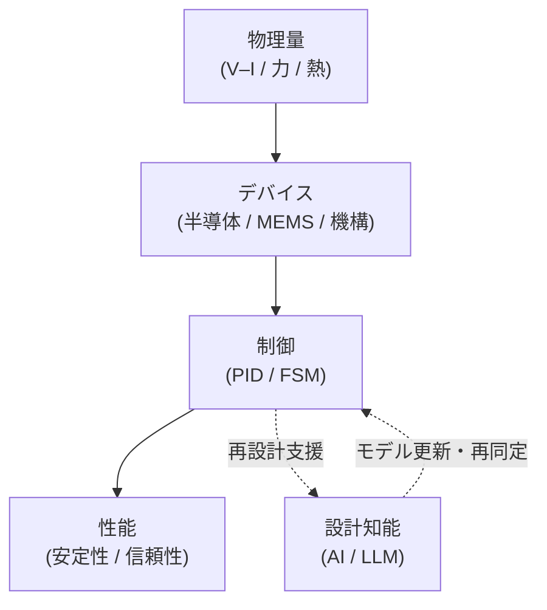

# 🎓 Samizo-AITL Portal

Architecture for Integrated Technology Logic

<strong>物理を起点とした設計</strong>から出発し、 
<strong>デバイス・制御・AI</strong> を 
<strong>因果構造として統合・可視化する</strong> 設計アーカイブ

  
  

---

## 🧭 AITLとは何か

**AITL（Architecture for Integrated Technology Logic）** は、

物理量 → デバイス → 制御 → AI → 性能

という関係を、  
**設計判断・説明・再設計に直接使える「因果構造」**として整理するための枠組みです。

---

## ▶ Step 1｜設計思想を読む

思想を理解する／設計判断の前提を掴む

<a href="/zenn-articles/"
   style="
     display: inline-block;
     padding: 22px 54px;
     font-size: 1.45em;
     font-weight: 900;
     letter-spacing: 0.10em;
     color: #ffffff;
     background: linear-gradient(135deg, #2563eb, #1e40af);
     border-radius: 16px;
     text-decoration: none;
     box-shadow: 0 18px 38px rgba(30,64,175,0.45);
   ">
  ▶ Zenn 記事一覧
</a>

AITL の設計思想・因果構造・判断基準は 
<strong>すべて Zenn 記事として文章化</strong>されています

---

## ▶ Step 2｜構造を「見る・体感する」

Portal｜ビジュアル構造アーカイブ

AITL の全体構造・因果関係・設計レイヤを 
<strong>図・アニメーション・デモ</strong>で一望する展示空間

  <a href="/portal/"
     style="
       display: inline-block;
       padding: 18px 44px;
       font-size: 1.25em;
       font-weight: 800;
       letter-spacing: 0.08em;
       color: #1e40af;
       background: #ffffff;
       border: 3px solid #1e40af;
       border-radius: 14px;
       text-decoration: none;
     ">
    ▶ Portal を開く
  </a>

  

    AITL 全体構造図
  

  

    制御階層（PID × FSM × AI）
  

  

    アニメーション／デモ
  

---

## 🔐 本ポータルの位置づけ

Samizo-AITL Portal は、  
入門教材やチュートリアルを目的としたサイトではありません。

**設計思想・判断基準・構造を  
省略せず残すための設計アーカイブ（SSOT）**として公開しています。

---

> **AITL は制御手法ではない。**  
> **設計を説明し、更新するための構造である。**
