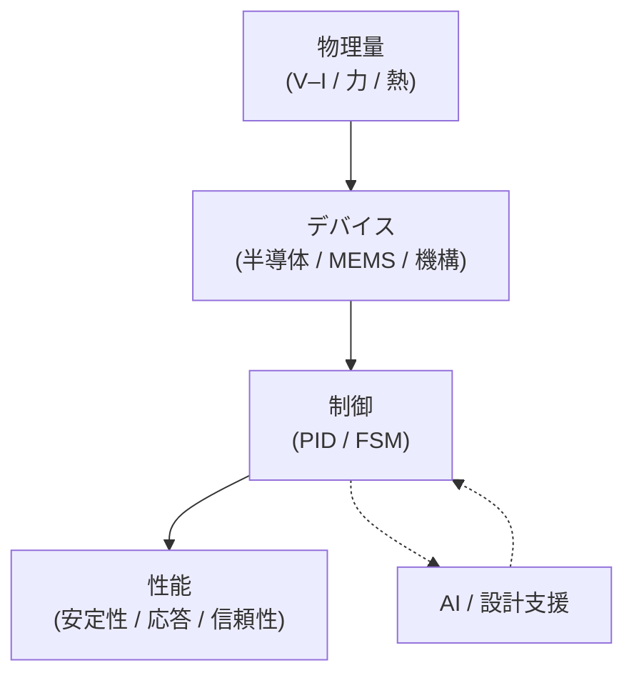

# 🎓 Samizo-AITL Portal

Architecture for Integrated Technology Logic

物理量（V–I など）から、デバイス・制御・AIまでを 
<strong>同じ構造図でつないで示す設計構造の技術アーカイブ</strong>

  
  

---

## 🧭 構造図

この図にある要素（箱）やつながり（矢印）を、1つずつ扱った記事やデモを置いています。

---

## 📚 Articles（記事）

<a href="/zenn-articles/"
   style="
     display: inline-block;
     padding: 22px 54px;
     font-size: 1.4em;
     font-weight: 900;
     letter-spacing: 0.10em;
     color: #ffffff;
     background: linear-gradient(135deg, #2563eb, #1e40af);
     border-radius: 16px;
     text-decoration: none;
     box-shadow: 0 18px 38px rgba(30,64,175,0.45);
   ">
  ▶ Zenn 記事一覧
</a>

各記事は、上の構造図の中から 
<strong>特定の箱、または矢印</strong>をテーマにした記述です。

---

## 🧩 Portal（構造ビュー）

<a href="/portal/"
   style="
     display: inline-block;
     padding: 18px 44px;
     font-size: 1.25em;
     font-weight: 800;
     letter-spacing: 0.08em;
     color: #1e40af;
     background: #ffffff;
     border: 3px solid #1e40af;
     border-radius: 14px;
     text-decoration: none;
   ">
  ▶ Portal を開く
</a>

  

    全体構造マップ
  

  

    制御階層（PID / FSM）
  

  

    AI連携・構造デモ
  

