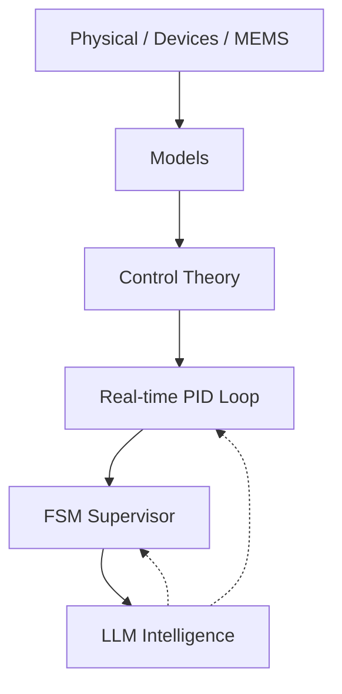

# 🎓 Samizo-AITL Portal  
> **物理 → デバイス → 制御 → 知能化を  
> 一つの因果構造で統合する技術アーカイブ**  
> *A unified framework connecting physics, devices, systems, and intelligent control.*

[](https://github.com/Samizo-AITL)
[](https://zenn.dev/samizo_aitl)


## 🌐 Language / 言語
[](https://samizo-aitl.github.io/en/)
[](https://samizo-aitl.github.io/)

---

## 🚀 What You Can Gain from This Portal

**Samizo-AITL** は、半導体・MEMS・制御・AI を  
**「物理基盤から一気通貫で理解・設計できる構造」**として  
再構築した技術ポータルです。

このポータルで得られるもの：

- 分野横断の技術を **因果構造として理解** できる  
- 物理モデルを起点に **制御・知能化まで接続** できる  
- 教材・PoC・実装を **再利用可能な設計構造** として扱える  

単なる教材集ではなく、  
**技術体系そのものを「設計可能な形」で提示すること**を目的としています。

---

## 🎯 Who Is This Portal For?

Samizo-AITL は、以下の技術者・研究者を対象としています。

- 物理モデル起点で設計を行いたい **半導体・MEMS・制御系エンジニア**  
- AI / LLM を **制御の代替ではなく、監督・再設計層として使いたい人**  
- 分野横断で **技術体系を再構築したい研究者・設計者**

※ 初学者向け入門サイトではありません。  
本ポータルは **設計のための構造アーカイブ** です。

---

## 🧩 AITL Structure Map（全体構造）



AITL（Adaptive Intelligent Technology Loop）では、

- **内側**：物理・デバイス・MEMS（制約を生む層）  
- **中間**：モデル・制御理論（挙動を決める層）  
- **外側**：FSM / LLM（判断・再設計・適応）

という三層構造で、  
**物理モデルを正しく「使い切る」ための知能化**を行います。

---

## 🗂 Samizo-AITL Directory Overview（全体像）

> **本ポータルは「ディレクトリ構成＝設計思想」です。**

```text
Samizo-AITL/
├─ 01_DevEnv/        環境・再現性（VSCode / Python / Toolchain）
│
├─ 02_CodeGen/       実装・制御・生成
│   ├─ PID           実時間制御（安定化・V–I 制御）
│   ├─ FSM           状態遷移・モード管理
│   └─ LLM           監督・再設計（非実時間）
│
├─ 03_Docs/          理解・教育・設計思想
│   ├─ Edusemi-v4x
│   ├─ EduController
│   └─ Edusemi-Plus
│
└─ 04_Archives/      PoC・履歴・技術資産
```

**推奨順**：  
**思想 → 物理 → 制御 → 知能**

---

## 📝 Essays / Design Philosophy (Zenn)

**設計思想・物理起点工学・AITL構造に関する考察記事は Zenn に集約しています。**

[](https://zenn.dev/samizo_aitl)

---

# 💠 Main Core（中核教材）

---

## 1️⃣ Edusemi-v4x
半導体プロセス・デバイス・回路設計を**物理起点で体系化する基幹教材**。

[](https://samizo-aitl.github.io/Edusemi-v4x/)
[](https://github.com/Samizo-AITL/Edusemi-v4x)

---

## 2️⃣ SemiDevKit
物理モデルから **SPICE・信頼性・レイアウト**までを接続する実装キット。

[](https://samizo-aitl.github.io/SemiDevKit/)
[](https://github.com/Samizo-AITL/SemiDevKit)

---

## 3️⃣ Edusemi-Plus
材料・装置・産業構造を、**物理視点で拡張する補助教材**。

[](https://samizo-aitl.github.io/Edusemi-Plus/)
[](https://github.com/Samizo-AITL/Edusemi-Plus)

---

# 🎛 Applied Layer（制御・知能化）

---

## 4️⃣ EduController
PID・FSM を中心に**制御構造を理解するための教材**。

[](https://samizo-aitl.github.io/EduController/)
[](https://github.com/Samizo-AITL/EduController)

---

## 5️⃣ AITL-Controller-A-Type
PID × FSM × LLM **三層構造の最小 PoC**。

[](https://samizo-aitl.github.io/aitl-controller-a-type/)
[](https://github.com/Samizo-AITL/aitl-controller-a-type)

---

## 6️⃣ V–I Control ASIC on SKY130
V–I 制御（PID + FSM）を **RTL → GDS まで実装する ASIC 教材**。

[](https://samizo-aitl.github.io/vi-control-asic-sky130/)
[](https://github.com/Samizo-AITL/vi-control-asic-sky130)

---

# ⚙️ MEMS / Physical Boundary

---

## 7️⃣ mems-ana
抽象モデルの限界を確認する **pre-FEM MEMS 解析ツール**。

[](https://samizo-aitl.github.io/mems-ana/)
[](https://github.com/Samizo-AITL/mems-ana)

---

## 8️⃣ Inkjet Printing — Design Trade-off Models
画質・速度・ドット挙動の因果関係を**最小モデルで可視化する教材**。

[](https://samizo-aitl.github.io/inkjet-dts/)
[](https://github.com/Samizo-AITL/inkjet-dts)

---

# 🎞 AITL Animation Demos
AITL 概念を可視化するための**試験的アニメーションデモ集**。

[](https://samizo-aitl.github.io/aitl-animation-demos/)

---

# 🕘 Update Log

**サイトおよび教材の更新履歴はこちらに集約しています。**  
設計思想・教材構成・PoC の更新は、必ずログとして残します。

- [📄 更新履歴を見る](https://samizo-aitl.github.io/about/update/)

---

# 👤 Author

**三溝 真一（Shinichi Samizo）**  
独立系半導体研究者  

- GitHub: [https://github.com/Samizo-AITL](https://github.com/Samizo-AITL)
- Zenn: [https://zenn.dev/samizo_aitl](https://zenn.dev/samizo_aitl)  
- Career Summary: [https://samizo-aitl.github.io/about/career-summary/](https://samizo-aitl.github.io/about/career-summary/)

