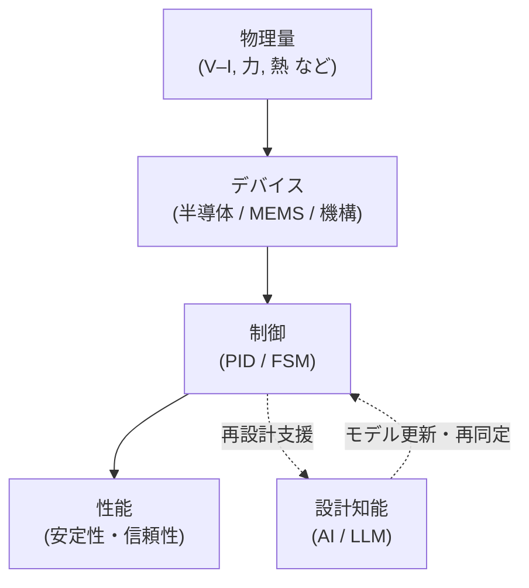

# 🎓 Samizo-AITL Portal
**物理を起点とした設計から出発し、  
デバイス・制御・AI を因果構造として整理する設計アーカイブ**

---

## 🧭 これは何か
**AITL（Architecture for Integrated Technology Logic）** は、

**物理量 → デバイス → 制御 → AI → 性能**

という関係を、  
**設計判断と説明に使える因果構造**として整理するための枠組みです。

```mermaid
flowchart TD
    P["物理量<br>(V–I, 力, 熱 など)"]
    D["デバイス<br>(半導体 / MEMS / 機構)"]
    C["制御<br>(PID / FSM)"]
    A["設計知能<br>(AI / LLM)"]
    S["性能<br>(安定性・信頼性)"]

    P --> D
    D --> C
    C --> S
    C -. 再設計支援 .-> A
    A -. モデル更新・再同定 .-> C
```

個別技術の解説ではなく、

- どの要素が  
- どこに効き  
- なぜその設計が成立しているか  

を **構造として扱う** ことを目的としています。

---

## 🔥 まず何を見るか

| 内容 | リンク | 補足 |
|---|---|---|
| **全体構造（Portal）** | [/portal/](https://samizo-aitl.github.io/portal/) | AITL 全体像 |
| **物理・半導体設計** | [/Edusemi-v4x/](https://samizo-aitl.github.io/Edusemi-v4x/) | V–I（電圧–電流）起点 |
| **制御・AI構造** | [/EduController/](https://samizo-aitl.github.io/EduController/) | PID / FSM / AI |

※ 上から順に読めば、因果関係が自然につながります。

---

## 🧠 設計構造（AITLの核）

AITL では、**制御とAIを明確に分離**します。

| 層 | 役割 | 担当 |
|---|---|---|
| **PID** | 実時間制御 | 安定性・応答・外乱 |
| **FSM** | 状態管理 | モード遷移・安全 |
| **AI / LLM** | 非実時間 | 再設計・再同定支援 |

- AIは **制御を置き換えない**
- AIは **設計更新を支援する層**
- 実時間制御は **PID / FSM が責任を持つ**

---

## 👤 想定読者
- 物理・デバイス・制御・AIを横断する設計者
- 設計判断を説明可能な形で残したい人
- 教材・設計思想を構造として整理したい人

---

> **AITL は制御手法ではない。  
> 設計を説明し、更新するための構造である。**
