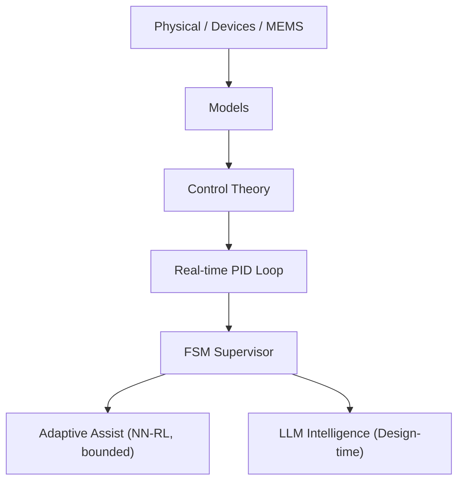

# 🎓 Samizo-AITL Portal  
> **A physical-first engineering framework  
> that integrates devices, control, and intelligence  
> through a unified causal loop back to the physical world**

[](https://github.com/Samizo-AITL)
[](https://zenn.dev/samizo_aitl)

---

## 🌐 Language
[](https://samizo-aitl.github.io/portal/)
[](https://samizo-aitl.github.io/portal/en/)

---

## ▶ Overview

A short slide deck summarizes  
the **design philosophy and overall structure of Samizo-AITL**.

Readers new to the portal are encouraged to start here.

▶ [Overview slides](https://samizo-aitl.github.io/about/marp/en/samizo-aitl-presentation.html)

---

## 🚀 What This Portal Provides

**Samizo-AITL** is a technical archive structured around  
a **physical-first design methodology**.

The portal provides:

- A framework for understanding systems **from physical constraints upward**
- A causal connection from **devices → models → control → intelligence**
- Design knowledge that preserves **why decisions exist**, not only how to implement them
- Reusable architectural concepts across **education, PoC, and practical design**

This is not a tutorial collection.  
It is an archive intended to support **design-level reasoning**.

---

## 🎯 Intended Audience

This portal is intended for engineers and researchers who:

- Begin system design from **physical models and constraints**
- Treat control theory as a **core structural element**
- Use AI / LLMs as **supervisory and analytical layers**, not controllers
- Require **cross-domain understanding without collapsing physical meaning**

⚠️ This is **not an introductory site**.  
It is a **reference archive for design-oriented engineering work**.

---

## 🧭 What Is Samizo-AITL?

The **Samizo-AITL Portal**, created by **Shinichi Samizo**,  
reorganizes semiconductor devices, MEMS, and control engineering  
around a **shared physical-first design framework**.

Rather than treating technologies in isolation,  
systems are presented along a single causal chain:

**Physics → Structure → Devices → Process → Models → Systems → Control → Intelligence**

This structure enables readers to trace  
**design rationale and constraints**, not only implementation details.

---

## 🧩 AITL Structure Map


> **Figure:**  
> Samizo-AITL technical architecture integrating  
> *physics → control → intelligence*  
> across DevEnv, CodeGen, Docs, and Archives layers.


※ LLM operates only at design-time for analysis and redesign, and does not intervene in real-time control.

AITL (Architecture for Integrated Technology Logic)  
is designed as the following **three-layer architecture**.

- **Inner Layer (Physical Layer)**: Physics, Devices, MEMS  
  → Defines physical constraints, limits, and inherent uncertainties  

- **Middle Layer (Control Layer)**: Models and Control Theory (PID)  
  → Determines system behavior and real-time stability  

- **Outer Layer (Supervisory & Design Layer)**: FSM / NN-RL / LLM  
  →  
  - **FSM**: Performs supervision, state transitions, and authorization of intervention  
  - **NN / RL**: Provides **bounded real-time adaptive assistance**, only when permitted by the FSM  
  - **LLM**: Supports **non-real-time interpretation, analysis, and design-level redesign**

---

## 🔍 For Reviewers, Evaluators, and Potential Collaborators

This portal organizes a **design-oriented engineering architecture**  
that integrates **physics-based models, control theory, and AI**,  
with explicit separation of responsibilities.

- Real-time control is handled exclusively by **PID**
- State supervision and decision boundaries are managed by **FSM**
- **AI (LLMs)** are restricted to **design-time analysis and redesign support**

AI is explicitly excluded from real-time control loops.  
The architecture therefore targets engineering systems that emphasize  
**safety, reproducibility, and objective evaluability**.

---

## 🗂 Directory Overview (Structural Map)

> **The directory structure itself represents the design philosophy.**

```text
Samizo-AITL/
├─ 01_DevEnv/        Environment & Reproducibility
│                   (VSCode / Python / Toolchain)
│
├─ 02_CodeGen/       Implementation & Control
│   ├─ PID           Real-time control (stability, V–I control)
│   ├─ FSM           Supervision, state transitions, mode management
│   ├─ NN_RL         Bounded real-time adaptive assistance
│   └─ LLM           Design supervision & redesign (non-real-time)
│
├─ 03_Docs/          Understanding, Education, Design Philosophy
│   ├─ Edusemi-v4x
│   ├─ EduController
│   └─ Edusemi-Plus
│
└─ 04_Archives/      PoC, history, design assets
```

**Recommended entry order**:  
**Architecture → Physics → Control → Intelligence**

---

## 🗺 How to Navigate This Portal

1. **Architecture & philosophy**  
   → Physical-first engineering and AITL concepts  
2. **Main Core (physical foundations)**  
   → Semiconductor devices, MEMS, physical constraints  
3. **Applied Layer (control & intelligence)**  
   → PID, FSM, and LLM roles  
4. **Proof-of-concept implementations**  
   → Verification through working systems  

This order avoids tool-driven or fragmented understanding.

---

## 📝 Essays / Design Philosophy (Zenn)

**Essays on design philosophy, physical-first engineering, and the AITL architecture are published on Zenn.**

[](https://zenn.dev/samizo_aitl)

---

# 💠 Main Core — Foundational Repositories
The Main Core forms a **coherent technical backbone**  
covering semiconductor technology from physics to system-level constraints.

---

## 1. Edusemi-v4x
A **systematic curriculum** covering semiconductor devices and processes:

- Device structures and operating physics  
- Process integration flows  
- Compact models and PDK concepts  
- Circuit-level fundamentals  
- SystemDK-based physical constraints  
  (thermal, stress, SI/PI, EMI)

[](https://samizo-aitl.github.io/Edusemi-v4x/en/)
[](https://github.com/Samizo-AITL/Edusemi-v4x)

---

### 🔹 Special Chapter: SystemDK (System Design Kit)

A special chapter that builds upon physics-based device and circuit knowledge and extends it into  
**implementation and system-level integration design**, including SI / PI / thermal / mechanical stress / EMI considerations.

- Organizes **system-level constraints** that cannot be resolved at the device level alone, starting from physical principles  
- Provides a unified design perspective spanning **SoC, chiplet, package, and board**  
- Usable not only as educational material, but also as a **practical design thinking framework** for real implementations  

👉 **Positioned as a bridge from “physics” to “system integration” within Edusemi-v4x.**

[](https://samizo-aitl.github.io/Edusemi-v4x/f_chapter2a_systemdk/)

---

## 2. SemiDevKit
An **implementation-oriented development kit** bridging semiconductor device theory and practical design workflows:

- Poisson / Drift–Diffusion solvers  
- BSIM4 compact device modeling  
- SPICE simulation  
- NBTI / HCI reliability analysis  
- Physical layout using OpenLane-Lite  

👉 **Transforming physical device understanding into executable design flows.**

### ■ Device Modeling Example (Short Channel Effect)


**NMOS Vg–Id characteristics (Linear region) modeled with BSIM4**,  
showing **channel-length (L) dependent behavior**.  
The increase in drain current and slope variation with reduced L  
clearly reflects **Short Channel Effects**, including  
*threshold voltage roll-off* and *mobility degradation*.

[](https://samizo-aitl.github.io/SemiDevKit/)
[](https://github.com/Samizo-AITL/SemiDevKit)

---

## 3. Edusemi-Plus
Extended materials connecting semiconductor fundamentals with surrounding domains:

- Advanced materials (SiC, GaN)  
- Manufacturing equipment and fabs  
- Packaging and system integration  
- Supply chains and industrial structures  

[](https://samizo-aitl.github.io/Edusemi-Plus/en/)
[](https://github.com/Samizo-AITL/Edusemi-Plus)

---

## 🕰 Legacy Technology (Failure & Recovery Archive)

**Legacy Technology** is **not a retrospective of obsolete processes**.  
It is a collection of **causal case studies** documenting how physical mechanisms,
process integration, and usage conditions **directly shaped failures,
yield recovery, and business decisions**.

- Failures are treated as **exposed design constraints**, not accidents  
- Recoveries are **bounded optimizations under real limitations**, not ideal solutions  
- Many of these structures **reappear in modern SoC, AI accelerators, and advanced nodes**

### ▶ Representative Cases

- **0.25µm DRAM (1998)**  
  Process integration, leakage-dominated retention,  
  Pause / Disturb failures, fail-stop binning strategy  
  → Yield recovery and structural limits revealed  
  🔗 [Open DRAM 0.25µm Case](https://samizo-aitl.github.io/Edusemi-Plus/archive/legacy/dram_025um/)

- **VSRAM (Pseudo-SRAM, 2001)**  
  DRAM-derived architecture operated under mobile conditions (90 °C)  
  → Technical recovery followed by strategic termination  
  🔗 [Open VSRAM Case](https://samizo-aitl.github.io/Edusemi-Plus/archive/legacy/vsram_2001/)

These materials explain **why AI and control architectures
cannot ignore physical reality**,  
based on real-world chains of **manufacturing, testing,
and market decision-making**.

[Open Legacy Technology](https://samizo-aitl.github.io/Edusemi-Plus/archive/legacy/)

> 🔐 **Note on Confidentiality**  
> This archive is based exclusively on semiconductor technologies  
> developed more than **20 years ago**.  
>  
> It contains **no proprietary process recipes, design rules, or
> operational know-how** applicable to current manufacturing.  
> The focus is on **structural failure-and-decision patterns**, not secrets.

---

## 4. openlane2-sram｜SRAM Hard Macro Integration (Physical Design Proof)
This project demonstrates a **complete RTL → GDS flow** using **OpenLane2 (v2)**  
by integrating an **SRAM hard macro** into a macro-aware physical design.

The focus is not SRAM design itself, but **realistic hard-macro integration**  
within an OpenLane2-based physical implementation flow.

- SRAM is treated as an **external hard macro** (blackbox / LEF / GDS)
- **Macro-aware floorplanning** with FIXED placement and halo / keepout
- **Final GDS generation** using the OpenLane2 Classic flow
- Explicitly follows standard SoC practice:  
  **SRAM internals are not exposed or inspected**

[](https://samizo-aitl.github.io/openlane2-sram/)
[](https://github.com/Samizo-AITL/openlane2-sram)

### 🔎 Layout Evidence (GDS)

**Figure 1: SRAM Macro Block-Level View**


**Figure 2: Standard-Cell-Level View Around the SRAM Macro**


> **Note:**  
> The SRAM is integrated as a fixed hard macro using abstract views (LEF/GDS).  
> Its internal transistor-level layout is intentionally not visible, which is consistent with standard SoC physical design practice.

---

# 🎛 Applied Layer — Control & Intelligence

This layer explores how physical foundations are applied to  
**dynamic systems and control problems**.

Classical control (PID, FSM) remains the **primary control mechanism**,  
while AI/LLMs are treated as **architectural support tools**, not replacements.

---

## 🧭 Control Architecture Concepts

> Core control-architecture concepts that **separate runtime operation**
> from **design-time recovery**.  
> Both concepts explicitly assume that **AI does not replace controllers**.

| Concept | Role | Links |
|---|---|---|
| **Envelope Control** | Runtime enforcement of safe operating envelopes under uncertainty | 🔗 [Open](https://samizo-aitl.github.io/envelope-control/) ｜ 🔧 [Repo](https://github.com/Samizo-AITL/envelope-control) |
| **Design Recovery Control** | Offline recovery of violated control design assumptions | 🔗 [Open](https://samizo-aitl.github.io/design-recovery-control/) ｜ 🔧 [Repo](https://github.com/Samizo-AITL/design-recovery-control) |

**Relationship (non-overlapping):**
- **Envelope Control** constrains *how the system operates now*.
- **Design Recovery Control** repairs *why the original design no longer works*.

These concepts are **complementary, not alternatives**.

---

## ▶ Control Playground (Time Response Demo)

This demo visualizes the **time response of a fixed-gain PID controller**
under **colored, adversarial disturbances**.

- No sliders  
- No tuning  
- Only **y(t), setpoint(t), and disturbance(t)** are shown  

<iframe
  src="https://samizo-aitl.github.io/control-playground/"
  style="width:100%; height:420px; border:none;">
</iframe>

> Control performance is not explained by words.  
> **The waveform tells the whole story.**

---

## 5. EduController
An educational resource focused on **control fundamentals**:

- PID control principles  
- FSM-based supervisory logic  
- Control-oriented design thinking  
- Optional HDL template generation  

[](https://samizo-aitl.github.io/EduController/en/)
[](https://github.com/Samizo-AITL/EduController)

---

## 6. AITL-Controller-A-Type

A **minimal experimental controller** implemented in Python to explore
a strict **separation of responsibilities** in control system design:

- **Control execution** (PID)  
- **Supervision and decision logic** (FSM)  
- **Limited real-time adaptive assistance** (NN / RL, bounded and optional)  
- **Redesign and analysis support** (LLM, design-time only)

This project is a **thinking framework** for control architecture design,  
**not** a proposal for a new control algorithm  
and **not** an autonomous control system.

- **AITL Controller (A-Type) — Official Architecture & Reliability Specification**

[](https://samizo-aitl.github.io/aitl-controller-a-type/)
[](https://github.com/Samizo-AITL/aitl-controller-a-type)

<figure style="text-align:center; margin:2rem auto;">
  
  <figcaption style="font-size:0.9rem; color:#555; margin-top:0.5rem;">
    System response under disturbance:  
    control by PID, supervision by FSM,  
    bounded adaptive assistance when permitted,  
    and design-time redesign triggered by LLM only when required.
  </figcaption>
</figure>

---

### ▶ Interactive Verification (Design-Side Playground)

The figure above shows an **idealized AITL response**,  
derived from logged simulation and analysis results.

For hands-on exploration of **why this layered separation is necessary**,  
and **where adaptation must stop and design reconsideration begins**,  
please refer to the interactive playground below.

👉 **AITL Control Playground (Interactive)**  
🔗 [/playground/](/playground/)

- Tune PID gains and observe stability, oscillation, and recovery
- Switch FSM modes (TRACK / HOLD / MANUAL)
- Observe **when bounded real-time adaptation is insufficient**
- See **when and why design-time intelligence (LLM-equivalent) would be invoked**

> This playground is intentionally separated from this PoC page  
> to preserve the clarity of the **minimal AITL structure and responsibility separation**.

---

## 7. V–I Control ASIC on SKY130
A **hands-on educational control ASIC** demonstrating a complete flow from  
**control theory to silicon** using **PID + FSM**.

- Deterministic digital V–I control  
- Fixed-point PID with explicit saturation  
- FSM-based safety supervision  
- Full RTL → GDS flow on OpenLane + SKY130  

[](https://samizo-aitl.github.io/vi-control-asic-sky130/)
[](https://github.com/Samizo-AITL/vi-control-asic-sky130)

---

### Logic-to-Physical Consistency (OpenLane v1)

This project demonstrates that the **V–I control logic (PID + FSM)**  
is functionally correct at the RTL level and can be carried through  
to **physical implementation using OpenLane v1**.

By validating the logical behavior first and then mapping it to silicon,  
the project clarifies **how control theory is concretely realized in an ASIC**.

---

#### Logical Verification (GTKWave)


*RTL-level functional verification using GTKWave.  
The waveform confirms correct PID + FSM behavior at the control interface.  
Internal macro implementations are intentionally treated as black boxes.*

---

#### Physical Implementation (OpenLane v1)


*Standard-cell placement and routing snapshot generated by OpenLane v1.  
This figure is used for **flow inspection**, not as a final GDS deliverable.*

---

**Note:**  
This project uses **OpenLane v1** as a baseline RTL-to-GDS implementation.  
Macro-aware and more advanced physical design examples are provided separately  
using **OpenLane v2**.

---

## 🔔 Ongoing Work: AI Control Safety Package

We are preparing **AI Control Safety Package**,  
a practical design and review package for introducing  
AI / LLM-based control systems **safely and responsibly**.

This is a **practice-oriented project** derived from  
the control architecture concepts presented in this portal.

🔗 **Project Page (GitHub Pages)**  
[AI Control Safety Package](https://samizo-aitl.github.io/ai-control-safety-package/)

🔧 Repository:  
[Samizo-AITL/ai-control-safety-package](https://github.com/Samizo-AITL/ai-control-safety-package)

---

# ⚙️ MEMS — Where Abstraction Meets Reality

A boundary domain where  
**abstract models are tested against real physical structures**,  
revealing the limits of simplification and guiding design decisions toward MEMS.

---

## 8. mems-ana  
**Pre-FEM MEMS Structural Exploration Tool**

A lightweight analysis tool for **early-stage MEMS structural exploration before full FEM simulation**.

This tool focuses on capturing **dominant deformation modes, scaling trends, and dynamic behavior** using simplified analytical and numerical models, enabling rapid design-space exploration without the overhead of full multiphysics solvers.

- Quick evaluation of structural response trends
- Identification of sensitive geometric and material parameters
- Early filtering of infeasible designs before FEM

[](https://samizo-aitl.github.io/mems-ana/)
[](https://github.com/Samizo-AITL/mems-ana)

### Demo animation (recommended)


---

## 9. Inkjet Printing — Design Trade-off Models

Minimal physical models that visualize **fundamental trade-offs in inkjet printing systems**, such as:

- Print quality
- Throughput
- Droplet behavior

These models are implemented as **simple Python simulations**, intentionally avoiding excessive detail in order to make **causal relationships and trade-off structures explicit**.

This project serves as a domain-specific example of how **physical constraints shape system-level design choices**.

[](https://samizo-aitl.github.io/inkjet-dts/)
[](https://github.com/Samizo-AITL/inkjet-dts)

---

## 10. inkjet-timing  

A design and educational demo that visualizes **time-domain causality across electrical, mechanical, and fluid domains** in a piezoelectric inkjet system.

By explicitly aligning drive waveforms, structural response, and droplet dynamics along a common time axis, this tool highlights **what happens when — and why** in coupled multiphysics systems.

- Time-resolved causal relationships
- Clear separation of controllable vs. uncontrollable dynamics
- Educational insight into waveform-driven inkjet behavior

[](https://samizo-aitl.github.io/inkjet-timing/)
[](https://github.com/Samizo-AITL/inkjet-timing)

---

## 11. Inkjet Driver IC — Physical Interface Abstraction

A design node that defines the **physical boundary where an inkjet driver IC interfaces with the MEMS / fluid domain**,  
explicitly including **PDK and process-level constraints**.

This project is based on the **GF180 PDK**, where  
**high-voltage (HV) MOS devices required for inkjet driving are manually designed at the layout level**.  
(This is fundamentally different from **sky130-style designs based on standard cells and automatic synthesis**.)

### What this node defines
- **Equivalent loads (V–I–t conditions)** passed from MEMS / fluid models to the IC
- Translation of those conditions into **IC-side voltage, current, and reliability constraints**
- One-to-one mapping between **abstract models and physical layouts**  
  (HVMOS / DNWELL / routing / pads)
- A clear definition of **what is beyond the control of the IC**

👉 A design interface that defines the **responsibility boundary** between physical models and IC design.

[](https://samizo-aitl.github.io/gf180-inkjet-driver/)
[](https://github.com/Samizo-AITL/gf180-inkjet-driver)

---

### HVMOS Layout as a Physical Interface

The following figure shows a representative **high-voltage MOS (HVMOS) layout**
that serves as the **physical interface** between the inkjet driver IC
and the MEMS / fluid domain.

Rather than a single device in isolation, this example represents the
minimum structure actually exposed by the IC:
the **HV_SW_UNIT**, consisting of the HVMOS device,
DNWELL isolation, and a continuous guard ring.

This layout visually defines:
- The physical structures for which the IC is responsible
- The starting point of voltage, current, and timing constraints
  presented to the MEMS / fluid system
- The boundary beyond which behavior is no longer controllable by the IC


---

## 12. Full Code Mechanical Design

**A methodology for defining mechanical and MEMS structures
as executable code rather than GUI-based CAD operations.**

In this approach, CAD is treated not as an authoring tool,
but as an **execution engine for physical structure and design intent**.

- Geometry is generated entirely by Python code  
- Dimensions and placements explicitly encode design intent  
- Assemblies are defined by **placement**, not constraint solvers  
- CAD files (FCStd / STEP) are treated as byproducts, not primary assets  

This methodology enables mechanical and MEMS structures to be
**reproducible, reviewable, and automatable**, and allows them to serve as
explicit **physical boundary definitions** for higher-level control
and AITL architectures.

👉 **Full Code Mechanical Design provides the physical-structure
definition layer upon which Samizo-AITL builds its control
and intelligence architectures.**

[](https://samizo-aitl.github.io/full-code-mechanical-design/)
[](https://github.com/Samizo-AITL/full-code-mechanical-design)

---

# 🎞 AITL Animation Demos
A collection of animation demos that visualize **AITL control architectures** and  
physical, device-level, and multiphysics behaviors over time.

- PID control time responses and control flow  
- Role separation across AITL layers (PID / FSM / NN·RL / LLM)  
- Time- and space-domain dynamics in inkjet, MEMS, and device physics  

These demos are intended to provide a **visual understanding of system structure and behavior**  
prior to engaging with equations or code.

[](https://samizo-aitl.github.io/aitl-animation-demos/)

---

## 🎞 AITL Control Flow Demo

This demo illustrates how the AITL control architecture operates along the time axis,  
where **PID × FSM form the real-time control core**,  
**NN / RL provide bounded real-time assistance**,  
and **LLM is isolated as a non-real-time design-support layer**.

---

### 🔁 Layer roles (summary)

- **PID (real-time control)**  
  Responsible for real-time control execution.  
  Under nominal conditions, reference tracking is achieved by PID alone.

- **FSM (supervisory control)**  
  Monitors system state and detects degradation.  
  Manages mode transitions  
  (*monitoring / disturbance / recovery / stable*)  
  and determines whether adaptive assistance or redesign is permitted.

- **NN / RL (bounded adaptive assist)**  
  Activated only when explicitly permitted by FSM.  
  Operates as a limited, bounded assist and does not replace PID control.

- **LLM (design-time support)**  
  Invoked by FSM only in non-real-time contexts.  
  Analyzes logs and reliability indicators to support  
  design-level updates (e.g., PID gains or control policies).

---

### 📉 Demo sequence

1. Normal operation: PID tracking, FSM monitoring  
2. Disturbance: error growth detected by FSM  
3. Conditional adaptation: FSM permits bounded NN / RL assistance  
4. Design review (if required): FSM invokes LLM  
5. Recovery: PID re-establishes tracking, FSM returns to stable

---

### 🎯 What this demo demonstrates

This demo confirms that, in AITL:

- Real-time control responsibility remains with PID  
- Adaptive intelligence is strictly bounded and conditional  
- Design-level reasoning is separated from real-time loops  

The architecture preserves **control stability and accountability**  
through explicit responsibility separation.

---

<section class="aitl-demo" style="margin:0;padding:0;">
  <iframe
    src="https://samizo-aitl.github.io/aitl-animation-demos/demo/js-svg/aitl-control-flow.html"
    style="display:block;width:100%;height:520px;border:none;border-radius:12px;background:#000;margin:0;"
    loading="lazy"
    referrerpolicy="no-referrer">
  </iframe>
</section>

---

# 📄 Related Manuscript (Preprint)

The design philosophy and structural architecture of **Samizo-AITL**  
are systematically described in the following **manuscript (preprint)**.

**A Web-Based Design Knowledge Hub for Reusable Engineering Education**  
Shinichi Samizo

👉 **[Read the manuscript (PDF)](/assets/paper/2026_fie_pdh_portal.pdf)**

> This manuscript presents a physical-first design knowledge architecture  
> that integrates devices, control theory, and intelligent systems  
> through a unified causal structure.
>
> *This document is a preprint and has not yet been formally published  
> or presented at any academic conference.*

---

# 🕘 Update Log
Chronological record of site and repository updates.

[📄 View update history](https://samizo-aitl.github.io/about/update/en/)

---

# 👤 Author

**Shinichi Samizo**  
Independent Semiconductor Researcher  

- GitHub: [https://github.com/Samizo-AITL](https://github.com/Samizo-AITL)
- Zenn: [https://zenn.dev/samizo_aitl](https://zenn.dev/samizo_aitl)
- Career Summary: [https://samizo-aitl.github.io/about/career-summary/en/](https://samizo-aitl.github.io/about/career-summary/en/)

---

# 🔐 License & Terms of Use (Hybrid Model)

[](https://samizo-aitl.github.io/portal/en//#-license)

This portal adopts a **hybrid licensing model**.

| 📌 Item | License | Description |
|--------|---------|-------------|
| **💻 Source Code** | **MIT License** | Free to use, modify, and redistribute |
| **📄 Text Materials** | **CC BY 4.0** or **CC BY-SA 4.0** | Attribution required; share-alike applies for BY-SA |
| **📊 Figures & Diagrams** | **CC BY-NC 4.0** | Non-commercial use only |
| **🔗 External References** | Follow the original license | Cite the original source properly |

## ⚠️ Important Note on AITL Architecture and Methodology

The licenses above apply to **individual materials**  
(source code, text materials, figures, and diagrams) respectively.

The **AITL architecture and methodology as an integrated system**  
(FSM × PID × LLM layered control design and its associated educational framework)  
are **not granted** by the above licenses.

🚫 **Systematic reuse, redistribution, or commercial application**  
of the AITL methodology or its complete educational structure  
requires **explicit permission from the project authors**.

---

# 💬 Technical Discussion / Consultation

[](https://github.com/Samizo-AITL/Samizo-AITL.github.io/discussions)

> This portal does not provide private contact channels  
> (e-mail, social media, or direct messages).
>
> All technical questions, discussions, and consultation inquiries  
> are handled **publicly via GitHub Discussions**,  
> with an emphasis on reproducibility and design context.
