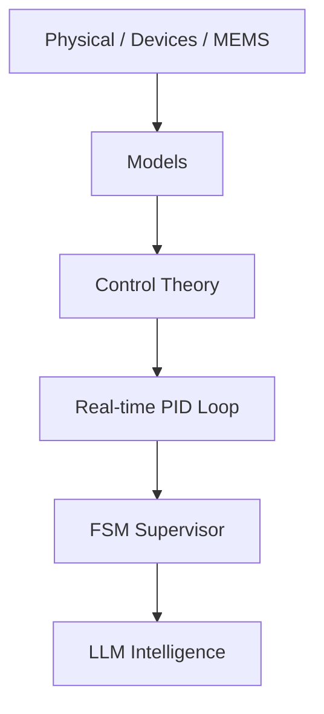

# 🎓 Samizo-AITL Portal  
> **A physical-first framework that connects devices, control, and intelligence  
> through a single coherent causal structure**  
> *A design-oriented technical archive for engineers and researchers.*

[](https://github.com/Samizo-AITL)
[](https://zenn.dev/samizo_aitl)


## 🌐 Language
[](https://samizo-aitl.github.io/portal/)
[](https://samizo-aitl.github.io/portal/en/)

---

## ▶ For First-Time Visitors (Overview)

A short slide deck summarizing  
the **design philosophy and overall concept of Samizo-AITL**.

**We recommend starting here.**

▶ [Start here (Overview slides)](https://samizo-aitl.github.io/about/marp/en/samizo-aitl-presentation.html)

---

## 🚀 What This Portal Provides

**Samizo-AITL** is not a collection of isolated tutorials.  
It is a **structural archive** that enables you to:

- Understand engineering systems **from physical constraints upward**
- Connect **devices → models → control → intelligence** without breaking causality
- Reconstruct **design decisions**, not just implementations
- Reuse architectural thinking across **education, PoC, and real design work**

This portal is built for engineers who need  
**structure, not abstraction shortcuts**.

---

## 🎯 Intended Audience

This portal is designed for engineers and researchers who:

- Start system design **from physical models and constraints**
- Treat control theory as a **first-class design element**
- Use AI / LLMs as **supervisory and analytical layers**, not black-box controllers
- Need **cross-domain understanding without collapsing physical meaning**

⚠️ This is **not an introductory tutorial site**.  
It is a **reference archive for design-oriented engineering work**.

---

## 🧭 What Is Samizo-AITL?

The **Samizo-AITL Portal**, created by **Shinichi Samizo**, reorganizes  
semiconductor devices, MEMS, and control engineering around a  
**shared physical-first design philosophy**.

Instead of explaining technologies in isolation,  
systems are presented through a **single causal chain**:

**Physics → Structure → Devices → Process → Models → Systems → Control → Intelligence**

This approach allows readers to follow *why* design decisions exist,  
not just *how* to implement them.

---

## 🧩 AITL Structure Map


> **Figure:**  
> Samizo-AITL technical architecture integrating  
> *physics → control → intelligence*  
> across DevEnv, CodeGen, Docs, and Archives layers.


※ LLM operates only at design-time for analysis and redesign, and does not intervene in real-time control.

### Architectural Positioning

- **Inner layers**: Physics, devices, MEMS (constraint-defining layers)  
- **Middle layers**: Modeling and classical control theory  
- **Outer layers**: Intelligence, supervision, and redesign  

LLMs are explicitly placed **outside the real-time control loop**,  
supporting diagnosis, analysis, and redesign.

---

## 🗂 Directory Overview (Structural Map)

> **The directory structure itself represents the design philosophy.**

```text
Samizo-AITL/
├─ 01_DevEnv/        Environment & reproducibility
│   └─ VSCode / Python / Toolchain
│
├─ 02_CodeGen/       Implementation, control, and generation
│   ├─ PID           Real-time control (stability, V–I control)
│   ├─ FSM           State transitions and supervisory logic
│   └─ LLM           Supervision and redesign (non–real-time)
│
├─ 03_Docs/          Documentation, education, design philosophy
│   ├─ Edusemi-v4x
│   ├─ EduController
│   └─ Edusemi-Plus
│
└─ 04_Archives/      PoCs, history, and technical assets
```

**Recommended entry order**:  
**Architecture → Physics → Control → Intelligence**

---

## 🗺 How to Navigate This Portal

1. **Architecture & philosophy**  
   → Physical-first engineering and AITL concepts  
2. **Main Core (physical foundations)**  
   → Semiconductor devices, MEMS, physical constraints  
3. **Applied Layer (control & intelligence)**  
   → PID, FSM, and LLM roles  
4. **Proof-of-concept implementations**  
   → Verification through working systems  

This order avoids tool-driven or fragmented understanding.

---

## 📝 Essays / Design Philosophy (Zenn)

**Essays on design philosophy, physical-first engineering, and the AITL architecture are published on Zenn.**

[](https://zenn.dev/samizo_aitl)

---

# 💠 Main Core — Foundational Repositories
The Main Core forms a **coherent technical backbone**  
covering semiconductor technology from physics to system-level constraints.

---

## 1️⃣ Edusemi-v4x
A **systematic curriculum** covering semiconductor devices and processes:

- Device structures and operating physics  
- Process integration flows  
- Compact models and PDK concepts  
- Circuit-level fundamentals  
- SystemDK-based physical constraints  
  (thermal, stress, SI/PI, EMI)

[](https://samizo-aitl.github.io/Edusemi-v4x/en/)
[](https://github.com/Samizo-AITL/Edusemi-v4x)

---

### 🔹 Special Chapter: SystemDK (System Design Kit)

A special chapter that builds upon physics-based device and circuit knowledge and extends it into  
**implementation and system-level integration design**, including SI / PI / thermal / mechanical stress / EMI considerations.

- Organizes **system-level constraints** that cannot be resolved at the device level alone, starting from physical principles  
- Provides a unified design perspective spanning **SoC, chiplet, package, and board**  
- Usable not only as educational material, but also as a **practical design thinking framework** for real implementations  

👉 **Positioned as a bridge from “physics” to “system integration” within Edusemi-v4x.**

[](https://samizo-aitl.github.io/Edusemi-v4x/f_chapter2a_systemdk/)

---

## 2️⃣ SemiDevKit
An **implementation-oriented development kit** bridging semiconductor device theory and practical design workflows:

- Poisson / Drift–Diffusion solvers  
- BSIM4 compact device modeling  
- SPICE simulation  
- NBTI / HCI reliability analysis  
- Physical layout using OpenLane-Lite  

👉 **Transforming physical device understanding into executable design flows.**

### ■ Device Modeling Example (Short Channel Effect)


**NMOS Vg–Id characteristics (Linear region) modeled with BSIM4**,  
showing **channel-length (L) dependent behavior**.  
The increase in drain current and slope variation with reduced L  
clearly reflects **Short Channel Effects**, including  
*threshold voltage roll-off* and *mobility degradation*.

[](https://samizo-aitl.github.io/SemiDevKit/)
[](https://github.com/Samizo-AITL/SemiDevKit)

---

## 3️⃣ Edusemi-Plus
Extended materials connecting semiconductor fundamentals with surrounding domains:

- Advanced materials (SiC, GaN)  
- Manufacturing equipment and fabs  
- Packaging and system integration  
- Supply chains and industrial structures  

[](https://samizo-aitl.github.io/Edusemi-Plus/en/)
[](https://github.com/Samizo-AITL/Edusemi-Plus)

---

## 4️⃣ openlane2-sram｜SRAM Hard Macro Integration (Physical Design Proof)
This project demonstrates a **complete RTL → GDS flow** using **OpenLane2 (v2)**  
by integrating an **SRAM hard macro** into a macro-aware physical design.

The focus is not SRAM design itself, but **realistic hard-macro integration**  
within an OpenLane2-based physical implementation flow.

- SRAM is treated as an **external hard macro** (blackbox / LEF / GDS)
- **Macro-aware floorplanning** with FIXED placement and halo / keepout
- **Final GDS generation** using the OpenLane2 Classic flow
- Explicitly follows standard SoC practice:  
  **SRAM internals are not exposed or inspected**

[](https://samizo-aitl.github.io/openlane2-sram/)
[](https://github.com/Samizo-AITL/openlane2-sram)

### 🔎 Layout Evidence (GDS)

**Figure 1: SRAM Macro Block-Level View**


**Figure 2: Standard-Cell-Level View Around the SRAM Macro**


> **Note:**  
> The SRAM is integrated as a fixed hard macro using abstract views (LEF/GDS).  
> Its internal transistor-level layout is intentionally not visible, which is consistent with standard SoC physical design practice.

---

# 🎛 Applied Layer — Control & Intelligence

This layer explores how physical foundations are applied to  
**dynamic systems and control problems**.

Classical control (PID, FSM) remains the **primary control mechanism**,  
while AI/LLMs are treated as **architectural support tools**, not replacements.

---

## 🧭 Control Architecture Concepts

> Core control-architecture concepts that **separate runtime operation**
> from **design-time recovery**.  
> Both concepts explicitly assume that **AI does not replace controllers**.

| Concept | Role | Links |
|---|---|---|
| **Envelope Control** | Runtime enforcement of safe operating envelopes under uncertainty | 🔗 [Open](https://samizo-aitl.github.io/envelope-control/) ｜ 🔧 [Repo](https://github.com/Samizo-AITL/envelope-control) |
| **Design Recovery Control** | Offline recovery of violated control design assumptions | 🔗 [Open](https://samizo-aitl.github.io/design-recovery-control/) ｜ 🔧 [Repo](https://github.com/Samizo-AITL/design-recovery-control) |

**Relationship (non-overlapping):**
- **Envelope Control** constrains *how the system operates now*.
- **Design Recovery Control** repairs *why the original design no longer works*.

These concepts are **complementary, not alternatives**.

---

## ▶ Control Playground (Time Response Demo)

This demo visualizes the **time response of a fixed-gain PID controller**
under **colored, adversarial disturbances**.

- No sliders  
- No tuning  
- Only **y(t), setpoint(t), and disturbance(t)** are shown  

<iframe
  src="https://samizo-aitl.github.io/control-playground/"
  style="width:100%; height:420px; border:none;">
</iframe>

> Control performance is not explained by words.  
> **The waveform tells the whole story.**

---

## 5️⃣ EduController
An educational resource focused on **control fundamentals**:

- PID control principles  
- FSM-based supervisory logic  
- Control-oriented design thinking  
- Optional HDL template generation  

[](https://samizo-aitl.github.io/EduController/en/)
[](https://github.com/Samizo-AITL/EduController)

---

## 6️⃣ AITL-Controller-A-Type
A **minimal experimental controller** implemented in Python to explore:

- Separation of control (PID)  
- Supervision and decision logic (FSM)  
- Redesign and analysis support (LLM)

This project is a **thinking framework**,  
not a proposal for a new control algorithm.

[](https://samizo-aitl.github.io/aitl-controller-a-type/)
[](https://github.com/Samizo-AITL/aitl-controller-a-type)

<figure style="text-align:center; margin:2rem auto;">
  
  <figcaption style="font-size:0.9rem; color:#555; margin-top:0.5rem;">
    System response under disturbance: control by PID, supervision by FSM,
    and redesign triggered by LLM only when required.
  </figcaption>
</figure>

---

## 7️⃣ V–I Control ASIC on SKY130
A **hands-on educational control ASIC** demonstrating a complete flow from  
**control theory to silicon** using **PID + FSM**.

- Deterministic digital V–I control  
- Fixed-point PID with explicit saturation  
- FSM-based safety supervision  
- Full RTL → GDS flow on OpenLane + SKY130  

[](https://samizo-aitl.github.io/vi-control-asic-sky130/)
[](https://github.com/Samizo-AITL/vi-control-asic-sky130)

---

# ⚙️ MEMS — Where Abstraction Meets Reality

A boundary domain where  
**abstract models are tested against real physical structures**,  
revealing the limits of simplification.

---

## 8️⃣ mems-ana
**Pre-FEM MEMS structural exploration tool**

[](https://samizo-aitl.github.io/mems-ana/)
[](https://github.com/Samizo-AITL/mems-ana)

### Demo animation (recommended)


---

## 9️⃣ Inkjet Printing — Design Trade-off Models
Minimal models visualizing trade-offs between:

- Print quality  
- Throughput  
- Dot behavior  

through **simple Python simulations**,  
serving as a domain-specific example of physical trade-offs.

[](https://samizo-aitl.github.io/inkjet-dts/)
[](https://github.com/Samizo-AITL/inkjet-dts)

---

## 🔟 inkjet-timing  
A design and educational demo that visualizes the **time-domain causality**
between electrical, mechanical, and fluid domains in a piezoelectric inkjet system.

[](https://samizo-aitl.github.io/inkjet-timing/)
[](https://github.com/Samizo-AITL/inkjet-timing)

---

# 🎞 AITL Animation Demos
A collection of animation demos visualizing **PID control, FSM, LLM, and AITL architectures**,  
as well as physical, device-level, and multiphysics behaviors.

- Visualization of **PID control time responses and control flow**
- Role separation and interaction within **AITL structures (PID × FSM × LLM)**
- Intuitive animations of **inkjet, MEMS, and device-physics dynamics** in time and space

These demos are intended to help readers **grasp system behavior and structure visually**  
before diving into equations or code.

[](https://samizo-aitl.github.io/aitl-animation-demos/)

---

## 🎞 AITL Control Flow Demo

This demo visualizes how the **core AITL control architecture**  
— **PID × FSM × LLM** — cooperates along the time axis.

---

### 🔁 Three-layer roles (key points)

- **PID (inner loop)**  
  Handles real-time control.  
  Under normal conditions, stable tracking is achieved by PID alone.

- **FSM (middle layer)**  
  Supervises system states.  
  Detects error growth or degradation and switches modes:  
  *monitoring → disturbance → recovery → stable*.

- **LLM (outer layer)**  
  Responsible for redesign.  
  Intervenes **only when invoked by FSM**, retuning PID gains (e.g., Kp).

---

### 📉 What happens in the demo

1. **Normal operation**  
   PID tracks the reference, FSM monitors, LLM stays idle.

2. **Disturbance occurs**  
   Error increases → FSM detects degradation.

3. **LLM intervention**  
   Control gains are retuned.

4. **Recovery completed**  
   PID re-tracks the reference → FSM becomes stable → LLM returns to idle.

---

### 🎯 Essence of AITL control

- LLM is **not** a real-time controller  
- PID is **not replaced**  
- FSM holds **decision authority**  
- LLM updates the **control design**, not the control signal

👉 **This is the core philosophy of AITL control**

---

<section class="aitl-demo" style="margin:0;padding:0;">
  <iframe
    src="https://samizo-aitl.github.io/aitl-animation-demos/demo/js-svg/aitl-control-flow.html"
    style="display:block;width:100%;height:520px;border:none;border-radius:12px;background:#000;margin:0;"
    loading="lazy"
    referrerpolicy="no-referrer">
  </iframe>
</section>

---

# 🕘 Update Log
Chronological record of site and repository updates.

[📄 View update history](https://samizo-aitl.github.io/about/update/en/)

---

# 👤 Author

**Shinichi Samizo**  
Independent Semiconductor Researcher  

- GitHub: [https://github.com/Samizo-AITL](https://github.com/Samizo-AITL)
- Zenn: [https://zenn.dev/samizo_aitl](https://zenn.dev/samizo_aitl)
- Career Summary: [https://samizo-aitl.github.io/about/career-summary/en/](https://samizo-aitl.github.io/about/career-summary/en/)

---

# 💬 Technical Discussion / Consultation

[](https://github.com/Samizo-AITL/Samizo-AITL.github.io/discussions)

> This portal does not provide private contact channels  
> (e-mail, social media, or direct messages).
>
> All technical questions, discussions, and consultation inquiries  
> are handled **publicly via GitHub Discussions**,  
> with an emphasis on reproducibility and design context.
