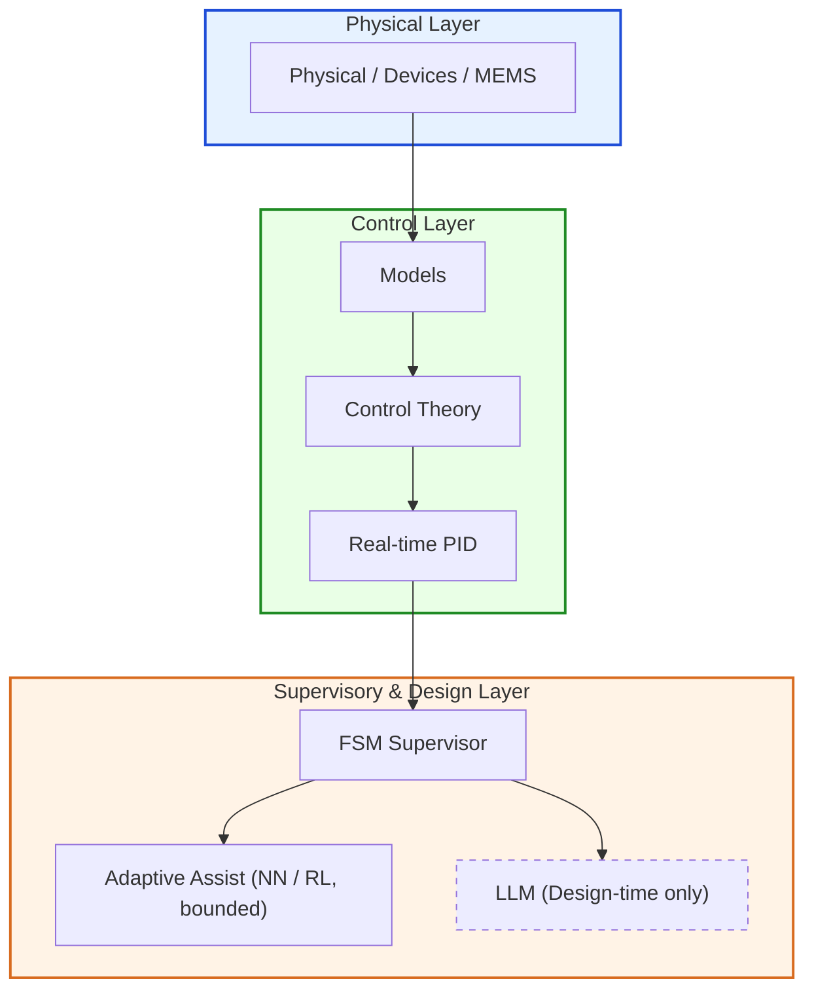

# 🎓 Samizo-AITL Portal  
> **物理 → デバイス → 制御 → 知能化 → 物理  
> ―― 実世界に戻る因果構造として統合した設計知識アーカイブ**

[](https://samizo-aitl.github.io/portal/en/)
[](https://github.com/Samizo-AITL)
[](https://zenn.dev/samizo_aitl)

---

## ▶ 全体構造の概要

Samizo-AITL の設計思想および全体構造を、  
短いスライド形式で整理しています。

📌 **初めて閲覧される場合は、本文に入る前に必ずご確認ください。**

[](https://samizo-aitl.github.io/about/marp/samizo-aitl-presentation.html)

----

## 🚀 このポータルで得られること

**Samizo-AITL** は、  
半導体・MEMS・制御・AI を  
**物理を起点とした一貫した設計構造**として整理した技術アーカイブです。

本ポータルでは、以下を提供します。

- 分野横断技術を **因果関係として整理する視点**
- 物理モデルから **制御・知能化までを接続した設計フレーム**
- 教材・PoC・実装を **再利用可能な設計資産として扱う構造**

単なる教材集ではなく、  
**技術体系そのものを設計可能な形で保存すること**を目的としています。

---

## 🎯 想定する読者

Samizo-AITL は、以下のような利用者を想定しています。

- 物理モデルを起点に設計を行いたい  
  半導体・MEMS・制御系エンジニア
- AI / LLM を  
  制御の代替ではなく、**監督・再設計層として利用したい設計者**
- 分野横断的に  
  **設計体系そのものを再構築したい研究者・開発者**

⚠️ **注意**  
本ポータルは入門向け資料ではありません。  
**設計判断に耐える理解を目的とした読者**を対象としています。

---

## 🧩 AITL Structure Map（全体構造）



AITL（Architecture for Integrated Technology Logic）は、  
**Physical → Control → Intelligence** という一方向の因果構造を中核とした  
技術設計アーキテクチャです。

- **Physical Layer**  
  物理・デバイス・MEMS によって  
  システムの制約・限界・不確実性が決定されます。

- **Control Layer**  
  物理モデルに基づく制御理論（PID）によって  
  安定性・応答・性能が保証されます。

- **Supervisory & Design Layer**  
  - **FSM**：状態判断・遷移・介入可否の管理  
  - **NN / RL**：FSM により許可された範囲での実時間適応補助（bounded）  
  - **LLM**：非実時間での意味解釈・再設計・設計支援  

※ **LLM は設計時（非実時間）でのみ使用され、  
　実時間制御ループには直接介入しません。**

**物理モデルを正しく、最後まで使い切るための知能化**  
――それが AITL の基本思想です。

---

## 🔍 設計前提と責務分離（AITLの非交渉条件）

本ポータルは、  
**物理モデル・制御理論・AI を役割分離した上で統合し、  
実装と説明責任の両立を目指す設計体系**を整理した技術アーカイブです。

- 実時間制御：**PID**  
- 状態監督・判断：**FSM**  
- AI（LLM）：**設計・再設計支援（非実時間）に限定**

AI を実時間制御に直接用いないことを前提とし、  
**安全性・再現性・評価可能性を重視した工学設計**を対象としています。

---

## 🗂 Samizo-AITL Directory Overview（全体像）

> **このディレクトリ構成そのものが、設計思想です。**

```text
Samizo-AITL/
├─ 01_DevEnv/        環境・再現性（VSCode / Python / Toolchain）
│
├─ 02_CodeGen/       実装・制御・生成
│   ├─ PID           実時間制御（安定性・V–I 制御）
│   ├─ FSM           監督・状態遷移・モード管理
│   ├─ NN_RL         制限付き実時間適応補助（FSM許可下）
│   └─ LLM           設計監督・再設計支援（非実時間）
│
├─ 03_Docs/          理解・教育・設計思想
│   ├─ Edusemi-v4x
│   ├─ EduController
│   └─ Edusemi-Plus
│
└─ 04_Archives/      PoC・履歴・技術資産
```

---

## 🎓 AITL Training & Competence Framework（教育・訓練）

Samizo-AITL の設計思想および技術体系を  
**組織的に教育・訓練・検証するための独立したドキュメント群**です。

本フレームワークは、  
**ISO 9001 Clause 7.2（Competence）を想定**し、  
AITL における責務分離（PID / FSM / NN・RL / LLM）を  
**教育・力量管理の観点から明文化**しています。

👉 **AITL Training GitHub Page and Repository**  

[](https://samizo-aitl.github.io/aitl-training/)
[](https://github.com/Samizo-AITL/aitl-training)

- 技術実装は含みません  
- 教育方針・訓練計画・検証・記録を定義します  
- Samizo-AITL 本体は **Single Source of Truth** のまま維持されます

---

## 🗺 このポータルの歩き方

1. **設計思想・アーキテクチャ**  
   物理起点エンジニアリングと AITL の基本概念

2. **物理・デバイス**  
   半導体物理、デバイス、MEMS、物理制約

3. **制御アーキテクチャ**  
   モデルと実時間制御（PID を FSM が監督）

4. **知能（設計時）**  
   監督ロジックと LLM による設計時解析（非リアルタイム）

5. **PoC 実装**  
   動作するシステムによる検証

この順序は、ツール起点や断片的理解を避けるためのものです。

----

## 📝 Essays / Design Philosophy (Zenn)

**設計思想・物理起点工学・AITL構造に関する考察記事は Zenn に集約しています。**

[](https://zenn.dev/samizo_aitl)

---

# 💠 Semiconductor Physics & Devices
物理起点で半導体・デバイスを体系化し、制御設計の前提条件を定義する基盤層

---

## 1️⃣ 📘 Edusemi-v4x
半導体プロセス・デバイス・回路設計を、**物理起点で体系化する基幹教材**。

- 電子物性・プロセス条件・デバイス構造の因果関係を整理
- 回路特性を「結果」ではなく「物理の帰結」として理解
- 教科書断片ではなく、**設計につながる物理体系**を構築

👉 **Samizo-AITL 全体の物理基盤となる中核教材。**

[](https://samizo-aitl.github.io/Edusemi-v4x/)
[](https://github.com/Samizo-AITL/Edusemi-v4x)

---

### 🔹 特別章：SystemDK（System Design Kit）

物理・デバイス・回路を前提として、  
**SI / PI / 熱 / 応力 / EMI を含む「実装・統合設計」へ展開する特別章**。

- デバイス単体では終わらない「システム制約」を物理から整理
- SoC / Chiplet / Package / Board を貫く設計視点
- 教材でありつつ、実設計の思考フレームとしても利用可能

👉 **Edusemi-v4x における「物理 → システム統合」への橋渡し位置づけ。**

[](https://samizo-aitl.github.io/Edusemi-v4x/f_chapter2a_systemdk/)
[](https://github.com/Samizo-AITL/Edusemi-v4x/tree/main/f_chapter2a_systemdk) 

---

## 2️⃣ 📐 SemiDevKit
物理モデルから **SPICE・信頼性・レイアウト**までを接続する実装キット。

- 物理モデルを SPICE モデルへ落とし込む
- 信頼性・ばらつき・設計マージンを考慮
- デバイス理解を **設計フローとして実装**する

👉 **物理理解を「設計作業」に変換するための橋渡し。**

[](https://samizo-aitl.github.io/SemiDevKit/)
[](https://github.com/Samizo-AITL/SemiDevKit)

### ■ Device Modeling Example（SCE対応）


**BSIM4モデルによるNMOS Vg–Id特性（Linear領域）**。  
チャネル長Lの短縮に伴うId増大と勾配変化を通じて、  
**Short Channel Effect（Vth roll-off / mobility degradation）を反映したデバイス挙動**を可視化。

---

## 🧱 openlane2-sram｜SRAMマクロ統合・物理設計実証
OpenLane2（v2）を用いて **SRAM hard macro を統合し、RTL → GDS まで完走する**  
**マクロ対応・物理設計の実践教材**。

- SRAM を **external hard macro（blackbox / LEF / GDS）** として扱う
- FIXED 配置・halo / keepout を含む **macro-aware floorplanning**
- OpenLane2 Classic flow による **最終 GDS 生成**
- SoC 物理設計で一般的な **「SRAM 中身は見ない」設計作法**を明示

[](https://samizo-aitl.github.io/openlane2-sram/)
[](https://github.com/Samizo-AITL/openlane2-sram)

### 🔎 レイアウト検証（GDS）

**図1：SRAM マクロのブロックレベル表示**


**図2：SRAM マクロ周辺のスタンダードセルレベル表示**


> 注記：本 SRAM は、抽象ビュー（LEF / GDS）を用いた **固定ハードマクロ** として統合されています。  
> 内部のトランジスタレベルのレイアウトは意図的に可視化されておらず、これは **SoC の物理設計における標準的な実務慣行**と一致しています。

---

## 3️⃣ 📘 Edusemi-Plus
材料・装置・産業構造を、**物理視点で拡張する補助教材**。

- 製造装置・材料技術と物理原理の関係整理
- 半導体産業構造・技術選択の背景を理解
- Edusemi-v4x の物理体系を **現実世界へ拡張**

👉 **「なぜこの技術が選ばれているか」を理解するための補助教材。**

[](https://samizo-aitl.github.io/Edusemi-Plus/)
[](https://github.com/Samizo-AITL/Edusemi-Plus)

---

## 🕰 Legacy Technology（Failure & Recovery Archive）

**Legacy Technology** は、過去技術の回顧ではありません。  
物理・プロセス・使用条件が **どのように失敗を生み、  
それが歩留まり・製品戦略・撤退判断にどう接続されたか**を記録した  
**因果構造ベースのケーススタディ集**です。

- 失敗は「結果」ではなく **設計制約の可視化**
- 成功は「最適解」ではなく **制約下での回復**
- 多くの構造は、**現代の SoC / AI / 先端デバイスでも再出現**します

👉 「なぜ AI や制御は**現実を無視できない**のか」を、  
実在した **製造・テスト・市場判断の連鎖**から理解するための資料群です。

[](https://samizo-aitl.github.io/Edusemi-Plus/archive/legacy/)
[](https://github.com/Samizo-AITL/Edusemi-Plus/tree/main/archive/legacy)

### ▶ 主なケース

- **0.25µm DRAM (1998)**  
  プロセス統合・リーク支配・Pause / Disturb 不良・Bin戦略  
  → 歩留まり回復と限界の顕在化  
  🔗 [**Open DRAM 0.25µm Case**](https://samizo-aitl.github.io/Edusemi-Plus/archive/legacy/dram_025um/)

- **PSRAM (Pseudo-SRAM, 2001)**  
  DRAM派生アーキテクチャをモバイル条件（90 °C）で運用した境界事例  
  → 技術的成功と戦略的撤退  
  🔗 [**Open PSRAM Case**](https://samizo-aitl.github.io/Edusemi-Plus/archive/legacy/psram_2001/)

> 🔐 **機密性に関する明示**  
> 本アーカイブは、**20年以上前（1990年代後半〜2000年代初頭）**の  
> 半導体技術を対象としています。  
>  
> 現行製造に適用可能な **プロセスレシピ、設計ルール、装置調整条件などの  
> 企業機密は一切含まれていません。**  
> 本資料は **失敗・回復・意思決定の因果構造**を保存することを目的としています。

---

# 🎛 Control & Supervisory Architecture
実時間制御（PID）を中核とし、FSM による状態監督と非実時間知能によって設計責務を分離する制御アーキテクチャ

---

## 4️⃣ 📘 EduController
PID・FSM を中心に、**制御系の構造そのものを理解するための教材**。

- PID による実時間制御と安定化の役割
- FSM による状態監督・モード遷移の意味
- 「制御ロジック」と「制御構造」の違いを明確化

👉 **制御を“組む前に考える”ための基礎教材。**

[](https://samizo-aitl.github.io/EduController/)
[](https://github.com/Samizo-AITL/EduController)

---

## ▶ Control Playground（Time Response Demo）

**固定 PID 制御器が、  
色付きかつ状態依存の外乱にさらされたときの時間応答を可視化したデモ**です。

- スライダーなし
- チューニング不可
- 見えるのは **y(t), setpoint(t), disturbance(t)** のみ

<iframe
  src="https://samizo-aitl.github.io/control-playground/"
  style="width:100%; height:420px; border:none;">
</iframe>

> 制御の成否は、説明ではなく **波形そのもの**が語ります。

---

## 5️⃣ 🎛 AITL-Controller-A-Type

PID × FSM を **実時間制御の中核**とし、  
NN / RL を **制限付きの実時間適応補助層**、  
LLM を **非実時間の設計支援層**として分離した  
**AITL アーキテクチャ（A-Type）の最小構成 PoC**です。

本 PoC の目的は、  
**適応・知能を導入しても制御責任を壊さない構造**を  
最小構成で実証することにあります。

- **PID**：  
  実時間制御のみを担当し、  
  安定性と基本性能を保証する

- **FSM**：  
  劣化検出・状態遷移・モード管理を担当し、  
  **適応を許可するかどうかの最終判断権**を持つ

- **NN / RL**：  
  FSM によって許可された場合のみ、  
  実時間で **限定的（bounded）な補助項**として介入  
  （PID 制御を置き換えない）

- **LLM**：  
  実時間制御には **一切関与せず**、  
  ログ解析・信頼性評価を通じて  
  **設計レベル（ゲイン・制御方針）の再検討を支援**する  
  非実時間の設計支援層

👉 **LLM が制御を置き換えないこと、  
👉 NN / RL も PID を置き換えないことを示す最小実証。**

- **AITL Controller (A-Type) ― 公式アーキテクチャ定義および信頼性境界仕様**

[](https://samizo-aitl.github.io/aitl-controller-a-type/)
[](https://github.com/Samizo-AITL/aitl-controller-a-type)

<figure style="text-align:center; margin:2rem auto;">
  
  <figcaption style="font-size:0.9rem; color:#555; margin-top:0.5rem;">
    外乱下における AITL 応答  
    （制御：PID／監督：FSM／適応補助：NN・RL（制限付き）／再設計：非実時間 LLM）
  </figcaption>
</figure>

---

### ▶ インタラクティブ検証（設計者向け Playground）

上図は、  
**AITL（実時間制御：PID × FSM × NN/RL／設計支援：LLM）** に基づく  
**理想化された応答結果（ログ・解析ベース）**を示しています。

この責務分離が **なぜ必要か**、  
また **どこで適応を止め、設計判断に戻るべきか**を  
実際に操作しながら確認したい場合は、  
以下のインタラクティブ Playground を参照してください。

👉 **AITL Control Playground (操作デモ)**  
[](/playground/)

- PID ゲインを変更し、安定性・発振・収束を観察
- FSM のモード切替（TRACK / HOLD / MANUAL）を体験
- **どの条件で実時間適応（NN / RL）を止め、  
  設計レベルの再検討（LLM 相当）に戻るべきか**を可視化

> 本ページでは、AITL の  
> **最小構成・責務分離・因果関係の明確化**を優先するため、  
> 操作可能なデモは別ページとして分離しています。

---

## 🧭 Control Architecture Concepts（制御アーキテクチャ概念）

> Runtime（運用）と Design-time（設計）を分離して扱うための  
> **中核となる制御アーキテクチャ概念**です。  
> いずれも **「AIが制御を置き換えない」** ことを前提にしています。

| 概念 | 役割 | リンク |
|---|---|---|
| **Envelope Control** | 不確実性下において、安全な運転範囲（Envelope）を**実行時に拘束**する制御概念 | 🔗 [Open](https://samizo-aitl.github.io/envelope-control/) ｜ 🔧 [Repo](https://github.com/Samizo-AITL/envelope-control) |
| **Design Recovery Control** | 破綻・逸脱した**制御設計前提を非実時間で回復**する設計監督概念 | 🔗 [Open](https://samizo-aitl.github.io/design-recovery-control/) ｜ 🔧 [Repo](https://github.com/Samizo-AITL/design-recovery-control) |

**関係性（非代替・補完関係）：**
- **Envelope Control**：*「いま、どう抑えて運転するか」* を規定する  
- **Design Recovery Control**：*「なぜ設計が通らなくなったか」* を修復する  

これらは **競合でも代替でもなく、補完関係にある概念**です。

---

## 🔔 進行中プロジェクト：AI Control Safety Package

**AI Control Safety Package** は、  
AI / LLM を用いた制御システムを  
**安全かつ責任ある形で導入するための  
設計・レビュー向け実務パッケージ**です。

本パッケージは、本ポータルで整理している  
制御アーキテクチャ概念  
（Envelope Control / Recovery Control / AITL）を  
**実務で使える形に統合すること**を目的としています。

[](https://samizo-aitl.github.io/ai-control-safety-package/)
[](https://github.com/Samizo-AITL/ai-control-safety-package)

---

## 6️⃣ 🧩 V–I Control ASIC on SKY130
V–I 制御（PID + FSM）を **RTL → GDS まで一貫実装する ASIC 教材**。

- 電圧–電流（V–I）制御を物理量起点で設計
- PID + FSM をハードウェアとして実装
- 制御理論と半導体物理の接続を実証

👉 **制御が「物理デバイスにどう実装されるか」を示す教材。**

[](https://samizo-aitl.github.io/vi-control-asic-sky130/)
[](https://github.com/Samizo-AITL/vi-control-asic-sky130)

---

### 論理検証と物理実装の対応（OpenLane v1）

本教材では、**V–I 制御ロジック（PID + FSM）**について、  
RTL レベルでの機能検証から **OpenLane v1 による物理実装**までを  
一貫したフローとして示しています。

まず論理動作を確認し、その後に物理実装へ進むことで、  
**制御理論が ASIC 上でどのように具現化されるか**を明確にします。

---

#### 論理検証（GTKWave）


*GTKWave による RTL レベルの機能検証。  
PID + FSM による制御動作が仕様通りであることを確認。  
マクロ内部はブラックボックスとして扱い、制御インタフェースの妥当性に注目しています。*

---

#### 物理実装（OpenLane v1）


*OpenLane v1 による標準セル配置・配線のスナップショット。  
最終成果物ではなく、設計フロー確認を目的とした途中状態の図です。*

※ 本教材では **OpenLane v1 を用いて RTL→GDS の一貫フロー成立を実証**しています。  
マクロ対応を含む発展的な物理設計例は、**OpenLane v2 を用いた別教材**で扱います。

---

# ⚙️ MEMS / Physical Boundary
物理モデルを起点に、抽象化・制御・設計判断を経て、  
**抽象モデルが通用しなくなる境界としての MEMS 実体**に到達する層。

---

## 7️⃣ 📐 mems-ana
抽象モデルの限界を確認する **pre-FEM MEMS 解析ツール**。

- lumped / 簡易モデルが成立する範囲を可視化
- FEM に進む前段階での仮定・近似の妥当性確認
- モデル化誤差が設計判断に与える影響を整理

👉 **「どこまで抽象化してよいか」を判断するための前処理ツール。**

[](https://samizo-aitl.github.io/mems-ana/)
[](https://github.com/Samizo-AITL/mems-ana)

### Demo animation (recommended)


---

## 8️⃣ 🖨 Inkjet Technology

インクジェットにおける **物理・駆動・吐出挙動**を、  
**設計判断に必要な因果構造として整理する技術群**。

---

## 8-1. 💧 Inkjet Printing — Design Trade-off Models
画質・速度・ドット挙動の因果関係を**最小モデルで可視化する教材**。

- ドット形成・吐出条件・駆動条件の因果関係整理
- 画質 ↔ 速度 ↔ 安定性のトレードオフを明示
- 高忠実度シミュレーションに頼らない設計思考

👉 **インクジェット設計の意思決定構造を理解するための教材。**

[](https://samizo-aitl.github.io/inkjet-dts/)
[](https://github.com/Samizo-AITL/inkjet-dts)

---

## 8-2. ⚡ inkjet-timing  
ピエゾインクジェットにおける **電気・機械・流体の時間因果関係**を、  
単一時間軸上で可視化する設計・教育用デモ。

- 電圧駆動 → 機械変形 → 流体応答の時間順序を可視化
- 遅延・重なり・非同期要素の影響を理解
- 波形設計と吐出挙動の関係を直感的に把握

👉 **マルチフィジクスを「時間因果」として捉えるためのデモ。**

[](https://samizo-aitl.github.io/inkjet-timing/)
[](https://github.com/Samizo-AITL/inkjet-timing)

---

## 8-3. 🧱 Inkjet Driver IC — Physical Interface Abstraction

インクジェット駆動ICが **MEMS／流体世界と接続する物理的境界**を、  
**PDK・プロセス前提込みで定義する設計ノード**。

本プロジェクトは **GF180 PDK** を前提とし、  
インクジェット駆動に必須となる **高耐圧（HV）MOS を手動レイアウトで設計**する。  
（※ sky130 のような標準セル＋自動合成前提とは異なる）

### 本ノードで定義すること
- MEMS／流体モデルから **ICが受け取る等価負荷（V–I–t 条件）**
- それを **IC側の電圧・電流・信頼性制約**へ翻訳
- 抽象モデル ⇄ 実レイアウト（HVMOS／DNWELL／配線／パッド）の対応
- **「どこから先は IC では制御できないか」**の明確化

👉 物理モデルと IC 設計の **責任分界点**を定義するための設計インタフェース。

[](https://samizo-aitl.github.io/gf180-inkjet-driver/)
[](https://github.com/Samizo-AITL/gf180-inkjet-driver)

---

### HVMOSレイアウトによる物理インタフェース実体

以下に示す図は、インクジェット駆動ICが
MEMS／流体世界と接続する **物理的インタフェースの実体**としての
**高耐圧MOS（HVMOS）レイアウト例**である。

ここでは、単体デバイスではなく、
実際にICとして外界に提示される最小構造である
**HV_SW_UNIT（HVMOS＋DNWELL＋ガードリング）**
を代表例として示す。


---

## 9️⃣ 🛠️ Full Code Mechanical Design（コード駆動型機械設計）

**機械・MEMS 構造を、GUI 操作ではなく  
「実行可能なコード」として定義する設計方法論**。

本プロジェクトでは、CAD を単なる作図ツールではなく、  
**物理構造および設計意図を実行・検証するエンジン**として扱う。

- 幾何形状は Python コードにより生成される  
- 寸法・配置は設計意図として明示的に記述される  
- アセンブリは拘束解決ではなく、**配置（placement）として定義**される  
- CAD ファイル（FCStd / STEP 等）は最終成果物ではなく **副生成物**とみなす  

この方法論により、  
機械・MEMS 構造は **再現可能・レビュー可能・自動化可能**となり、  
物理境界条件として **制御・AITL 上位層と明示的に接続**できる。

👉 **Full Code Mechanical Design は、  
Samizo-AITL における  
「物理構造を設計資産として固定化するための基盤方法論」である。**

[](https://samizo-aitl.github.io/full-code-mechanical-design/)
[](https://github.com/Samizo-AITL/full-code-mechanical-design)

---

# 🎞 AITL Animation Demos
PID 制御・FSM・LLM を含む AITL 構造や、  
物理・デバイス・マルチフィジクス挙動を  
**アニメーションとして可視化したデモ集**。

- PID 制御の時間応答および制御フローの可視化  
- AITL における各レイヤ（PID / FSM / NN・RL / LLM）の役割分担の確認  
- インクジェット、MEMS、デバイス物理における時間・空間挙動の把握  

数式やコードに入る前段として、  
**振る舞いと構造を時間軸上で把握すること**を目的とする。

[](https://samizo-aitl.github.io/aitl-animation-demos/)
[](https://github.com/Samizo-AITL/aitl-animation-demos)

---

## 🎞 AITL Control Flow Demo

本デモは、AITL における制御アーキテクチャ、すなわち  
**PID × FSM を実時間制御核とし、  
NN / RL（実時間適応補助）および LLM（非実時間再設計）を分離した階層構造**が、  
時間軸上でどのように連携するかを示す。

---

### 🔁 各レイヤの役割（要点）

- **PID（実時間制御）**  
  実時間制御を一貫して担当し、  
  通常状態では PID のみで安定追従を行う。

- **FSM（監督・判断）**  
  状態監督を担当し、誤差や劣化を検出する。  
  状態遷移（monitoring / disturbance / recovery / stable）を管理し、  
  実時間適応や再設計を許可するかどうかを判断する。

- **NN / RL（実時間適応補助）**  
  FSM により許可された場合のみ介入し、  
  実時間で限定的（bounded）な補助項として動作する。

- **LLM（非実時間設計支援）**  
  FSM により呼び出された場合に限り、  
  ログ解析や信頼性評価を通じて  
  設計レベル（例：PID ゲイン、制御方針）の再検討を支援する。

---

### 📉 デモの流れ

1. 通常状態：PID による追従制御、FSM は監視のみ  
2. 外乱発生：誤差増大を FSM が検出  
3. 適応（条件付き）：FSM の許可下で NN / RL が限定的に介入  
4. 再設計（必要時）：FSM が LLM を呼び出し設計レベルの検討を実施  
5. 回復：PID による再追従、FSM は stable 状態へ遷移

---

### 🎯 このデモで確認できること

本デモでは、AITL における責務分離が  
**時間軸上でどのように維持されるか**を確認できる。

- 実時間制御は PID が担当し続ける  
- FSM が状態監督と介入判断を行う  
- NN / RL は補助的役割に限定される  
- LLM は非実時間の設計支援に限定される  

各レイヤは互いに代替せず、  
**制御責任が崩れない構造として分離**されている。

---

<section class="aitl-demo" style="margin:0;padding:0;">
  <iframe
    src="https://samizo-aitl.github.io/aitl-animation-demos/demo/js-svg/aitl-control-flow.html"
    style="display:block;width:100%;height:520px;border:none;border-radius:12px;background:#000;margin:0;"
    loading="lazy"
    referrerpolicy="no-referrer">
  </iframe>
</section>

---

# 📄 関連論文（原稿／プレプリント）

**Samizo-AITL** の設計思想および構造的アーキテクチャについては、  
以下の **論文原稿（プレプリント）** にて体系的に整理しています。

**『再利用可能な工学教育のための、Webベース設計知識ハブ』**  
三溝 真一（Shinichi Samizo）

👉 **[論文PDFを読む](/assets/paper/2026_fie_pdh_portal.pdf)**

> 本原稿では、物理起点の設計思想に基づき、  
> デバイス・制御・知能化を  
> **単一の因果構造として統合する設計知識アーキテクチャ**を提案しています。
>
> ※ 本資料は **プレプリント（未発表原稿）** であり、  
> 現時点では学会等での正式な発表・採択は行われていません。

---

# 🕘 Update Log

**サイトおよび教材の更新履歴はこちらに集約しています。**  
設計思想・教材構成・PoC の更新は、必ずログとして残します。

- [📄 更新履歴を見る](https://samizo-aitl.github.io/about/update/)

---

# 👤 Author

**三溝 真一（Shinichi Samizo）**  
独立系半導体研究者  

- GitHub: [https://github.com/Samizo-AITL](https://github.com/Samizo-AITL)
- Zenn: [https://zenn.dev/samizo_aitl](https://zenn.dev/samizo_aitl)  
- Career Summary: [https://samizo-aitl.github.io/about/career-summary/](https://samizo-aitl.github.io/about/career-summary/)

---

# 🔐 利用条件とライセンスについて（ハイブリッド方式）

[](https://samizo-aitl.github.io/portal/#---license)

本ポータルは **ハイブリッドライセンス方式**を採用しています。

| 📌 項目 | ライセンス | 説明 |
|--------|------------|------|
| **💻 ソースコード** | [**MIT License**](https://opensource.org/licenses/MIT) | 自由に使用・改変・再配布可能 |
| **📄 テキスト教材** | [**CC BY 4.0**](https://creativecommons.org/licenses/by/4.0/) または [**CC BY-SA 4.0**](https://creativecommons.org/licenses/by-sa/4.0/) | 出典明記必須（BY-SA は継承条件あり） |
| **📊 図・ダイアグラム** | [**CC BY-NC 4.0**](https://creativecommons.org/licenses/by-nc/4.0/) | 非商用利用に限定 |
| **🔗 外部参照資料** | 元ライセンスに従う | 出典を適切に明記すること |

## ⚠️ AITL アーキテクチャおよび方法論に関する重要な注意

上記ライセンスは、  
**個々の素材（コード・文章・図表）**に対して適用されるものです。

**AITL アーキテクチャおよび方法論を一体の体系として利用すること**  
（FSM × PID × LLM による層構造制御設計およびその教育体系）は、  
上記ライセンスによって **包括的に許諾されているものではありません**。

🚫 AITL 方法論全体の体系的な再利用、再配布、  
または **商用利用**を行う場合は、  
**事前にプロジェクト作者の許可が必要です**。

---

# 💬 技術ディスカッション / Technical Consultation

[](https://github.com/Samizo-AITL/Samizo-AITL.github.io/discussions)

> 本ポータルでは、メールや SNS 等の私的な連絡手段は設けていません。  
> 技術的な議論・相談・協業に関する問い合わせは、  
> **GitHub Discussions 上での公開議論**として受け付けています。  
>  
> 設計思想の共有、因果構造の整理、PoC 検討など、  
> **再現性と技術的文脈を重視した対話**を目的としています。


