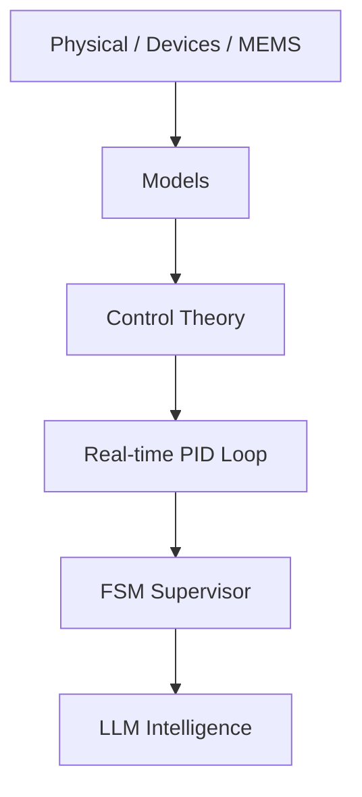

# 🎓 Samizo-AITL Portal  
> **物理 → デバイス → 制御 → 知能化を  
> 一つの因果構造で統合する技術アーカイブ**  
> *A unified framework connecting physics, devices, systems, and intelligence.*

[](https://github.com/Samizo-AITL)
[](https://zenn.dev/samizo_aitl)


## 🌐 Language / 言語
[](https://samizo-aitl.github.io/portal/en/)
[](https://samizo-aitl.github.io/portal/)

---

## ▶ はじめての方へ（Overview）

Samizo-AITL の **設計思想と全体構造** を、  
短いスライドにまとめています。

📌 **初めての方は、文章を読む前にこちらをご覧ください。**

▶ **[Overview スライドを見る](https://samizo-aitl.github.io/about/marp/samizo-aitl-presentation.html)**

---

## 🚀 What You Can Gain from This Portal

**Samizo-AITL** は、  
半導体・MEMS・制御・AI を  
**「物理を起点とした一つの設計構造」**として整理した  
技術アーカイブです。

このポータルで得られること：

- 分野横断の技術を **因果関係で説明できる**
- 物理モデルから **制御・知能化まで一貫して設計できる**
- 教材・PoC・実装を **再利用可能な設計資産として扱える**

単なる教材集ではなく、  
**技術体系そのものを「設計できる形」で残すこと**  
を目的としています。

---

## 🎯 Who Is This Portal For?

Samizo-AITL は、次のような方を想定しています。

- **物理モデルを起点に設計したい**  
  半導体・MEMS・制御系エンジニア
- AI / LLM を  
  **制御の代替ではなく、監督・再設計層として使いたい人**
- 分野横断で  
  **技術体系そのものを再構築したい研究者・設計者**

⚠️ **注意**  
本ポータルは入門サイトではありません。  
**「設計のための理解」を求める方向け**です。

---

## 🧩 AITL Structure Map（全体構造）

### ▶ 全体像（まず図で把握）


> 物理 → モデル → 制御 → 知能化 を中核とし、  
> DevEnv・CodeGen・Docs・Archives を  
> **因果構造として横断的に統合**しています。

---

### ▶ 論理構造（AITL）


※ LLM is used only at design-time for explanation and redesign, and does not intervene in real-time control.

AITL（Architecture for Integrated Technology Logic）は、  
次の **三層構造**で設計されています。

- **内側**：物理・デバイス・MEMS  
  → 制約・限界を決める層  
- **中間**：モデル・制御理論（PID）  
  → 振る舞いと安定性を決める層  
- **外側**：FSM / LLM  
  → 判断・再設計・適応を行う層  

**物理モデルを正しく使い切るための知能化**  
――それが AITL の目的です。

---

## 🗂 Samizo-AITL Directory Overview（全体像）

> **このディレクトリ構成そのものが、設計思想です。**

```text
Samizo-AITL/
├─ 01_DevEnv/        環境・再現性（VSCode / Python / Toolchain）
│
├─ 02_CodeGen/       実装・制御・生成
│   ├─ PID           実時間制御（安定化・V–I 制御）
│   ├─ FSM           状態遷移・モード管理
│   └─ LLM           監督・再設計（非実時間）
│
├─ 03_Docs/          理解・教育・設計思想
│   ├─ Edusemi-v4x
│   ├─ EduController
│   └─ Edusemi-Plus
│
└─ 04_Archives/      PoC・履歴・技術資産
```

### ▶ 読み進める順番（推奨）

**① 思想・全体像  
→ ② 物理・デバイス  
→ ③ 制御  
→ ④ 知能化（AITL）**

---

## 📝 Essays / Design Philosophy (Zenn)

**設計思想・物理起点工学・AITL構造に関する考察記事は Zenn に集約しています。**

[](https://zenn.dev/samizo_aitl)

---

# 💠 Main Core（中核教材）

---

## 1️⃣ Edusemi-v4x
半導体プロセス・デバイス・回路設計を、**物理起点で体系化する基幹教材**。

- 電子物性・プロセス条件・デバイス構造の因果関係を整理
- 回路特性を「結果」ではなく「物理の帰結」として理解
- 教科書断片ではなく、**設計につながる物理体系**を構築

👉 **Samizo-AITL 全体の物理基盤となる中核教材。**

[](https://samizo-aitl.github.io/Edusemi-v4x/)
[](https://github.com/Samizo-AITL/Edusemi-v4x)

---

### 🔹 特別章：SystemDK（System Design Kit）

物理・デバイス・回路を前提として、  
**SI / PI / 熱 / 応力 / EMI を含む「実装・統合設計」へ展開する特別章**。

- デバイス単体では終わらない「システム制約」を物理から整理
- SoC / Chiplet / Package / Board を貫く設計視点
- 教材でありつつ、実設計の思考フレームとしても利用可能

👉 **Edusemi-v4x における「物理 → システム統合」への橋渡し位置づけ。**

[](https://samizo-aitl.github.io/Edusemi-v4x/f_chapter2a_systemdk/)

---

## 2️⃣ SemiDevKit
物理モデルから **SPICE・信頼性・レイアウト**までを接続する実装キット。

- 物理モデルを SPICE モデルへ落とし込む
- 信頼性・ばらつき・設計マージンを考慮
- デバイス理解を **設計フローとして実装**する

👉 **物理理解を「設計作業」に変換するための橋渡し。**

### ■ Device Modeling Example（SCE対応）


**BSIM4モデルによるNMOS Vg–Id特性（Linear領域）**。  
チャネル長Lの短縮に伴うId増大と勾配変化を通じて、  
**Short Channel Effect（Vth roll-off / mobility degradation）を反映したデバイス挙動**を可視化。

[](https://samizo-aitl.github.io/SemiDevKit/)
[](https://github.com/Samizo-AITL/SemiDevKit)

---

## 3️⃣ Edusemi-Plus
材料・装置・産業構造を、**物理視点で拡張する補助教材**。

- 製造装置・材料技術と物理原理の関係整理
- 半導体産業構造・技術選択の背景を理解
- Edusemi-v4x の物理体系を **現実世界へ拡張**

👉 **「なぜこの技術が選ばれているか」を理解するための補助教材。**

[](https://samizo-aitl.github.io/Edusemi-Plus/)
[](https://github.com/Samizo-AITL/Edusemi-Plus)

---

## 4️⃣ openlane2-sram｜SRAMマクロ統合・物理設計実証
OpenLane2（v2）を用いて **SRAM hard macro を統合し、RTL → GDS まで完走する**  
**マクロ対応・物理設計の実践教材**。

- SRAM を **external hard macro（blackbox / LEF / GDS）** として扱う
- FIXED 配置・halo / keepout を含む **macro-aware floorplanning**
- OpenLane2 Classic flow による **最終 GDS 生成**
- SoC 物理設計で一般的な **「SRAM 中身は見ない」設計作法**を明示

[](https://samizo-aitl.github.io/openlane2-sram/)
[](https://github.com/Samizo-AITL/openlane2-sram)

### 🔎 Layout Evidence（GDS）

**Figure 1: SRAM Macro Block-Level View**


**Figure 2: Standard-Cell-Level View Around SRAM Macro**


> Note: The SRAM is integrated as a fixed hard macro using abstract views (LEF/GDS).  
> Its internal transistor-level layout is intentionally not visible, which is consistent with standard SoC physical design practice.

---

# 🎛 Applied Layer（制御・知能化）

---

## 🧭 Control Architecture Concepts（制御アーキテクチャ概念）

> Runtime（運用）と Design-time（設計）を分離して扱うための  
> **中核となる制御アーキテクチャ概念**です。  
> いずれも **「AIが制御を置き換えない」** ことを前提にしています。

| 概念 | 役割 | リンク |
|---|---|---|
| **Envelope Control** | 不確実性下において、安全な運転範囲（Envelope）を**実行時に拘束**する制御概念 | 🔗 [Open](https://samizo-aitl.github.io/envelope-control/) ｜ 🔧 [Repo](https://github.com/Samizo-AITL/envelope-control) |
| **Design Recovery Control** | 破綻・逸脱した**制御設計前提を非実時間で回復**する設計監督概念 | 🔗 [Open](https://samizo-aitl.github.io/design-recovery-control/) ｜ 🔧 [Repo](https://github.com/Samizo-AITL/design-recovery-control) |

**関係性（非代替・補完関係）：**
- **Envelope Control**：*「いま、どう抑えて運転するか」* を規定する  
- **Design Recovery Control**：*「なぜ設計が通らなくなったか」* を修復する  

これらは **競合でも代替でもなく、補完関係にある概念**です。

---

## ▶ Control Playground（Time Response Demo）

**固定 PID 制御器が、  
色付きかつ状態依存の外乱にさらされたときの時間応答を可視化したデモ**です。

- スライダーなし
- チューニング不可
- 見えるのは **y(t), setpoint(t), disturbance(t)** のみ

<iframe
  src="https://samizo-aitl.github.io/control-playground/"
  style="width:100%; height:420px; border:none;">
</iframe>

> 制御の成否は、説明ではなく **波形そのもの**が語ります。

---

## 5️⃣ EduController
PID・FSM を中心に、**制御系の構造そのものを理解するための教材**。

- PID による実時間制御と安定化の役割
- FSM による状態監督・モード遷移の意味
- 「制御ロジック」と「制御構造」の違いを明確化

👉 **制御を“組む前に考える”ための基礎教材。**

[](https://samizo-aitl.github.io/EduController/)
[](https://github.com/Samizo-AITL/EduController)

---

## 6️⃣ AITL-Controller-A-Type
PID × FSM × LLM **三層構造（AITL）の最小構成 PoC**。

- PID：実時間制御のみを担当
- FSM：劣化検出・状態遷移を担当
- LLM：FSMに呼ばれた場合のみ介入し、設計（ゲイン）を更新

👉 **LLMが制御を置き換えないことを示す最小実証。**

<figure style="text-align:center; margin:2rem auto;">
  
  <figcaption style="font-size:0.9rem; color:#555; margin-top:0.5rem;">
    外乱下における AITL 応答（制御：PID／監督：FSM／再設計：LLM）
  </figcaption>
</figure>

[](https://samizo-aitl.github.io/aitl-controller-a-type/)
[](https://github.com/Samizo-AITL/aitl-controller-a-type)

---

## 7️⃣ V–I Control ASIC on SKY130
V–I 制御（PID + FSM）を **RTL → GDS まで一貫実装する ASIC 教材**。

- 電圧–電流（V–I）制御を物理量起点で設計
- PID + FSM をハードウェアとして実装
- 制御理論と半導体物理の接続を実証

👉 **制御が「物理デバイスにどう実装されるか」を示す教材。**

[](https://samizo-aitl.github.io/vi-control-asic-sky130/)
[](https://github.com/Samizo-AITL/vi-control-asic-sky130)

---

# ⚙️ MEMS / Physical Boundary

---

## 8️⃣ mems-ana
抽象モデルの限界を確認する **pre-FEM MEMS 解析ツール**。

- lumped / 簡易モデルが成立する範囲を可視化
- FEM に進む前段階での仮定・近似の妥当性確認
- モデル化誤差が設計判断に与える影響を整理

👉 **「どこまで抽象化してよいか」を判断するための前処理ツール。**

[](https://samizo-aitl.github.io/mems-ana/)
[](https://github.com/Samizo-AITL/mems-ana)

### Demo animation (recommended)


---

## 9️⃣ Inkjet Printing — Design Trade-off Models
画質・速度・ドット挙動の因果関係を**最小モデルで可視化する教材**。

- ドット形成・吐出条件・駆動条件の因果関係整理
- 画質 ↔ 速度 ↔ 安定性のトレードオフを明示
- 高忠実度シミュレーションに頼らない設計思考

👉 **インクジェット設計の意思決定構造を理解するための教材。**

[](https://samizo-aitl.github.io/inkjet-dts/)
[](https://github.com/Samizo-AITL/inkjet-dts)

---

## 🔟 inkjet-timing  
ピエゾインクジェットにおける **電気・機械・流体の時間因果関係**を、  
単一時間軸上で可視化する設計・教育用デモ。

- 電圧駆動 → 機械変形 → 流体応答の時間順序を可視化
- 遅延・重なり・非同期要素の影響を理解
- 波形設計と吐出挙動の関係を直感的に把握

👉 **マルチフィジクスを「時間因果」として捉えるためのデモ。**

[](https://samizo-aitl.github.io/inkjet-timing/)
[](https://github.com/Samizo-AITL/inkjet-timing)

---

# 🎞 AITL Animation Demos
PID 制御・FSM・LLM を含む AITL 構造や、  
物理・デバイス・マルチフィジクス挙動を **アニメーションで可視化したデモ集**。

- **PID 制御の時間応答・制御フロー**の可視化
- FSM・LLM を含む **AITL 制御構造の役割分担**の表示
- インクジェット、MEMS、デバイス物理などの **時間・空間挙動の直感的理解**

数式やコードの前に、  
**振る舞いと構造を目で把握すること**を目的としています。

[](https://samizo-aitl.github.io/aitl-animation-demos/)

---

## 🎞 AITL Control Flow Demo

AITL制御の**中核**である**PID × FSM × LLM の三層構造**が、時間軸上でどのように連携するかを示すデモです。

---

### 🔁 三層の役割（要点）

- **PID（最内層）**  
  実時間制御を担当。通常はPIDのみで安定追従する。

- **FSM（中間層）**  
  状態監督を担当。誤差や劣化を検出し、  
  *monitoring → disturbance → recovery → stable* を切り替える。

- **LLM（最外層）**  
  再設計を担当。  
  FSMに呼ばれた場合のみ介入し、PIDゲイン（例：Kp）を再同定する。

---

### 📉 デモの流れ

1. **通常**：PID追従／FSM監視／LLM待機  
2. **外乱**：誤差増大 → FSMが劣化検出  
3. **介入**：LLMがゲイン再調整  
4. **回復**：PID再追従 → FSM stable → LLM idle

---

### 🎯 AITL制御の本質

- LLMは**常時制御しない**
- PIDを**置き換えない**
- FSMが**判断の主導権**を持つ
- LLMは**設計を更新する存在**

👉 **これが AITL 制御の根幹思想**

---

<section class="aitl-demo" style="margin:0;padding:0;">
  <iframe
    src="https://samizo-aitl.github.io/aitl-animation-demos/demo/js-svg/aitl-control-flow.html"
    style="display:block;width:100%;height:520px;border:none;border-radius:12px;background:#000;margin:0;"
    loading="lazy"
    referrerpolicy="no-referrer">
  </iframe>
</section>

---

# 🕘 Update Log

**サイトおよび教材の更新履歴はこちらに集約しています。**  
設計思想・教材構成・PoC の更新は、必ずログとして残します。

- [📄 更新履歴を見る](https://samizo-aitl.github.io/about/update/)

---

# 👤 Author

**三溝 真一（Shinichi Samizo）**  
独立系半導体研究者  

- GitHub: [https://github.com/Samizo-AITL](https://github.com/Samizo-AITL)
- Zenn: [https://zenn.dev/samizo_aitl](https://zenn.dev/samizo_aitl)  
- Career Summary: [https://samizo-aitl.github.io/about/career-summary/](https://samizo-aitl.github.io/about/career-summary/)

---

# 💬 技術ディスカッション / Technical Consultation

[](https://github.com/Samizo-AITL/Samizo-AITL.github.io/discussions)

> 本ポータルでは、メールや SNS 等の私的な連絡手段は設けていません。  
> 技術的な議論・相談・協業に関する問い合わせは、  
> **GitHub Discussions 上での公開議論**として受け付けています。  
>  
> 設計思想の共有、因果構造の整理、PoC 検討など、  
> **再現性と技術的文脈を重視した対話**を目的としています。


